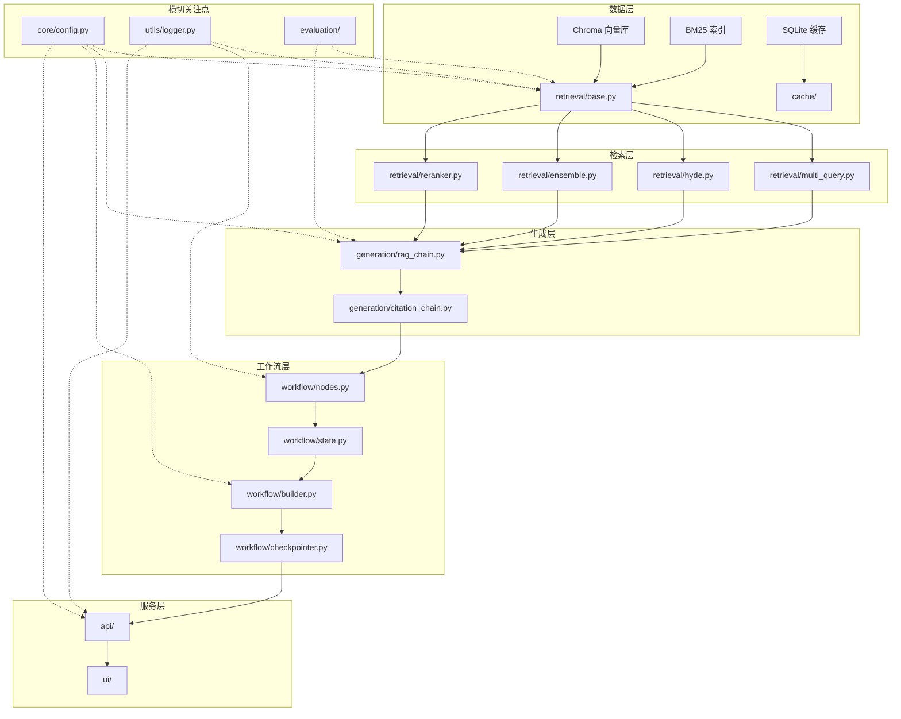

# 项目目录结构、模块职责与依赖关系、各模块技术详解

基于 Phase 1-5 的完整设计，以下为生产级 LangGraph RAG 问答系统的架构文档。
**仅作参考，以实际的最佳实践为准**。

---

## 一、项目目录结构

```
RAG_DEMO_2/
├── src/
│   ├── core/                              # 核心基础设施
│   │   ├── __init__.py
│   │   ├── config.py                      # Pydantic Settings 配置管理
│   │   ├── exceptions.py                  # 自定义异常类
│   │   └── callbacks.py                   # LangChain 回调处理器（性能监控）
│   │
│   ├── ingestion/                         # 数据摄入模块
│   │   ├── __init__.py
│   │   ├── crawler.py                     # HTML 爬取 → Markdown（已完成）
│   │   ├── splitter.py                    # 智能文档切分器（Markdown 感知 + 代码块保护）
│   │   └── indexer.py                     # 向量库入库 + BM25 索引构建
│   │
│   ├── retrieval/                         # 检索策略模块
│   │   ├── __init__.py
│   │   ├── base.py                        # 基础向量检索器封装
│   │   ├── multi_query.py                 # MultiQuery 多角度检索
│   │   ├── hyde.py                        # HyDE 假设文档检索
│   │   ├── ensemble.py                    # 混合检索（向量 + BM25 + RRF）
│   │   ├── bm25_builder.py                # BM25 索引构建与加载
│   │   ├── reranker.py                    # Cross-Encoder 重排序器
│   │   └── prompts.py                     # 检索专用 Prompt 模板
│   │
│   ├── generation/                        # 生成模块
│   │   ├── __init__.py
│   │   ├── prompts.py                     # 生成 Prompt 模板（多语言支持）
│   │   ├── rag_chain.py                   # LCEL RAG 链（基础版）
│   │   └── citation_chain.py              # 带结构化引用的生成链
│   │
│   ├── workflow/                          # LangGraph 工作流
│   │   ├── __init__.py
│   │   ├── state.py                       # GraphState 定义（TypedDict + Reducer）
│   │   ├── nodes.py                       # 节点函数（route、retrieve、grade、generate、rewrite、web_search）
│   │   ├── edges.py                       # 条件边路由逻辑
│   │   ├── builder.py                     # 图构建器（compile）
│   │   └── checkpointer.py                # SqliteSaver 检查点持久化
│   │
│   ├── memory/                            # 对话记忆管理
│   │   ├── __init__.py
│   │   ├── conversation.py                # 滑动窗口裁剪 + 指代消解上下文构建
│   │   └── summary.py                     # 长对话摘要压缩
│   │
│   ├── tools/                             # 外部工具集成
│   │   ├── __init__.py
│   │   ├── search_tool.py                 # Tavily 网络搜索工具（@tool）
│   │   └── mcp_server.py                  # MCP 服务端（可选扩展）
│   │
│   ├── cache/                             # 缓存模块
│   │   ├── __init__.py
│   │   ├── llm_cache.py                   # SQLite 精确匹配缓存
│   │   └── semantic_cache.py              # GPTCache 语义缓存
│   │
│   ├── evaluation/                        # 评估模块
│   │   ├── __init__.py
│   │   ├── dataset.py                     # 评估数据集加载
│   │   ├── metrics.py                     # 检索指标计算（Hit Rate, MRR, NDCG）
│   │   ├── retrieval_eval.py              # 检索评估运行器
│   │   ├── generation_eval.py             # LLM-as-Judge 生成评估
│   │   ├── ragas_eval.py                  # RAGAS 评估集成
│   │   ├── compare.py                     # A/B 对比工具
│   │   └── report_generator.py            # 评估报告生成（Markdown + 雷达图）
│   │
│   ├── utils/                             # 通用工具
│   │   ├── __init__.py
│   │   ├── logger.py                      # structlog 结构化日志配置
│   │   ├── retry.py                       # tenacity 重试装饰器
│   │   ├── async_helpers.py               # 异步辅助函数（asyncio.to_thread 封装）
│   │   └── metrics.py                     # 性能指标收集（计时器上下文管理器）
│   │
│   └── app.py                             # CLI 交互入口（开发调试用）
│
├── api/                                   # FastAPI 服务
│   ├── __init__.py
│   ├── main.py                            # 应用入口 + 生命周期管理
│   ├── dependencies.py                    # 依赖注入（Graph、配置、缓存）
│   ├── schemas.py                         # Pydantic 请求/响应模型
│   ├── routers/
│   │   ├── __init__.py
│   │   └── chat.py                        # /chat 端点（流式 + 非流式）
│   ├── middleware.py                      # 限流、CORS、日志中间件
│   └── streaming.py                       # SSE 流式响应生成器
│
├── ui/                                    # Web UI（Gradio）
│   ├── app.py                             # Gradio ChatInterface 主程序
│   └── components.py                      # 自定义 UI 组件
│
├── tests/                                 # 测试套件
│   ├── __init__.py
│   ├── conftest.py                        # Pytest fixtures
│   ├── test_ingestion/                    # 数据摄入测试
│   ├── test_retrieval/                    # 检索器单元测试
│   ├── test_workflow/                     # LangGraph 节点和边测试
│   ├── test_evaluation/                   # 评估指标测试
│   └── test_e2e/                          # 端到端集成测试
│
├── data/                                  # 数据目录
│   ├── raw/                               # 原始 HTML / Markdown 文档
│   ├── eval/
│   │   ├── qa_pairs.json                  # 手工标注评估数据集
│   │   ├── ragas_testset.csv              # RAGAS 自动生成测试集
│   │   └── reports/                       # 评估报告存档
│   └── logs/                              # 应用日志（开发环境）
│
├── db/                                    # 持久化存储
│   ├── chroma/                            # Chroma 向量库数据
│   ├── checkpoints.db                     # LangGraph 检查点（SQLite）
│   ├── llm_cache.db                       # LLM 精确缓存（SQLite）
│   └── bm25_index.pkl                     # BM25 索引序列化文件
│
├── docker/                                # Docker 相关
│   ├── Dockerfile
│   ├── .dockerignore
│   └── entrypoint.sh                      # 容器启动脚本
│
├── docker-compose.yml                     # 服务编排
├── .env                                   # 环境变量模板
├── .pre-commit-config.yaml                # Pre-commit 钩子配置
├── pyproject.toml                         # 项目依赖与工具配置
├── AGENTS.md                              # AI 上下文文档（架构设计说明）
├── README.md                              # 项目说明文档
├── DEPLOYMENT.md                          # 部署指南
├── CHANGELOG.md                           # 版本变更日志
└── LICENSE                                # MIT 许可证
```

---

## 二、模块职责与依赖关系

### 2.1 模块职责概览

| 模块 | 职责 | 关键输出 |
|------|------|---------|
| `core/` | 全局配置管理、异常定义、回调钩子 | `Settings` 配置对象、自定义异常类 |
| `ingestion/` | 文档爬取、智能切分、向量化入库 | Chroma 向量库、BM25 索引文件 |
| `retrieval/` | 多种检索策略实现（基础、MultiQuery、HyDE、Ensemble、Reranker） | 统一的 `BaseRetriever` 接口 |
| `generation/` | RAG 答案生成、Prompt 模板管理、结构化引用 | LCEL Chain、`CitationAnswer` 结构化输出 |
| `workflow/` | LangGraph 工作流编排、状态管理、检查点持久化 | `CompiledGraph` 实例 |
| `memory/` | 对话历史管理、token 裁剪、摘要压缩 | 裁剪/摘要函数，供节点调用 |
| `tools/` | 外部工具集成（Tavily 搜索、MCP 服务） | `@tool` 装饰的工具函数 |
| `cache/` | LLM 响应缓存（精确匹配 + 语义匹配） | 缓存命中逻辑，降低 API 成本 |
| `evaluation/` | 检索与生成质量评估、A/B 对比、报告生成 | 评估指标、对比报告 Markdown |
| `utils/` | 日志、重试、异步辅助、性能计时 | 可复用的工具函数 |
| `api/` | RESTful API 服务封装、流式响应 | FastAPI 应用实例 |
| `ui/` | Web 交互界面 | Gradio 应用 |

### 2.2 依赖关系图（自底向上）



**依赖方向说明**：
- `workflow/` 依赖 `generation/` 和 `retrieval/`，上层编排下层能力。
- `api/` 和 `ui/` 依赖 `workflow/`，作为最外层服务入口。
- `core/config.py` 作为全局配置，被所有模块依赖。
- `utils/` 和 `evaluation/` 为横切模块，可被任意层调用。

---

## 三、各模块技术详解
包含各模块

### 3.1 核心基础设施（`src/core/`）

| 子模块 | 面试级知识点 | 生产级注意事项 |
|--------|-------------|---------------|
| `config.py` | **Pydantic Settings 管理**：使用 `pydantic_settings.BaseSettings` 从环境变量自动加载配置，支持类型验证、默认值、嵌套配置。多环境通过 `ENV` 变量切换配置类。 | 敏感字段使用 `SecretStr` 类型防止日志泄露；提供 `.env.example` 模板文件；配置对象在应用启动时单例化。 |
| `exceptions.py` | **自定义异常层次结构**：定义 `RAGSystemError` 基类，派生 `RetrievalError`、`LLMError`、`ToolError` 等，便于上层统一捕获和处理。 | 异常消息应包含足够上下文（如 query、文档 ID），但不暴露敏感信息。 |
| `callbacks.py` | **LangChain Callback 机制**：继承 `BaseCallbackHandler`，在 `on_llm_start`、`on_retriever_end` 等钩子中记录性能指标（耗时、Token 用量）。 | 回调中避免执行耗时操作；使用 `structlog` 输出结构化日志；通过 `config` 动态启用/禁用。 |

---

### 3.2 数据摄入（`src/ingestion/`）

| 子模块 | 面试级知识点 | 生产级注意事项 |
|--------|-------------|---------------|
| `splitter.py` | **Markdown 感知切分**：识别标题层级（h1/h2）作为语义边界；代码块保护（用占位符替换 ``` 块，切分后还原）。**Chunk Size 权衡**：2000 字符基于采样分析（一段说明+代码约 1200-1800 字符），通过评估对比确定最优值。 | 切分参数通过配置文件管理；每次切分记录元数据（chunk_id、source、heading_path）；支持增量更新（仅切分新增文档）。 |
| `indexer.py` | **向量库版本管理**：入库时在 `db/` 目录下生成 `metadata.json`，记录入库时间、文档数量、切分参数。**BM25 索引构建**：使用 `rank_bm25` 构建关键词索引，序列化为 pickle 文件，启动时加载。 | 入库前检查向量库是否已存在，支持 `--force-recreate` 强制重建；BM25 索引与向量库文档顺序严格一致。 |

---

### 3.3 检索策略（`src/retrieval/`）

| 子模块 | 面试级知识点 | 生产级注意事项 |
|--------|-------------|---------------|
| `base.py` | **VectorStore vs Retriever**：`BaseRetriever` 封装 Chroma，提供统一接口。**MMR 原理**：平衡相关性与多样性，`lambda_mult` 默认 0.5，评估时调优。 | 单例模式避免重复加载向量库；`top_k` 可配置；返回的 Document 必须包含 `source` 元数据。 |
| `multi_query.py` | **查询转换策略**：LLM 生成 3 个语义不同的变体，并行检索后去重合并。与 RAG Fusion 的区别在于是否使用 RRF 融合。 | 变体生成使用较低 temperature（0.3）保证稳定性；并行检索用 `asyncio.gather`；去重基于文档 ID 哈希。 |
| `hyde.py` | **HyDE 原理**：用 LLM 生成假设答案（英文），缩小 query 与文档的语义鸿沟。适合概念性问题，事实性问题效果有限。 | 跨语言场景：强制生成英文假设文档；长度限制 200-500 字符；失败时降级为直接检索。 |
| `ensemble.py` | **混合检索 + RRF**：向量检索与 BM25 各取 top_k=10，用 RRF 算法（k=60）融合排序，取前 6 个。**RRF 公式**：`score(d) = Σ(1 / (k + rank_i(d)))`。 | BM25 索引启动时加载至内存；RRF 常数 k 通过评估调优；两路检索数量应大于最终需要的数量。 |
| `reranker.py` | **Bi-Encoder vs Cross-Encoder**：粗排用 Bi-Encoder（Embedding 模型），精排用 Cross-Encoder（Cohere 或本地模型）。`ContextualCompressionRetriever` 实现压缩检索。 | Cohere API 支持批量请求（最多 1000 文档）；本地模型推荐 `BAAI/bge-reranker-base`；重排序结果可缓存。 |

---

### 3.4 生成模块（`src/generation/`）

| 子模块 | 面试级知识点 | 生产级注意事项 |
|--------|-------------|---------------|
| `prompts.py` | **跨语言 Prompt 设计**：System Message 明确“基于英文文档回答，用中文输出”；Few-shot 示例规范引用格式。 | Prompt 模板版本化管理（字典存储）；使用 `MessagesPlaceholder` 管理动态上下文。 |
| `rag_chain.py` | **LCEL 组合**：`RunnableParallel` 同时传递 context 和 question；`RunnablePassthrough` 透传原始输入。 | 支持 `.stream()` 流式输出；空文档时返回预设回复而非调用 LLM；错误处理捕获 `OpenAIError`。 |
| `citation_chain.py` | **结构化输出**：使用 `with_structured_output(CitationAnswer)` 强制模型返回符合 Pydantic 模型的 JSON，包含答案和引用列表。 | 若模型不支持 Function Calling，降级为文本解析（正则提取 `[数字]` 标记）；引用 URL 必须来自检索文档的 metadata。 |

---

### 3.5 LangGraph 工作流（`src/workflow/`）

| 子模块 | 面试级知识点 | 生产级注意事项 |
|--------|-------------|---------------|
| `state.py` | **TypedDict + Annotated**：定义 `GraphState`，`messages` 字段使用 `add_messages` reducer 实现增量追加。 | 状态字段精简，仅保留跨节点必需数据；`iteration_count` 用于循环控制。 |
| `nodes.py` | **节点函数签名**：`async def node(state: GraphState) -> dict`，返回部分状态更新。**文档评估节点**：LLM 二元判断（YES/NO）检索结果相关性。**查询重写节点**：调用 LLM 改写查询，`rewrite_count` 自增。 | 每个节点内部异常捕获，返回包含错误信息的状态；`web_search` 节点为 Phase 4 工具调用预留。 |
| `edges.py` | **条件边路由**：`route_after_grade` 根据 `grade` 字段返回 `"generate"` 或 `"rewrite"`；`route_after_rewrite` 检查 `rewrite_count` 阈值，超限跳转 `web_search` 或 `fallback`。 | 路由函数必须幂等；添加“安全阀”防止无限循环。 |
| `builder.py` | **图构建与编译**：`StateGraph` → `add_node` → `add_conditional_edges` → `compile`。支持通过配置注入不同检索策略。 | `recursion_limit` 设为 15；编译后生成 Mermaid 图用于文档。 |
| `checkpointer.py` | **SqliteSaver 持久化**：使用 `SqliteSaver.from_conn_string()` 创建，传入 `config["configurable"]["thread_id"]` 区分会话。 | 检查点数据库路径 `db/checkpoints.db`；支持 TTL 自动清理；不同用户通过 `thread_id` 隔离。 |

---

### 3.6 对话记忆管理（`src/memory/`）

| 子模块 | 面试级知识点 | 生产级注意事项 |
|--------|-------------|---------------|
| `conversation.py` | **滑动窗口裁剪**：按 token 数裁剪消息列表，保留最近的消息直到总 token 数不超过阈值（如 4000）。**指代消解**：在 Prompt 中注入最近 3 轮对话历史，由 LLM 自行解析。 | 使用 `tiktoken` 精确计数；裁剪时保留 System Message 和最后一轮用户消息。 |
| `summary.py` | **对话摘要压缩**：当消息 token 数超过阈值时，调用 LLM 将历史对话压缩为一段摘要，替换原始消息。 | 摘要生成后缓存结果；摘要格式：“[对话摘要] 用户询问了 X，助手回答了 Y。” |

---

### 3.7 外部工具集成（`src/tools/`）

| 子模块 | 面试级知识点 | 生产级注意事项 |
|--------|-------------|---------------|
| `search_tool.py` | **Tool Calling**：使用 `@tool` 装饰器定义 `tavily_search`，LangGraph 的 `ToolNode` 自动处理调用。 | Tavily API 限流处理（计数器或令牌桶）；搜索结果过滤低分项（score < 0.5）；结果缓存 1 小时。 |
| `mcp_server.py` | **MCP 协议**：使用 FastMCP 暴露检索工具，供 Claude Desktop 等外部 AI 应用调用。 | 传输模式：stdio（本地）或 HTTP+SSE（远程）；工具定义包含清晰的参数描述。 |

---

### 3.8 缓存模块（`src/cache/`）

| 子模块 | 面试级知识点 | 生产级注意事项 |
|--------|-------------|---------------|
| `llm_cache.py` | **SQLite 精确缓存**：使用 LangChain 内置 `SQLiteCache`，缓存键为 `(prompt, model_name)` 的哈希。 | 缓存数据库路径 `db/llm_cache.db`；TTL 默认 24 小时；缓存命中日志记录。 |
| `semantic_cache.py` | **GPTCache 语义缓存**：Embedding 相似度匹配，阈值 0.95。架构：Pre-Processor → Embedding → Vector Store → Cache Manager。 | 复用项目 Embedding 模型；向量库使用 Chroma 独立 collection；评估调优阈值；知识库更新时清空缓存。 |

---

### 3.9 评估模块（`src/evaluation/`）

| 子模块 | 面试级知识点 | 生产级注意事项 |
|--------|-------------|---------------|
| `metrics.py` | **检索指标计算**：Hit Rate@k、MRR@k、NDCG@k，纯 Python 实现，无 LLM 依赖。 | 处理边界情况（相关文档数为 0 时返回 0）；支持多级相关性打分（NDCG）。 |
| `retrieval_eval.py` | **评估流程**：遍历数据集，对每个 query 调用检索器，计算指标并聚合。 | 支持按文档类别分组统计；输出 Markdown 表格报告。 |
| `generation_eval.py` | **LLM-as-Judge**：使用 GPT-4o-mini 评估 faithfulness 和 relevancy，Prompt 包含评分标准（1-5 分）。 | 评估模型与生成模型分离；评估结果一致性校验（重复评估 3 次取均值）。 |
| `ragas_eval.py` | **RAGAS 四指标**：Faithfulness、Answer Relevancy、Context Precision、Context Recall。使用 `TestsetGenerator` 自动生成评估集。 | 评估 LLM 使用 `gpt-4o-mini` 降本；生成测试集后人工抽样验证质量。 |
| `compare.py` | **A/B 对比**：输入两个策略名称，运行评估并生成对比报告（表格 + 雷达图）。 | 支持统计显著性检验（Bootstrap）；报告版本化管理。 |

---

### 3.10 通用工具（`src/utils/`）

| 子模块 | 面试级知识点 | 生产级注意事项 |
|--------|-------------|---------------|
| `logger.py` | **structlog 结构化日志**：配置 JSON 渲染器，绑定 `request_id`、`thread_id` 等上下文。 | 日志级别通过环境变量控制；敏感字段脱敏处理器。 |
| `retry.py` | **tenacity 重试**：装饰器实现指数退避，区分可重试错误（429、5xx）和不可重试错误（401、400）。 | 最大重试 3 次，最小等待 4 秒，最大等待 10 秒。 |
| `async_helpers.py` | **同步转异步**：`asyncio.to_thread` 封装同步检索调用，避免阻塞事件循环。 | 线程池大小与 CPU 核心数匹配。 |
| `metrics.py` | **性能计时**：上下文管理器 `Timer`，记录耗时并输出到日志。 | 支持嵌套计时；可聚合为 Prometheus 格式（可选）。 |

---

### 3.11 服务层（`api/` 和 `ui/`）

| 子模块 | 面试级知识点 | 生产级注意事项 |
|--------|-------------|---------------|
| `api/` | **FastAPI 异步端点**：`/chat` 支持 SSE 流式响应，使用 `StreamingResponse` 包装 `astream_events`。**依赖注入**：`Depends(get_graph)` 提供全局单例。**限流**：`slowapi` 基于 IP 限制每分钟 10 次。 | 健康检查 `/health` 返回向量库连接状态；CORS 配置仅允许明确的前端来源；API Key 认证（可选）。 |
| `ui/` | **Gradio ChatInterface**：`gr.ChatInterface(fn=chat_fn)` 自动处理流式输出和历史。`session_hash` 映射为 `thread_id`。 | 自定义 CSS 美化；错误消息友好提示；支持 `share=False` 本地运行。 |
