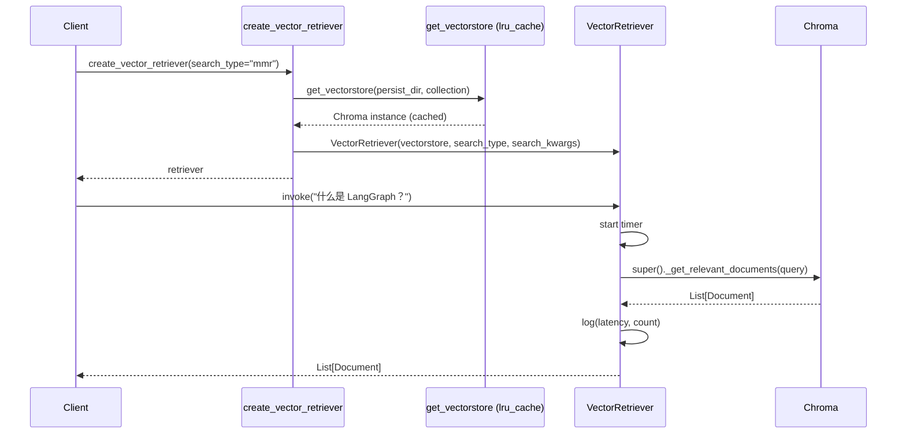

# Task 1.3 基础向量检索器封装 - 实现文档

## 第 1 层：代码骨架

### 模块结构

```
src/retriever/
├── __init__.py              # 公共导出
└── base_retriever.py        # VectorRetriever + 工厂函数 + 异常体系
```

### 核心签名

```python
# ===== 异常体系 =====
class RetrievalError(Exception): ...
class UnsupportedSearchTypeError(RetrievalError): ...

# ===== 封装类=====
class VectorRetriever(VectorStoreRetriever):
    """继承原生 VectorStoreRetriever，添加日志/异常/计时。"""
    def _get_relevant_documents(self, query, *, run_manager, **kwargs) -> List[Document]: ...

# ===== 基础设施 =====
@functools.lru_cache(maxsize=4)
def get_vectorstore(persist_directory, collection_name) -> Chroma: ...

# ===== 工厂函数 =====
def create_vector_retriever(
    persist_directory, collection_name, search_type, search_kwargs
) -> VectorRetriever: ...
```

### 模块依赖关系

```
base_retriever.py
    ├── src.config.ollama_embeddings   # Embedding 模型
    ├── langchain_chroma.Chroma        # 向量库
    ├── langchain_core.VectorStoreRetriever  # 基类
    └── structlog                      # 结构化日志
```

---

## 第 2 层：架构设计思路

### 为什么选择继承 VectorStoreRetriever（方案 B）而非直接用 as_retriever（方案 A）？

**方案 A — 工厂函数 `vectorstore.as_retriever()`**：
- 优点：一行代码搞定，零学习成本
- 缺点：无法注入自定义逻辑（日志、计时、异常转换）

**方案 B — 继承 VectorStoreRetriever**：
- 优点：
  - 完全控制 `_get_relevant_documents()` 的行为
  - 可添加日志、计时、异常转换等横切关注点
  - 面试时展示对 LangChain Retriever 接口的深入理解
- 缺点：多几十行代码

**决策**：以方案 B 为主实现，方案 A 作为工厂函数入口 `create_vector_retriever()` 内部使用方案 B 的类。

### 关键设计决策

1. **k 参数纳入 search_kwargs**：不单独声明 `self.k`，而是通过 `kwargs.setdefault("k", 5)` 注入 `search_kwargs` 字典，与 LangChain 原生 `VectorStoreRetriever` 设计一致，避免参数冲突。

2. **lru_cache 实现单例 VectorStore**：`get_vectorstore()` 加 `@lru_cache(maxsize=4)` 保证同参数组合只创建一次 Chroma 实例，避免重复加载向量库。

3. **异常层级**：`RetrievalError` → `UnsupportedSearchTypeError`，让上层可以按粒度捕获。

### 交互时序



---

## 第 3 层：生产级注意事项

### 关键配置项

| 参数 | 默认值 | 说明 |
|------|--------|------|
| `search_type` | `"similarity"` | 可选 `"similarity"` / `"mmr"` / `"similarity_score_threshold"` |
| `search_kwargs.k` | `5` | 返回文档数，评估时可调为 10-20 |
| `search_kwargs.lambda_mult` | `0.5` | MMR 多样性权重，0=最大多样性，1=纯相似度 |
| `search_kwargs.score_threshold` | - | 仅 `similarity_score_threshold` 模式生效 |
| `search_kwargs.filter` | - | Chroma metadata 过滤条件，如 `{"doc_category": "langgraph"}` |

### 常见坑点

1. **Chroma metadata 过滤语法**：Chroma 使用 `where` 子句而非 LangChain 的 `filter`，但 LangChain 的 Chroma 适配器会自动转换 `search_kwargs["filter"]` → Chroma `where`。

2. **MMR 需要 `fetch_k`**：MMR 先检索 `fetch_k`（默认 20）个候选，再从中选 `k` 个。如果 `fetch_k` 太小（如 < k），多样性效果会退化。

3. **lru_cache 与可变参数**：`get_vectorstore` 的参数必须是可哈希的（str），不能传 dict/list，否则 cache 失效。

4. **线程安全**：`lru_cache` 在 Python 3.9+ 是线程安全的。Chroma 的读操作也是线程安全的。

### 性能权衡

- **similarity** 最快（单次 ANN 查询）
- **MMR** 较慢（先查 fetch_k 个，再做 O(k × fetch_k) 的贪心选择）
- 对于 1792 chunks 的小库，差异可忽略；大库（10w+）时 MMR 的 fetch_k 需要控制

---

## 第 4 层：验收标准与测试要点

### 验收检查项

- [x] `create_vector_retriever()` 返回 `VectorRetriever` 实例
- [x] `retrieve("什么是 LangGraph？")` 返回 k 个文档
- [x] 每个文档 metadata 包含 `source`（有效 URL）和 `title`
- [x] `search_type="mmr"` 与 `"similarity"` 返回结果有差异（多样性）
- [x] 异常场景：无效 search_type 抛出 `UnsupportedSearchTypeError`

### 建议测试用例

```python
# 1. 基础 similarity 检索
retriever = create_vector_retriever(search_type="similarity", search_kwargs={"k": 5})
docs = retriever.invoke("什么是 LangGraph？")
assert len(docs) == 5
assert all("source" in d.metadata for d in docs)

# 2. MMR 检索
retriever_mmr = create_vector_retriever(search_type="mmr", search_kwargs={"k": 5, "lambda_mult": 0.5})
docs_mmr = retriever_mmr.invoke("什么是 LangGraph？")
assert len(docs_mmr) == 5
# MMR 结果应与 similarity 有差异
sources_sim = [d.metadata["source"] for d in docs]
sources_mmr = [d.metadata["source"] for d in docs_mmr]
assert sources_sim != sources_mmr  # 大概率不同

# 3. metadata 过滤
retriever_filtered = create_vector_retriever(search_kwargs={"k": 3, "filter": {"doc_category": "langgraph"}})
docs_f = retriever_filtered.invoke("状态管理")
assert all(d.metadata.get("doc_category") == "langgraph" for d in docs_f)

# 4. 异常：无效 search_type
try:
    bad = create_vector_retriever(search_type="invalid_type")
    bad.invoke("test")
    assert False, "应抛出异常"
except UnsupportedSearchTypeError:
    pass
```

---

## 第 5 层：完整代码实现

代码已存在于 `src/retriever/base_retriever.py`（81 行），无需修改。以下为现有完整代码：

```python
import functools
from typing import Optional, Dict, Any
from langchain_core.retrievers import BaseRetriever
from langchain_chroma import Chroma
from langchain_core.vectorstores import VectorStoreRetriever
import time
from src.config import ollama_embeddings
import structlog
from typing import override

logger = structlog.get_logger(__name__)


# 自定义异常类
class RetrievalError(Exception):
    """自定义检索错误类。"""
    pass


class UnsupportedSearchTypeError(RetrievalError):
    """不支持的搜索类型。"""
    pass


# ============================================================
# 方案 B：完整封装类（学习价值 + 生产扩展性）
# ============================================================

class VectorRetriever(VectorStoreRetriever):
    """继承原生 VectorStoreRetriever，添加日志和异常处理。"""

    @override
    def _get_relevant_documents(self, query, *, run_manager, **kwargs):
        start = time.perf_counter()
        try:
            docs = super()._get_relevant_documents(query, run_manager=run_manager, **kwargs)
            latency_ms = (time.perf_counter() - start) * 1000
            logger.info("检索成功", query=query, retrieval_count=len(docs),
                        latency_ms=round(latency_ms, 1), search_type=self.search_type)
            return docs
        except ValueError as e:
            raise UnsupportedSearchTypeError(str(e)) from e
        except Exception as e:
            logger.error("检索失败", query=query[:50], error=str(e))
            raise RetrievalError(f"检索失败: {e}") from e


@functools.lru_cache(maxsize=4)
def get_vectorstore(
        persist_directory: str = "db/langchain_docs_db1",
        collection_name: str = "langchain_docs1",
) -> Chroma:
    return Chroma(
        persist_directory=persist_directory,
        collection_name=collection_name,
        embedding_function=ollama_embeddings,
    )

def create_vector_retriever(
    persist_directory: str = "db/langchain_docs_db1",
    collection_name: str = "langchain_docs1",
    search_type: str = "similarity",
    search_kwargs: Optional[Dict[str, Any]] = None,
) -> VectorRetriever:
    vectorstore = get_vectorstore(persist_directory, collection_name)
    kwargs = search_kwargs.copy() if search_kwargs else {}
    kwargs.setdefault("k", 5)
    return VectorRetriever(
        vectorstore=vectorstore,
        search_type=search_type,
        search_kwargs=kwargs,
    )
```

### `__init__.py`（已完成，无需修改）

```python
from .base_retriever import (
    RetrievalError,
    UnsupportedSearchTypeError,
    VectorRetriever,
    create_vector_retriever,
    get_vectorstore,
)

__all__ = [
    "RetrievalError",
    "UnsupportedSearchTypeError",
    "VectorRetriever",
    "create_vector_retriever",
    "get_vectorstore",
]
```
