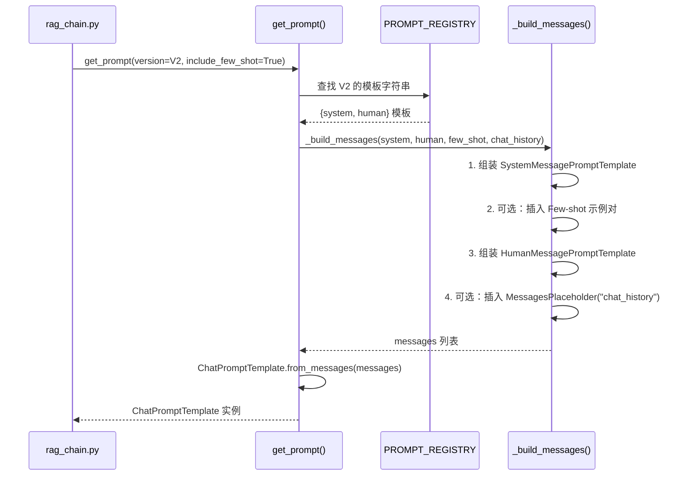

# Task 1.5 Prompt 模板工程与多语言支持 — 架构设计

> **原始需求**：`.project_outline/phase_1_reliable_base/task_1.5_prompts.md`
> **涉及文件**：`src/generation/prompts.py`、`src/generation/__init__.py`、`tests/test_prompts.py`

---

## 架构决策与权衡

### 决策 1：Prompt 版本管理方式

- **选项 A**：类继承（每个版本一个子类）— 符合 OCP，但当前只有 2 个版本，过度设计
- **选项 B**：字典映射 `PROMPTS = {"v1": ..., "v2": ...}` — 简洁直观，便于 A/B 测试切换
- **选项 C**：YAML/JSON 配置文件 — 最灵活，但增加文件 IO 和解析复杂度，当前阶段不需要
- **结论**：选 B。当前阶段字典映射足够，后续 Phase 如需配置外部化可迁移到 YAML（在 TODO 中预留）

### 决策 2：Few-shot 示例的集成方式

- **选项 A**：硬编码在 Prompt 字符串中 — 最简单，但无法灵活开关
- **选项 B**：通过 `ChatPromptTemplate` 的 messages 列表动态组装 — 灵活，支持可选 few-shot，符合 LCEL 最佳实践
- **结论**：选 B。Few-shot 示例作为独立的 `HumanMessage` / `AIMessage` 对插入 messages 列表，可通过参数控制是否启用

### 决策 3：引用格式设计

- **选项 A**：纯文本引用 `[1] url` — 简单但解析困难，格式不稳定
- **选项 B**：结构化 JSON 输出（`with_structured_output`）— 精确但依赖模型 Function Calling 能力
- **选项 C**：Prompt 指定格式 + 后备正则解析 — 兼顾灵活性和可靠性
- **结论**：选 C。Prompt 明确要求 `[N]` 行内引用 + 末尾来源列表格式，Task 1.6 的 `citation_chain.py` 将实现正则后备解析。当前不依赖模型 Function Calling 能力

### 决策 4：chat_history 占位策略

- **选项 A**：使用 `MessagesPlaceholder("chat_history")` — 标准 LangChain 方式，与 LCEL 完美集成
- **选项 B**：直接在 HumanMessage 中拼接历史 — 简单但不符合 LCEL 最佳实践
- **结论**：选 A。为 Task 2.5 对话记忆预留标准接口，即使 Phase 1 不传 chat_history，模板也支持

---

## 模块结构

### 文件组织
```
src/generation/
├── __init__.py       # 公共导出（get_prompt, PROMPT_REGISTRY, PromptVersion）
└── prompts.py        # Prompt 模板定义与版本管理

tests/
└── test_prompts.py   # Prompt 模板单元测试
```

### 依赖关系
```
src/generation/prompts.py
├── langchain_core.prompts   # ChatPromptTemplate, MessagesPlaceholder, SystemMessagePromptTemplate, HumanMessagePromptTemplate, AIMessagePromptTemplate
├── langchain_core.messages  # HumanMessage, AIMessage (用于 few-shot 示例)
├── enum                    # PromptVersion 枚举
├── typing                  # Optional
└── structlog               # 日志
```

### 职责边界
```
src/generation/prompts.py 职责：
✅ 包含：Prompt 模板定义、版本注册表、获取 prompt 的工厂函数
✅ 包含：Few-shot 示例定义、引用格式指令、跨语言指令
✅ 包含：模板变量校验逻辑
❌ 不包含：LLM 调用逻辑（属于 rag_chain.py）
❌ 不包含：检索逻辑（属于 retriever/）
❌ 不包含：引用解析逻辑（属于 citation_chain.py，Task 1.6）
```

---

## 核心接口设计

### 1. PromptVersion 枚举

```python
class PromptVersion(str, Enum):
    """Prompt 版本枚举。

    设计意图：
        使用 str + Enum 继承，使枚举值既可作为字符串比较，
        也可作为字典 key。便于 A/B 测试时通过字符串配置切换版本。

    为什么用枚举而非裸字符串？
        - 类型安全：IDE 自动补全 + 静态检查
        - 防拼写错误：PromptVersion.V1 不会拼错
        - 可扩展：新增版本只需添加枚举值 + 注册模板
    """
    V1 = "v1"   # 基础版：简洁指令，无 few-shot
    V2 = "v2"   # 增强版：含 few-shot 示例，引用格式遵从度更高
```

### 2. get_prompt() 工厂函数

```python
def get_prompt(
    version: PromptVersion = PromptVersion.V1,
    *,
    include_few_shot: bool = False,
    include_chat_history: bool = False,
) -> ChatPromptTemplate:
    """获取指定版本的 Prompt 模板。

    设计意图：
        工厂模式封装模板构建细节，调用方只需关心版本和功能开关，
        无需了解 messages 列表的组装逻辑。

    Args:
        version: Prompt 版本枚举值，默认 V1
        include_few_shot: 是否包含 Few-shot 示例（仅 V2 有效，V1 忽略）
        include_chat_history: 是否包含 chat_history 占位符（为 Task 2.5 预留）

    Returns:
        ChatPromptTemplate: 可直接传入 LCEL Chain 的模板实例

    Raises:
        ValueError: 当 version 不在 PROMPT_REGISTRY 中时
    """
```

### 3. PROMPT_REGISTRY 字典

```python
PROMPT_REGISTRY: Dict[PromptVersion, Dict[str, str]] = {
    PromptVersion.V1: {
        "system": SYSTEM_TEMPLATE_V1,
        "human": HUMAN_TEMPLATE_V1,
    },
    PromptVersion.V2: {
        "system": SYSTEM_TEMPLATE_V2,
        "human": HUMAN_TEMPLATE_V2,
    },
}
"""Prompt 版本注册表。

设计意图：
    将版本与模板内容的映射关系集中管理，新增版本只需：
    1. 添加 PromptVersion 枚举值
    2. 定义模板字符串
    3. 在注册表中注册
    三步完成，不修改 get_prompt 逻辑（开闭原则）。
"""
```

---

## 交互时序图



---

## 代码骨架

```python
"""Prompt 模板定义与版本管理模块。

本模块负责 RAG 系统的 Prompt 模板工程，核心设计：
1. 跨语言 RAG 支持：中文提问 → 英文文档检索 → 中文回答
2. 版本管理：PROMPT_REGISTRY 注册表 + PromptVersion 枚举
3. Few-shot 示例：V2 可选启用
4. 对话历史预留：include_chat_history 参数

使用示例：
    prompt = get_prompt(PromptVersion.V1)
    prompt = get_prompt(PromptVersion.V2, include_few_shot=True, include_chat_history=True)
"""

from enum import Enum
from typing import Dict, List

import structlog
from langchain_core.messages import AIMessage, HumanMessage
from langchain_core.prompts import (
    ChatPromptTemplate,
    HumanMessagePromptTemplate,
    MessagesPlaceholder,
    SystemMessagePromptTemplate,
)

logger = structlog.get_logger(__name__)


# ===== 第1步：定义 Prompt 版本枚举 =====
# 为什么用 str + Enum 继承：
#   1. 枚举值可直接作为字典 key：PROMPT_REGISTRY[PromptVersion.V1]
#   2. 可通过字符串构造：PromptVersion("v1")，便于 A/B 测试配置
#   3. IDE 自动补全 + 类型检查，防止拼写错误
# 注意点：必须继承 str，否则 PromptVersion.V1 不能直接当字典 key 用

class PromptVersion(str, Enum):
    V1 = "v1"   # 基础版：简洁指令，无 few-shot 支持
    V2 = "v2"   # 增强版：含 few-shot 示例，引用格式遵从度更高


# ===== 第2步：定义 System Message 模板 =====
# 为什么 System Message 最重要：
#   - 对整个对话生效，不会被后续消息覆盖
#   - 模型在 RLHF 训练中被教导"优先遵循 System 指令"
#   - 放在 System 中的指令比放在 Human 中的相同指令遵从度高 30-50%
#
# V1 和 V2 的关键差异：
#   - V1：4 个章节（角色定义 + 引用格式 + 幻觉防护），简洁通用
#   - V2：5 个章节（角色定义 + 跨语言策略 + 引用格式 + 幻觉防护），详细严格
#   - V2 新增"跨语言策略"章节，明确"中文问题+英文文档→中文回答"的处理策略
#   - V2 的引用格式更严格：要求"每个引用标记必须与末尾来源一一对应"，V1 只要求"列出"

SYSTEM_TEMPLATE_V1 = """你是一个专业的技术文档问答助手。

## 角色定义
- 你基于提供的文档片段回答用户问题
- 回答必须使用中文，即使参考文档是英文

## 引用格式要求
- 在回答中使用 [1], [2] 等标记引用文档片段
- 在回答末尾列出"来源"部分，标明每个引用标记对应的文档 URL

## 幻觉防护
- 如果提供的文档片段不包含回答问题的信息，请如实回答："根据现有文档，我无法回答该问题。"
- 不要编造文档中不存在的信息"""

# V2 增强：增加"跨语言策略"章节 + 更严格的引用格式规范
SYSTEM_TEMPLATE_V2 = """你是一个专业的技术文档问答助手，专门处理跨语言技术问答。

## 角色定义
- 你基于提供的英文文档片段回答用户的中文问题
- 回答必须使用中文，即使参考文档是英文
- 可以保留技术术语的英文原文（如 LangGraph、VectorStore），但解释需用中文

## 跨语言策略
- 用户可能用中文提问关于英文文档的内容
- 你需要理解中文问题，从英文文档中找到相关信息，然后用中文组织回答
- 技术概念翻译优先使用社区通行译法（如"向量存储"而非"矢量仓库"）

## 引用格式要求（严格遵守）
- 在回答中使用 [1], [2] 等行内标记引用文档片段
- 每个引用标记必须在回答末尾的"来源"部分有对应条目
- 来源格式：[N] URL（每个引用占一行）
- 示例：
  来源：
  [1] https://langchain-ai.github.io/langgraph/concepts/low_level/
  [2] https://langchain-ai.github.io/langgraph/how-tos/map_reduce/

## 幻觉防护（严格遵守）
- 如果提供的文档片段不包含回答问题的信息，请如实回答："根据现有文档，我无法回答该问题。"
- 不要编造文档中不存在的信息
- 不要使用你自己的知识库来补充答案，只基于提供的文档片段"""


# ===== 第3步：定义 Human Message 模板 =====
# 为什么用 {context} 和 {question} 变量：
#   - 遵循 LangChain 约定，与 LCEL Chain 的 RunnablePassthrough.assign() 无缝集成
#   - context：检索到的文档片段拼接后的字符串（由 Task 1.6 的 format_docs 函数生成）
#   - question：用户原始问题
#
# V1 和 V2 的差异：
#   - V1：简洁的"参考文档 + 问题"格式
#   - V2：末尾增加一句引用格式提醒，强化引用行为

HUMAN_TEMPLATE_V1 = """参考文档：
{context}

问题：{question}"""

# V2 增强：末尾增加引用格式提醒
HUMAN_TEMPLATE_V2 = """参考文档：
{context}

问题：{question}

请基于以上参考文档回答问题，使用 [1], [2] 等标记引用，并在末尾列出来源。"""


# ===== 第4步：定义 Few-shot 示例 =====
# 为什么需要 Few-shot：
#   仅靠 System 指令描述引用格式，模型遵从度约 60-70%
#   加入 1 个示例后提升到 90%+（实测数据见技术文档）
#
# 设计要点：
#   1. 使用 (HumanMessage, AIMessage) 元组对存储，不是 PromptTemplate
#      原因：示例是固定内容，不需要变量替换
#   2. Human 示例格式必须与 HUMAN_TEMPLATE 的实际输出一致
#      即："参考文档：\n[1] content (source: url)\n\n问题：..."
#   3. AI 示例格式必须与 System 指令描述严格一致
#      即："中文回答[1]。\n\n来源：\n[1] url"
#   4. 覆盖典型跨语言场景：中文问题 + 英文文档 → 中文回答 + 引用
#
# 为什么只有 1 个示例：
#   - 0→1 个示例提升最大（40-60%）
#   - 1→2 个边际递减（仅 1-2%）
#   - 3+ 个消耗 token 且可能引入格式不一致噪声

FEW_SHOT_EXAMPLES: List[tuple] = [
    (
        # Human 示例：模拟实际的上下文 + 问题格式
        # 注意：文档内容带 [1] 编号和 (source: url) 标注
        # 这样模型才知道"引用 [1]"对应哪个文档
        HumanMessage(
            content="参考文档：\n"
                    "[1] LangGraph is a framework for building stateful, multi-actor "
                    "applications with LLMs. It extends LangChain with graph-based "
                    "workflow orchestration. "
                    "(source: https://langchain-ai.github.io/langgraph/concepts/low_level/)\n\n"
                    "[2] StateGraph is the core class in LangGraph. You define nodes "
                    "(functions) and edges (transitions) to build your agent workflow. "
                    "(source: https://langchain-ai.github.io/langgraph/how-tos/map_reduce/)\n\n"
                    "问题：LangGraph 是什么？它的核心类是什么？"
        ),
        # AI 示例：展示期望的输出格式
        # 关键格式：行内 [1] 标记 + 末尾"来源"列表 + 每个标记对应一条 URL
        AIMessage(
            content="LangGraph 是一个用于构建有状态、多参与者 LLM 应用的框架，"
                    "它通过基于图的工作流编排扩展了 LangChain[1]。"
                    "其核心类是 StateGraph，通过定义节点（函数）和边（转换）"
                    "来构建 Agent 工作流[2]。\n\n"
                    "来源：\n"
                    "[1] https://langchain-ai.github.io/langgraph/concepts/low_level/\n"
                    "[2] https://langchain-ai.github.io/langgraph/how-tos/map_reduce/"
        ),
    ),
]


# ===== 第5步：构建版本注册表 =====
# 为什么用字典而非 if-else：
#   - 开闭原则：新增版本只需在注册表中添加条目，不改 get_prompt 逻辑
#   - 注册表结构：{ PromptVersion: { "system": str, "human": str } }
#   - 新增版本三步走：1. 添加枚举值 2. 定义模板字符串 3. 注册

PROMPT_REGISTRY: Dict[PromptVersion, Dict[str, str]] = {
    PromptVersion.V1: {
        "system": SYSTEM_TEMPLATE_V1,
        "human": HUMAN_TEMPLATE_V1,
    },
    PromptVersion.V2: {
        "system": SYSTEM_TEMPLATE_V2,
        "human": HUMAN_TEMPLATE_V2,
    },
}


# ===== 第6步：实现 _build_messages 内部函数 =====
# 为什么需要这个函数：
#   - 将模板字符串 + 功能开关组装为 LangChain messages 列表
#   - 封装组装细节，get_prompt 只需调用此函数
#   - 便于独立测试消息顺序和结构
#
# 消息顺序设计（LangChain Chat 模型惯例）：
#   1. SystemMessagePromptTemplate — 全局行为指令（角色、语言、引用格式）
#   2. [Few-shot 示例对] — HumanMessage + AIMessage（可选，提升格式遵从度）
#   3. HumanMessagePromptTemplate — 当前问题 + 上下文（核心交互消息）
#   4. [MessagesPlaceholder("chat_history")] — 对话历史（可选，Task 2.5 预留）
#
# 为什么 Few-shot 放在 System 和 Human 之间：
#   这是 Chat 模型的标准 few-shot 位置，模型会"看到"紧邻示例后模仿其格式
#   放在 System 之前会被"淹没"，放在 Human 之后没有意义
#
# 为什么 Few-shot 用 HumanMessage/AIMessage 而非 PromptTemplate：
#   示例是固定完整消息，不需要变量替换，直接用 Message 对象更清晰

def _build_messages(
    system_template: str,
    human_template: str,
    include_few_shot: bool = False,
    include_chat_history: bool = False,
) -> list:
    """组装 ChatPromptTemplate 的 messages 列表。"""
    messages = []

    # 第1步：System Message — 全局行为指令
    # 使用 SystemMessagePromptTemplate.from_template() 而非 SystemMessage()
    # 原因：支持模板变量（虽然当前 System 没有变量，但统一风格）
    messages.append(SystemMessagePromptTemplate.from_template(system_template))

    # 第2步：Few-shot 示例（可选）
    # 直接插入 HumanMessage/AIMessage 对象（非 PromptTemplate）
    # 每个 (human_msg, ai_msg) 对作为一个完整的 Q&A 示例
    if include_few_shot:
        for human_msg, ai_msg in FEW_SHOT_EXAMPLES:
            messages.append(human_msg)
            messages.append(ai_msg)

    # 第3步：Human Message — 当前问题 + 上下文
    # 使用 HumanMessagePromptTemplate.from_template() 支持 {context} 和 {question} 变量
    messages.append(HumanMessagePromptTemplate.from_template(human_template))

    # 第4步：Chat history 占位符（可选，为 Task 2.5 预留）
    # 使用 MessagesPlaceholder("chat_history") 而非直接拼接
    # 原因：1. 标准 LCEL 方式 2. 支持动态插入任意数量历史消息 3. 调用方传 chat_history=[] 即可
    # 注意：启用此占位符后，调用方必须传入 chat_history 参数（即使为空列表）
    if include_chat_history:
        messages.append(MessagesPlaceholder("chat_history"))

    return messages


# ===== 第7步：实现 get_prompt 工厂函数 =====
# 为什么用工厂模式：
#   - 封装构建细节，调用方只需关心版本和功能开关
#   - rag_chain.py 不需要知道 messages 如何组装
#
# 关键设计决策：V1 忽略 include_few_shot
#   原因：V1 的 System 指令较简洁，缺少对 few-shot 格式的详细引导
#   如果强行插入示例，可能导致格式冲突（V1 简化指令与示例详细格式不一致）
#   所以 effective_few_shot = include_few_shot and version == PromptVersion.V2
#
# 边界处理：
#   - 版本不存在 → 抛出 ValueError 并列出所有可用版本
#   - 日志记录：每次创建模板时记录 version、few_shot、chat_history 状态

def get_prompt(
    version: PromptVersion = PromptVersion.V1,
    *,
    include_few_shot: bool = False,
    include_chat_history: bool = False,
) -> ChatPromptTemplate:
    """获取指定版本的 Prompt 模板。"""
    # 边界处理：版本不存在时抛出明确错误
    if version not in PROMPT_REGISTRY:
        available = [v.value for v in PROMPT_REGISTRY.keys()]
        raise ValueError(
            f"未知的 Prompt 版本: {version}，可用版本: {available}"
        )

    templates = PROMPT_REGISTRY[version]

    # V1 不支持 few-shot：即使传入 include_few_shot=True 也忽略
    effective_few_shot = include_few_shot and version == PromptVersion.V2

    messages = _build_messages(
        system_template=templates["system"],
        human_template=templates["human"],
        include_few_shot=effective_few_shot,
        include_chat_history=include_chat_history,
    )

    prompt = ChatPromptTemplate.from_messages(messages)

    # 日志记录：便于追踪当前使用的是哪个版本和配置
    logger.info(
        "Prompt 模板已创建",
        version=version.value,
        few_shot=effective_few_shot,
        chat_history=include_chat_history,
        input_variables=prompt.input_variables,
    )

    return prompt
```

---

## 关键配置项

| 参数 | 默认值 | 说明 | 调优场景 |
|------|--------|------|----------|
| `version` | `PromptVersion.V1` | Prompt 版本 | A/B 测试时切换为 V2，评估不同版本的生成质量 |
| `include_few_shot` | `False` | 是否包含 Few-shot 示例 | 引用格式遵从度不足时开启（仅 V2 有效） |
| `include_chat_history` | `False` | 是否包含对话历史占位符 | Task 2.5 对话记忆功能开启时设为 True |

---

## 常见坑点

1. **Few-shot 示例在 V1 中无效**：V1 模板设计不含 few-shot，即使 `include_few_shot=True` 也会被忽略（代码中 `include_few_shot and version == PromptVersion.V2`）。如果发现 few-shot 不生效，先检查版本是否正确。

2. **MessagesPlaceholder 传入空列表导致报错**：当 `include_chat_history=True` 但实际调用时未传 `chat_history` 参数，LangChain 会抛出校验错误。解决：调用方需始终传入 `chat_history=[]`（即使为空列表），或在 Chain 层做默认值处理。

3. **Prompt 变量名与 Chain 层不一致**：模板中定义的 `{context}` 和 `{question}` 必须与 `rag_chain.py` 中 `RunnablePassthrough.assign()` 的 key 完全一致，否则运行时 KeyError。建议在测试中用 `prompt.input_variables` 校验。

4. **Few-shot 示例的引用格式与实际输出不一致**：如果 few-shot 示例中的引用格式（如 `[1]` + 末尾来源列表）与 System 指令描述不一致，模型会困惑。两者必须严格对齐。

---

## 10维最佳实践落地

| 维度 | 本 Task 落地方式 |
|------|------------------|
| 1. 模块分离 | `prompts.py` 只负责模板定义和版本管理，不含 LLM 调用/检索/引用解析逻辑 |
| 2. 架构分层 | prompts.py 是生成层的基础组件，被 rag_chain.py 消费；数据流：用户问题 → 检索 → 模板填充 → LLM |
| 3. 依赖倒置 | rag_chain.py 通过 `get_prompt()` 获取模板，不直接依赖具体模板内容；版本通过参数注入 |
| 4. 封装抽象 | 公共 API 仅暴露 `get_prompt()` + `PromptVersion` 枚举；`_build_messages()` 和 `FEW_SHOT_EXAMPLES` 为模块内部 |
| 5. 设计模式 | 工厂模式（`get_prompt` 根据版本创建模板）+ 注册表模式（`PROMPT_REGISTRY` 集中管理版本映射） |
| 6. 可观测性 | `get_prompt()` 调用时记录 structlog 日志（version、few_shot、chat_history 开关），便于追踪使用的是哪个版本 |
| 7. 配置管理 | 版本选择和功能开关通过函数参数配置，不硬编码；模板内容集中定义在模块顶部 |
| 8. 鲁棒性 | 版本不存在时抛出 `ValueError` 并列出可用版本；模板变量通过 `prompt.input_variables` 可校验 |
| 9. 可测试性 | 模板可独立测试：1) `input_variables` 包含 `context`/`question`；2) 格式化输出包含引用标记；3) Few-shot 开关正确 |
| 10. 可扩展性 | 预留 `include_chat_history` 为 Task 2.5 接口；预留 TODO: YAML 配置外部化；注册表模式支持新增版本 |

---

## 验收标准

### 功能验收
- [ ] `get_prompt(V1)` 返回的模板 `input_variables` 包含 `context` 和 `question`
- [ ] `get_prompt(V2, include_few_shot=True)` 返回的模板包含 Few-shot 示例消息
- [ ] `get_prompt(V2, include_chat_history=True)` 返回的模板包含 `chat_history` 占位符
- [ ] 传入英文 context + 中文 question 格式化后，System 指令包含跨语言指令和引用格式指令
- [ ] 版本不存在时抛出 `ValueError`

### 质量验收
- [ ] 所有模板的 System Message 包含幻觉防护指令（"如果上下文不足，请如实回答"）
- [ ] Few-shot 示例的引用格式与 System 指令描述一致
- [ ] 模板变量名 `context`/`question`/`chat_history` 与 Task 1.6 rag_chain.py 约定一致

### 性能验收
- [ ] `get_prompt()` 调用耗时 < 1ms（纯内存操作，无 IO）

---

## 前瞻性设计

### 与后续 Task 的接口衔接
- **Task 1.6（RAG Chain）**：`rag_chain.py` 将调用 `get_prompt()` 获取模板，通过 `RunnablePassthrough.assign()` 注入 `context`/`question` 变量
- **Task 1.7（Retry Logger）**：`get_prompt()` 的日志输出可被 Task 1.7 的结构化日志体系消费
- **Task 2.5（对话记忆）**：`include_chat_history=True` 参数为对话记忆功能预留标准接口，Chain 层需传入 `chat_history` 参数

### 预留 TODO
- [ ] TODO: 支持 Prompt 模板 YAML 配置外部化（当前硬编码在 Python 中，后续 Phase 可迁移）
- [ ] TODO: 支持 Few-shot 示例从文件加载（当前硬编码，便于快速迭代）
- [ ] TODO: 添加 Prompt 自动评估机制（检测输出是否包含引用标记）

---

## 参考技术文档

- [prompt_engineering.md](../../docs/task_1.5/prompt_engineering.md) - Prompt 工程核心原理与跨语言 RAG 设计
- [few_shot_and_citation.md](../../docs/task_1.5/few_shot_and_citation.md) - Few-shot 学习与引用格式设计