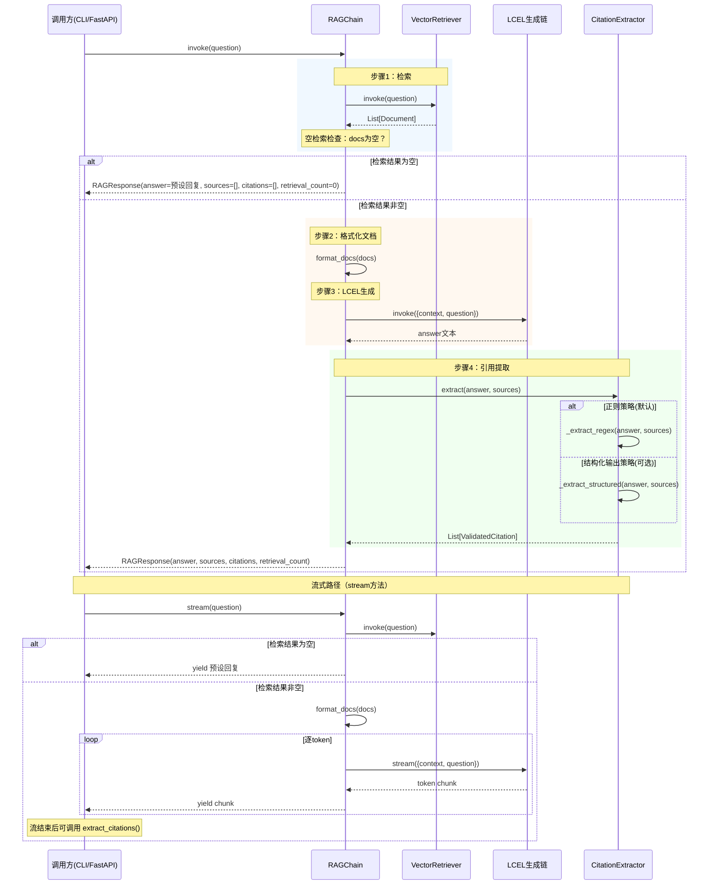

# Task 1.6 基础 RAG Chain（LCEL 实现）— 架构设计

> **原始需求**：`.project_outline/phase_1_reliable_base/task_1.6_rag_chain.md`
> **涉及文件**：`src/generation/rag_chain.py`、`src/generation/citation_chain.py`、`src/generation/__init__.py`、`tests/test_rag_chain.py`、`tests/test_citation_chain.py`

---

## 架构决策与权衡

### 决策 1：LCEL Chain 的编排粒度

- **选项 A**：单一管道 `retriever | format_docs | prompt | llm | parser`（全量 LCEL）
  - 优点：展示 LCEL 组合能力，代码简洁，一行搞定
  - 缺点：无法在检索和生成之间插入空检索拦截；无法在生成后提取引用；流式时无法获取中间结果（文档列表）
- **选项 B**：生成步骤用 LCEL（`prompt | llm | parser`），编排逻辑由 RAGChain 类方法控制
  - 优点：可在检索后拦截空结果、在生成后提取引用、流式和同步路径清晰分离
  - 缺点：不是"纯管道"风格，编排逻辑分散在方法中
- **选项 C**：使用 `RunnableBranch` / `RunnableLambda` 在管道中处理空检索拦截
  - 优点：保持纯 LCEL 风格
  - 缺点：RunnableBranch 语法复杂，空检索返回预设响应的类型与正常路径不一致，可读性差
- **结论**：选 B。生产级 RAG 需要在管道的多个位置插入拦截逻辑（空检索、异常、引用提取），强行塞入单一 LCEL 管道会导致代码可读性下降。生成步骤仍用 LCEL 组合（展示 Runnable 协议知识），编排由类方法控制（展示工程化思维）。LCEL 是工具而非教条

### 决策 2：引用提取的策略选择

- **选项 A**：仅正则解析 — 简单可靠，无额外 LLM 调用，但不展示 `with_structured_output` 知识点
- **选项 B**：仅结构化输出 — 精确但依赖模型 Function Calling，无法流式输出
- **选项 C**：双策略（正则为主，结构化输出为可选增强）
  - 默认使用正则解析从已生成的回答文本中提取引用标记和 URL
  - 可选启用 `with_structured_output` 让 LLM 直接返回结构化引用数据（作为独立知识演示）
  - 正则解析不消耗额外 LLM 调用，且 Prompt 已通过 few-shot 示例规定了引用格式，正则提取足够可靠
- **结论**：选 C。正则为主保证生产级效率（零额外 LLM 开销），结构化输出作为可选策略覆盖面试知识点。CitationExtractor 通过策略模式在两种方案间切换

### 决策 3：自定义异常的放置位置

- **选项 A**：定义在 `src/core/exceptions.py` — 集中管理，符合全局异常体系
- **选项 B**：定义在 `src/generation/rag_chain.py` — 就近原则，Task 1.7 才创建 `src/core/exceptions.py`
- **选项 C**：在 `src/generation/exceptions.py` 中定义生成模块专用异常 — 模块自治，Task 1.7 迁移公共部分
- **结论**：选 C。Task 1.6 的异常（`GenerationError`、`LLMCallError`）是生成模块专属的，放在 generation 子包内符合模块自治原则。Task 1.7 创建 `src/core/exceptions.py` 时，可将 `RetrievalError`（已在 retriever 中）和 `GenerationError` 的公共基类迁移到 core 中统一管理（在 TODO 中标注）

### 决策 4：流式输出与引用提取的关系

- **选项 A**：流式输出包含引用提取 — 流结束后追加引用验证结果
  - 优点：调用方一次调用获得完整信息
  - 缺点：流式场景下引用需等待全文本生成完毕后才能提取，API 设计复杂
- **选项 B**：流式输出仅返回文本 token 流，引用提取由调用方在流结束后单独触发
  - 优点：流式 API 简洁（`stream()` 返回 `Iterator[str]`），符合 FastAPI SSE 场景
  - 缺点：调用方需自己协调两步
- **结论**：选 B。流式场景的首要目标是低延迟（逐 token 推送），引用提取必须等全文本完成才有意义。将两者分离：`invoke()` 返回完整 `RAGResponse`（含引用），`stream()` 仅返回文本流。这是 FastAPI SSE 的标准做法

### 决策 5：format_docs 的文档格式

- **选项 A**：纯文本拼接 `doc1.content\n\n---\n\ndoc2.content`
- **选项 B**：带编号和来源的格式 `[1] content (source: URL)`
- **结论**：选 B。格式必须与 Prompt V2 的 few-shot 示例保持一致（few-shot 示例中就是 `[N] content (source: URL)` 格式），这样 LLM 才能正确模仿引用格式。编号对应引用标记 [1] [2]，source URL 便于 LLM 在回答末尾列出来源

---

## 模块结构

### 文件组织
```
src/generation/
├── __init__.py            # 更新公共导出（新增 RAGChain, CitationExtractor, RAGResponse 等）
├── prompts.py             # [已有] Prompt 模板定义（Task 1.5）
├── rag_chain.py           # [新建] RAG 问答链：LCEL 组合 + 空检索拦截 + 流式支持
├── citation_chain.py      # [新建] 引用提取与验证：正则解析 + 结构化输出（可选）
└── exceptions.py          # [新建] 生成模块专用异常

tests/
├── test_rag_chain.py      # [新建] RAG Chain 单元测试
└── test_citation_chain.py # [新建] 引用提取单元测试
```

### 依赖关系
```
src/generation/rag_chain.py
├── langchain_core.runnables    # RunnablePassthrough, RunnableLambda, RunnableParallel
├── langchain_core.output_parsers  # StrOutputParser
├── langchain_core.documents    # Document（类型注解）
├── structlog                   # 结构化日志
├── src.retriever.base_retriever  # VectorRetriever, create_vector_retriever, RetrievalError
├── src.generation.prompts        # get_prompt, PromptVersion
├── src.generation.citation_chain # CitationExtractor, ValidatedCitation
└── src.generation.exceptions     # GenerationError, LLMCallError, EmptyRetrievalError

src/generation/citation_chain.py
├── re                           # 正则表达式
├── dataclasses                  # dataclass 装饰器
├── typing                       # List, Optional
├── pydantic                     # BaseModel（结构化输出的 schema 定义）
├── langchain_core.language_models  # BaseChatModel（类型注解）
└── src.generation.exceptions     # CitationExtractionError

src/generation/exceptions.py
└── （无外部依赖，纯异常类定义）
```

### 职责边界
```
src/generation/rag_chain.py 职责：
✅ 包含：format_docs 文档格式化、RAGChain 类（invoke/stream/ainvoke）、RAGResponse 数据结构
✅ 包含：LCEL 生成链的组装（prompt | llm | parser）
✅ 包含：空检索拦截逻辑、LLM 调用异常包装
❌ 不包含：Prompt 模板定义（属于 prompts.py）
❌ 不包含：引用提取逻辑（属于 citation_chain.py）
❌ 不包含：重试机制（属于 Task 1.7 retry.py）

src/generation/citation_chain.py 职责：
✅ 包含：Citation/ValidatedCitation 数据结构、CitationExtractor 类
✅ 包含：正则提取策略（_extract_regex）、结构化输出策略（_extract_structured）
✅ 包含：引用验证逻辑（URL 是否存在于检索结果源列表中）
❌ 不包含：RAG 链编排（属于 rag_chain.py）
❌ 不包含：LLM 调用（仅结构化输出策略使用 llm.with_structured_output，非完整调用）

src/generation/exceptions.py 职责：
✅ 包含：GenerationError 基类、LLMCallError、EmptyRetrievalError、CitationExtractionError
❌ 不包含：检索相关异常（属于 retriever/base_retriever.py 的 RetrievalError）
❌ 不包含：重试相关异常（属于 Task 1.7）
```

---

## 核心接口设计

### 1. GenerationError 异常体系（exceptions.py）

```python
class GenerationError(Exception):
    """生成模块异常基类。

    设计意图：
        为所有生成相关异常提供统一基类，上层调用方只需
        `except GenerationError` 即可捕获所有生成错误。
        异常消息始终包含上下文信息（如问题文本截断、原始错误详情），
        便于日志追踪和用户提示。

    为什么不直接用 Exception：
        细化异常类型可让调用方区分"空检索"（应返回预设回复）
        和"LLM 崩溃"（应重试或报错），采取不同恢复策略。
    """
    pass


class LLMCallError(GenerationError):
    """LLM API 调用失败时抛出。

    触发场景：网络超时、API Key 无效、Rate Limit 超限、模型返回错误。
    包装底层 openai.APIError / httpx.HTTPError 等，调用方无需了解底层 SDK 细节。

    Attributes:
        original_error: 被包装的原始异常对象，保留完整堆栈信息
    """
    def __init__(self, message: str, original_error: Optional[Exception] = None):
        super().__init__(message)
        self.original_error = original_error


class EmptyRetrievalError(GenerationError):
    """检索返回空文档列表时抛出（可选，由 RAGChain 配置决定）。

    触发场景：用户问题与向量库中的所有文档都不相关。
    RAGChain 默认不抛出此异常（直接返回预设回复），但可配置为抛出，
    供上层（如 LangGraph 节点）做路由决策。
    """
    pass


class CitationExtractionError(GenerationError):
    """引用提取失败时抛出。

    触发场景：结构化输出解析失败、正则匹配异常。
    此异常不应中断主流程——即使引用提取失败，回答文本仍然有效。
    RAGChain 应捕获此异常并返回不含引用验证的 RAGResponse。
    """
    pass
```

### 2. format_docs 函数（rag_chain.py）

```python
def format_docs(docs: List[Document]) -> str:
    """将检索到的文档列表格式化为带编号和来源的上下文字符串。

    设计意图：
        输出格式严格与 Prompt V2 的 few-shot 示例保持一致：
        [1] Document content (source: URL)
        [2] Document content (source: URL)
        这样 LLM 才能正确模仿引用格式，在回答中使用 [1] [2] 标记
        并在末尾列出对应 URL。

    为什么用编号而非纯拼接：
        编号 [1] [2] 建立了文档片段与引用标记的一一对应关系，
        LLM 可以用 [N] 精确引用第 N 个文档，而非模糊引用"某段文档"。

    为什么来源 URL 写在每段后面而非集中列在末尾：
        LLM 的注意力机制对距离近的信息遵从度更高，
        将 source 紧跟在内容之后，LLM 更容易准确引用。

    Args:
        docs: 检索器返回的文档列表，每个文档需包含 metadata["source"] 字段。
            若某文档缺少 source 元数据，使用 "unknown" 占位。

    Returns:
        格式化后的字符串，文档间以双换行分隔。

    注意：
        空列表返回空字符串 ""，RAGChain 的空检索拦截逻辑
        会在调用此函数之前检查 docs 是否为空。
    """
```

### 3. RAGResponse 数据结构（rag_chain.py）

```python
@dataclass
class RAGResponse:
    """RAG 链的完整响应数据。

    设计意图：
        将回答文本、来源 URL、引用验证结果封装为统一数据结构，
        调用方（CLI/FastAPI/LangGraph 节点）只需处理一个对象，
        无需从回答文本中自行提取引用信息。

    Attributes:
        answer: LLM 生成的回答文本（含行内引用标记 [1] [2] 等）
        sources: 检索命中的文档 source URL 列表（来自 Document.metadata["source"]），
            长度 = 检索到的文档数量，用于验证引用 URL 的真实性
        citations: 引用验证结果列表，每个元素包含编号、URL、是否有效。
            若引用提取失败（CitationExtractionError），此字段为空列表
        retrieval_count: 检索到的文档数量，便于日志和统计
    """
    answer: str
    sources: List[str]
    citations: List[ValidatedCitation]
    retrieval_count: int
```

### 4. RAGChain 类（rag_chain.py）

```python
class RAGChain:
    """生产级 RAG 问答链，封装检索→拦截→生成→引用提取的完整管道。

    设计意图：
        提供简洁的 invoke/stream/ainvoke 接口，隐藏 LCEL 组合细节、
        空检索拦截、异常包装、引用提取等工程逻辑。
        调用方只需：chain = RAGChain.create(); result = chain.invoke("问题")

    为什么用类而非函数：
        1. RAGChain 持有 retriever、llm、prompt、citation_extractor 等依赖，
           这些依赖只需初始化一次，后续多次调用共享
        2. 类方法可方便地切换同步/异步/流式调用模式
        3. 便于 Task 2.2 的 LangGraph 生成节点封装为节点函数

    LCEL 在哪里：
        self._generation_chain = self._prompt | self._llm | StrOutputParser()
        生成步骤使用 LCEL 组合，展示 Runnable 协议知识。
        检索步骤不在 LCEL 管道中（决策1），因为需要在检索后插入空检索拦截。

    Args:
        retriever: 向量检索器实例（VectorRetriever 或任何兼容 Runnable 的检索器）
        llm: Chat 模型实例（需支持 .invoke() 和 .stream()）
        prompt: ChatPromptTemplate 实例（由 get_prompt() 工厂函数生成）
        citation_extractor: 引用提取器实例（默认 CitationExtractor）
        empty_retrieval_response: 空检索时的预设回复文本

    Raises:
        LLMCallError: LLM 调用失败时（网络错误、Rate Limit 等）
        EmptyRetrievalError: 检索返回空结果且 raise_on_empty=True 时
    """

    EMPTY_RETRIEVAL_RESPONSE: ClassVar[str] = (
        "抱歉，我在文档库中未找到与您问题相关的内容。"
        "请尝试换个方式提问，或确认您的问题与文档主题相关。"
    )
    """空检索预设回复。为什么不用"根据现有文档，我无法回答该问题"：
        那是 LLM 回答"文档不足"的措辞，空检索是"连文档都没有"的场景，
        需要更明确地告知用户检索阶段就没找到任何内容。"""

    def __init__(
        self,
        retriever: VectorStoreRetriever,
        llm: BaseChatModel,
        prompt: ChatPromptTemplate,
        citation_extractor: Optional[CitationExtractor] = None,
        empty_retrieval_response: str = EMPTY_RETRIEVAL_RESPONSE,
    ): ...

    def invoke(self, question: str) -> RAGResponse:
        """同步调用完整 RAG 管道：检索 → 空检索拦截 → 生成 → 引用提取。"""
        ...

    def stream(self, question: str) -> Iterator[str]:
        """流式生成：检索 → 空检索拦截 → 逐 token 返回文本流。

        注意：流式模式不包含引用提取，调用方需在流结束后
        单独调用 extract_citations 方法（如果需要验证引用）。
        这是刻意的设计：流式场景的首要目标是低延迟推送，
        引用提取必须等全文本生成完毕才能执行。
        """
        ...

    async def ainvoke(self, question: str) -> RAGResponse:
        """异步调用完整 RAG 管道（为 FastAPI 准备）。

        TODO: Task 4.5 异步优化时实现完整异步链路
        """
        ...

    def retrieve(self, question: str) -> List[Document]:
        """仅执行检索步骤，返回文档列表（供 LangGraph 检索节点复用）。

        为什么暴露此方法：
            Task 2.2 的检索节点需要单独调用检索逻辑，
            不需要走完整的 RAG 管道。
            暴露 retrieve 方法避免 LangGraph 节点重新实例化检索器。
        """
        ...

    def extract_citations(
        self, answer: str, sources: List[str]
    ) -> List[ValidatedCitation]:
        """从已生成的回答文本中提取并验证引用（供流式场景后置调用）。"""
        ...

    @classmethod
    def create(
        cls,
        persist_directory: str = "db/langchain_docs_db1",
        collection_name: str = "langchain_docs1",
        search_type: str = "similarity",
        search_kwargs: Optional[Dict[str, Any]] = None,
        prompt_version: PromptVersion = PromptVersion.V2,
        include_few_shot: bool = True,
        include_chat_history: bool = False,
    ) -> "RAGChain":
        """工厂方法：使用默认配置创建 RAGChain 实例。

        设计意图：
            封装 retriever 和 llm 的创建细节，调用方无需了解
            向量库路径、嵌入模型配置、LLM API Key 等底层参数。
            适用于 CLI 和简单脚本场景。

        为什么用类方法而非独立函数：
            1. 命名空间归属清晰：RAGChain.create() 比 create_rag_chain() 更直观
            2. 子类可覆盖 create 方法实现不同的默认配置
            3. 与 LangChain 的 ChatModel.init_chat_model() 风格一致

        Args:
            persist_directory: Chroma 数据目录
            collection_name: Chroma 集合名称
            search_type: 检索类型（similarity / mmr / similarity_score_threshold）
            search_kwargs: 检索参数（k, score_threshold 等）
            prompt_version: Prompt 版本（V1 基础版 / V2 增强版）
            include_few_shot: 是否包含 few-shot 示例（仅 V2 有效）
            include_chat_history: 是否包含对话历史占位符（Task 2.5 预留）

        Returns:
            配置好的 RAGChain 实例
        """
        ...
```

### 5. Citation / ValidatedCitation 数据结构（citation_chain.py）

```python
@dataclass
class Citation:
    """单个引用信息。

    Attributes:
        number: 引用编号，对应回答文本中的 [N] 标记
        url: 引用指向的文档 URL
    """
    number: int
    url: str


@dataclass
class ValidatedCitation(Citation):
    """带验证结果的引用。

    Attributes:
        is_valid: URL 是否存在于检索结果的 source 列表中。
            True = 引用的 URL 确实来自检索到的文档（可信）
            False = URL 不在检索结果中（可能是 LLM 幻觉产生的）
    """
    is_valid: bool
```

### 6. CitationExtractor 类（citation_chain.py）

```python
class CitationExtractor:
    """引用提取与验证器，支持正则解析和结构化输出两种策略。

    设计意图：
        策略模式：默认使用正则解析（快速、零额外开销），
        可选启用结构化输出（精确、但需额外 LLM 调用且不支持流式）。
        两种策略产出相同的数据结构（List[ValidatedCitation]），
        调用方无需关心内部使用哪种策略。

    为什么正则是默认策略：
        1. Prompt V2 + few-shot 已明确规定引用格式，LLM 遵从度较高
        2. 正则提取零额外 LLM 调用开销，延迟几乎为零
        3. 结构化输出需要 Function Calling 支持，不同模型兼容性不一致
        4. 生产级系统中，效率优先于完美精度

    Args:
        llm: Chat 模型实例（仅结构化输出策略使用，正则策略不需要）
        use_structured_output: 是否优先使用结构化输出策略。
            True 时先尝试 with_structured_output，失败则回退到正则。
            False 时直接使用正则。默认 False。
    """

    # 正则模式：匹配 [N] URL 格式的引用
    # 为什么用这个模式：
    #   Prompt V2 的来源格式要求为 "[N] URL"（每行一个），
    #   此正则匹配 "来源" 或 "Sources" 标题之后、每行的 [数字] URL 结构。
    #   使用 re.MULTILINE 确保 ^ 匹配每行开头。
    CITATION_PATTERN: ClassVar[str] = r"\[(\d+)\]\s*(https?://\S+)"

    def __init__(
        self,
        llm: Optional[BaseChatModel] = None,
        use_structured_output: bool = False,
    ): ...

    def extract(
        self, answer: str, sources: List[str]
    ) -> List[ValidatedCitation]:
        """从回答文本中提取引用并验证。

        Args:
            answer: LLM 生成的回答文本（含 [N] 引用标记和来源列表）
            sources: 检索命中的文档 source URL 列表，用于验证引用真实性

        Returns:
            验证后的引用列表。若提取失败返回空列表（不抛异常）。
        """
        ...

    def _extract_regex(
        self, answer: str, sources: List[str]
    ) -> List[ValidatedCitation]:
        """正则提取策略：从回答文本中匹配 [N] URL 模式。"""
        ...

    def _extract_structured(
        self, answer: str, sources: List[str]
    ) -> List[ValidatedCitation]:
        """结构化输出策略：使用 llm.with_structured_output 提取引用。

        实现方式：
            1. 定义 Pydantic 模型 CitationList（字段：citations: List[CitationItem]）
            2. 调用 self._llm.with_structured_output(CitationList) 创建结构化链
            3. 使用提取 Prompt 将回答文本送入结构化链
            4. 如果模型不支持 Function Calling（抛出 NotImplementedError），
               回退到 _extract_regex

        为什么不在主 RAG 链中使用 with_structured_output：
            结构化输出要求 LLM 返回 JSON 而非自由文本，
            与流式输出不兼容（JSON 无法逐 token 流式传输）。
            因此结构化输出仅作为引用提取的可选增强策略。
        """
        ...
```

### 7. 结构化输出的 Pydantic Schema（citation_chain.py）

```python
class CitationItem(BaseModel):
    """单个引用条目（结构化输出的 schema 定义）。"""
    number: int = Field(description="引用编号，对应回答中的 [N] 标记")
    url: str = Field(description="引用的文档 URL")


class CitationList(BaseModel):
    """引用列表（结构化输出的顶层 schema）。"""
    citations: List[CitationItem] = Field(description="从回答中提取的所有引用")
```

---

## 交互时序图



---

## 代码骨架

### src/generation/exceptions.py

```python
"""生成模块异常定义。

设计意图：
    定义生成模块的专用异常体系，将底层 LLM SDK 异常（openai.APIError、
    httpx.HTTPError 等）转换为语义明确的业务异常，上层调用方只需
    捕获 GenerationError 基类即可处理所有生成相关错误。

与检索模块异常的关系：
    retriever/base_retriever.py 定义了 RetrievalError 和 UnsupportedSearchTypeError，
    当前生成模块异常与检索模块异常互相独立。
    Task 1.7 创建 src/core/exceptions.py 时，可提取公共基类 RAGSystemError，
    让 GenerationError 和 RetrievalError 都继承自它。

TODO(Task 1.7): 将公共异常基类迁移到 src/core/exceptions.py
"""

from typing import Optional


class GenerationError(Exception):
    """生成模块异常基类。

    为什么需要自定义基类：
        1. 上层调用方只需 except GenerationError 即可统一处理
        2. 可在基类中添加通用行为（如错误码映射、上下文信息格式化）
        3. 便于 LangGraph 节点按异常类型做路由决策

    所有子类异常的 message 应包含：
        - 发生错误的上下文（如问题文本截断）
        - 原始错误信息（如 API 返回的 error message）
    """

    pass


class LLMCallError(GenerationError):
    """LLM API 调用失败时抛出。

    触发场景：
        - 网络超时（openai.APITimeoutError）
        - API Key 无效（openai.AuthenticationError）
        - Rate Limit 超限（openai.RateLimitError）
        - 服务器错误（openai.APIStatusError with 5xx）
        - 连接失败（httpx.ConnectError）

    为什么包装而非直接抛出底层异常：
        1. 调用方不应依赖特定 SDK 的异常类型（依赖倒置）
        2. 切换 LLM 提供商（DeepSeek → Qwen）时无需修改上层代码
        3. 可在包装时附加上下文信息（问题文本、重试次数等）

    Attributes:
        original_error: 被包装的原始异常对象，保留完整堆栈信息，
            便于调试时追溯底层原因
    """

    def __init__(
        self, message: str, original_error: Optional[Exception] = None
    ):
        # 第1步：调用父类初始化，传入完整错误消息
        # 第2步：保存原始异常引用，便于日志记录和调试追溯
        super().__init__(message)
        self.original_error = original_error


class EmptyRetrievalError(GenerationError):
    """检索返回空文档列表时抛出（可选）。

    触发场景：
        用户问题与向量库中的所有文档都不相关，检索器返回空列表。

    为什么是可选异常：
        RAGChain 默认行为是返回预设回复（不抛异常），因为空检索
        是合法的业务场景（用户问了文档范围外的问题）。
        但在某些场景下（如 LangGraph 路由），上层需要知道检索为空
        以走不同的分支（如调用网络搜索工具），
        此时可通过 raise_on_empty=True 配置启用此异常。

    使用方式：
        RAGChain(retriever=..., raise_on_empty=False)  # 默认：返回预设回复
        RAGChain(retriever=..., raise_on_empty=True)   # 抛出 EmptyRetrievalError
    """

    pass


class CitationExtractionError(GenerationError):
    """引用提取失败时抛出。

    触发场景：
        - 结构化输出解析失败（模型返回的 JSON 不符合 schema）
        - 正则匹配异常（answer 文本格式严重偏离预期）

    为什么不应中断主流程：
        引用提取是增强功能，回答文本本身仍然有效。
        RAGChain 在调用 CitationExtractor 时应捕获此异常，
        返回 citations=[] 的 RAGResponse，而非让整个请求失败。
    """

    pass
```

### src/generation/citation_chain.py

```python
"""引用提取与验证模块。

本模块负责从 LLM 生成的回答文本中提取引用信息并验证其真实性，
支持正则解析（默认）和结构化输出（可选）两种策略。

核心设计：
1. **策略模式**：CitationExtractor 根据配置选择正则或结构化输出策略，
   两种策略产出统一的 List[ValidatedCitation]，调用方无需关心内部实现。

2. **验证机制**：提取的 URL 与检索结果的 source 列表做精确匹配，
   标记 is_valid=True/False，帮助调用方识别 LLM 幻觉产生的虚假引用。

3. **结构化输出知识演示**：_extract_structured 方法展示了
   with_structured_output 的用法，这是面试重点知识点。
   但作为默认策略过于重量级（额外 LLM 调用），正则解析是生产级首选。
"""

import re
from dataclasses import dataclass
from typing import ClassVar, List, Optional

import structlog
from langchain_core.language_models import BaseChatModel
from pydantic import BaseModel, Field

from .exceptions import CitationExtractionError

logger = structlog.get_logger(__name__)


# ============================================================
# 数据结构
# ============================================================

@dataclass
class Citation:
    """单个引用信息。

    Attributes:
        number: 引用编号，对应回答文本中的 [N] 标记
        url: 引用指向的文档 URL
    """
    number: int
    url: str


@dataclass
class ValidatedCitation(Citation):
    """带验证结果的引用。

    Attributes:
        is_valid: URL 是否存在于检索结果的 source 列表中。
            True = 引用的 URL 确实来自检索到的文档（可信引用）
            False = URL 不在检索结果中（可能是 LLM 幻觉产生的虚假引用）
    """
    is_valid: bool


# ============================================================
# 结构化输出的 Pydantic Schema
# ============================================================

class CitationItem(BaseModel):
    """单个引用条目（结构化输出的 schema 定义）。

    为什么用 Pydantic 而非 dataclass：
        with_structured_output 要求传入 Pydantic BaseModel，
        LangChain 内部使用 Pydantic 的 JSON Schema 生成 Function Calling 的
        parameters 定义。dataclass 不支持此功能。
    """
    number: int = Field(description="引用编号，对应回答中的 [N] 标记")
    url: str = Field(description="引用的文档 URL")


class CitationList(BaseModel):
    """引用列表（结构化输出的顶层 schema）。

    为什么需要顶层容器：
        with_structured_output 返回的是单个 Pydantic 对象，
        不能直接返回 List。需要一个包含列表字段的容器类。
    """
    citations: List[CitationItem] = Field(description="从回答中提取的所有引用")


# ============================================================
# 引用提取 Prompt（结构化输出策略专用）
# ============================================================

CITATION_EXTRACTION_PROMPT = """从以下回答文本中提取所有引用信息。

回答文本：
{answer}

请提取文本中所有 [N] URL 格式的引用，返回每个引用的编号和URL。"""


# ============================================================
# CitationExtractor 类
# ============================================================

class CitationExtractor:
    """引用提取与验证器，支持正则解析和结构化输出两种策略。

    策略选择逻辑：
        use_structured_output=False（默认）→ 直接调用 _extract_regex
        use_structured_output=True → 先尝试 _extract_structured，
            若模型不支持 Function Calling（抛出 NotImplementedError），
            则回退到 _extract_regex 并记录 warning 日志

    Args:
        llm: Chat 模型实例（仅结构化输出策略需要，正则策略可传 None）
        use_structured_output: 是否优先使用结构化输出策略，默认 False
    """

    # 正则模式：匹配 [N] URL 格式的引用
    # 具体做法：
    #   \[(\d+)\]    匹配 [1] [2] 等编号，捕获数字
    #   \s*           匹配编号和 URL 之间可能的空白
    #   (https?://\S+) 匹配以 http:// 或 https:// 开头的 URL，\S+ 匹配非空白字符
    # 为什么不用更复杂的正则：
    #   Prompt 规定的格式很规范（[N] URL 每行一个），
    #   过于复杂的正则反而容易误匹配回答正文中的 [N] 标记
    #   （正文中 [1] 后面通常是中文文字而非 URL）
    CITATION_PATTERN: ClassVar[str] = r"\[(\d+)\]\s*(https?://\S+)"

    def __init__(
        self,
        llm: Optional[BaseChatModel] = None,
        use_structured_output: bool = False,
    ):
        # 第1步：保存 llm 引用（结构化输出策略使用）
        # 第2步：保存策略配置
        # 第3步：如果启用结构化输出但未提供 llm，记录 warning 并回退到正则策略
        #   为什么不抛异常：正则策略已足够可靠，结构化输出是增强而非必需
        ...

    def extract(
        self, answer: str, sources: List[str]
    ) -> List[ValidatedCitation]:
        """从回答文本中提取引用并验证。

        为什么提取失败返回空列表而非抛异常：
            引用提取是增强功能，不应中断主流程。
            调用方（RAGChain）在捕获 CitationExtractionError 后
            也会返回 citations=[] 的 RAGResponse。

        Args:
            answer: LLM 生成的回答文本
            sources: 检索命中的文档 source URL 列表

        Returns:
            验证后的引用列表。提取失败返回空列表。
        """
        # 第1步：边界处理 — answer 为空 → 返回空列表
        # 第2步：根据策略选择提取方法
        #   use_structured_output=True → 调用 _extract_structured，失败回退 _extract_regex
        #   use_structured_output=False → 直接调用 _extract_regex
        # 第3步：记录日志（提取到的引用数量、验证通过数量）
        # 第4步：返回验证后的引用列表
        ...

    def _extract_regex(
        self, answer: str, sources: List[str]
    ) -> List[ValidatedCitation]:
        """正则提取策略。

        具体做法：
            1. 使用 self.CITATION_PATTERN 对 answer 进行 findall
               → 得到 List[Tuple[str, str]]，每个元素是 (编号, URL)
            2. URL 清理：rstrip(")") rstrip(".") 去除尾部可能被误捕获的标点
               为什么：正则 \S+ 会捕获 URL 末尾紧跟的 ) 或 .
               如 "https://example.com/)" 中的右括号
            3. 构建 ValidatedCitation：
               number = int(编号), url = 清理后的 URL,
               is_valid = url in sources_set（sources 预先转为集合做 O(1) 查找）
            4. 去重：同一 (number, url) 只保留第一个
               为什么需要去重：LLM 可能在回答正文中和来源列表中
               各出现一次 [1] URL，正则会匹配到两次
            5. 按 number 排序后返回

        Args:
            answer: LLM 生成的回答文本
            sources: 检索结果 source URL 列表

        Returns:
            验证后的引用列表
        """
        # 第1步：将 sources 转为集合，O(1) 查找
        # 第2步：re.findall(self.CITATION_PATTERN, answer)
        # 第3步：遍历匹配结果，清理 URL、构建 ValidatedCitation、去重
        # 第4步：按 number 排序
        # 第5步：记录日志
        ...

    def _extract_structured(
        self, answer: str, sources: List[str]
    ) -> List[ValidatedCitation]:
        """结构化输出策略（可选增强）。

        具体做法：
            1. 用 self._llm.with_structured_output(CitationList) 创建结构化链
               为什么用 with_structured_output：
                   让 LLM 返回符合 CitationList schema 的 JSON 对象，
                   LangChain 内部自动将 schema 转为 Function Calling 的
                   parameters 定义，解析返回的 JSON 为 Pydantic 对象。
            2. 构建提取 Prompt，填入 answer 文本
            3. 调用结构化链的 invoke 方法
            4. 将 CitationList.citations 转为 List[ValidatedCitation]，
               对每个 url 做 is_valid 验证
            5. 异常处理：
               NotImplementedError → 模型不支持 Function Calling，回退到正则
               其他异常 → 包装为 CitationExtractionError 并抛出

        为什么不在主 RAG 链中使用 with_structured_output：
            结构化输出要求 LLM 返回 JSON 而非自由文本，
            与流式输出不兼容（JSON 无法逐 token 流式传输）。
            因此结构化输出仅用于引用提取（后处理步骤），
            不用于主链的回答生成。

        Args:
            answer: LLM 生成的回答文本
            sources: 检索结果 source URL 列表

        Returns:
            验证后的引用列表

        Raises:
            CitationExtractionError: 结构化输出解析失败时
        """
        # 第1步：边界检查 — self._llm 为 None → 回退到 _extract_regex 并记录 warning
        # 第2步：创建结构化链 structured_llm = self._llm.with_structured_output(CitationList)
        # 第3步：构建提取 Prompt，填入 answer
        # 第4步：调用 structured_llm.invoke(prompt_text)
        # 第5步：将 CitationList → List[ValidatedCitation]（含 is_valid 验证）
        # 第6步：异常处理 — NotImplementedError → 回退正则，其他 → CitationExtractionError
        ...

    def _validate_url(self, url: str, sources_set: set) -> bool:
        """验证 URL 是否存在于检索结果的 source 集合中。

        为什么需要验证：
            LLM 可能产生"幻觉引用"——引用了文档库中不存在的 URL。
            验证后的 is_valid 字段帮助调用方区分真实引用和幻觉引用。

        验证方式：
            精确匹配（url in sources_set）。
            为什么不做模糊匹配（如域名匹配、路径前缀匹配）：
                当前文档库的 source URL 是完整路径，LLM 通常完整复制，
                精确匹配即可。若后续出现 URL 格式不一致问题，
                可升级为归一化匹配（去除尾部斜杠、统一 http/https）。

        Args:
            url: 待验证的 URL
            sources_set: 检索结果 source URL 集合

        Returns:
            True = URL 存在于检索结果中
        """
        # 直接返回 url in sources_set
        ...
```

### src/generation/rag_chain.py

```python
"""RAG 问答链模块：LCEL 组合 + 空检索拦截 + 流式支持。

本模块是 RAG 系统的核心编排层，将检索器、Prompt 模板、LLM、
输出解析器和引用提取器组装为端到端的问答管道。

核心设计：
1. **LCEL 生成链**：使用 LCEL 的 | 操作符组合 prompt → llm → StrOutputParser，
   展示 Runnable 协议的链式调用能力（RunnablePassthrough、RunnableLambda、
   RunnableParallel 等组件在 format_docs 和 Chain 组装中体现）。

2. **类方法编排**：检索→拦截→生成→引用提取的完整流程由 RAGChain 类方法控制，
   而非塞入单一 LCEL 管道（决策1），因为需要在多个位置插入拦截逻辑。

3. **流式支持**：stream() 方法逐 token 推送文本，为 Task 5.2 FastAPI SSE 做准备。

4. **空检索拦截**：检索返回空文档时直接返回预设回复，不调用 LLM（节省开销）。

使用示例：
    # 快速启动
    chain = RAGChain.create()
    result = chain.invoke("LangGraph 是什么？")
    print(result.answer)
    print(result.citations)

    # 流式输出
    for chunk in chain.stream("LangGraph 是什么？"):
        print(chunk, end="", flush=True)

    # 自定义配置
    from src.retriever import create_vector_retriever
    from src.generation.prompts import get_prompt, PromptVersion
    from src.core.config import deepseek_llm

    retriever = create_vector_retriever(search_kwargs={"k": 3})
    prompt = get_prompt(PromptVersion.V1)
    chain = RAGChain(retriever=retriever, llm=deepseek_llm, prompt=prompt)
"""

import time
from dataclasses import dataclass
from typing import Any, ClassVar, Dict, Iterator, List, Optional

import structlog
from langchain_core.documents import Document
from langchain_core.language_models import BaseChatModel
from langchain_core.output_parsers import StrOutputParser
from langchain_core.prompts import ChatPromptTemplate
from langchain_core.runnables import RunnableLambda, RunnableParallel, RunnablePassthrough
from langchain_core.vectorstores import VectorStoreRetriever

from src.core.config import deepseek_llm
from src.generation.citation_chain import CitationExtractor, ValidatedCitation
from src.generation.exceptions import (
    EmptyRetrievalError,
    GenerationError,
    LLMCallError,
)
from src.generation.prompts import PromptVersion, get_prompt
from src.retriever.base_retriever import create_vector_retriever

logger = structlog.get_logger(__name__)


# ============================================================
# format_docs 函数
# ============================================================

def format_docs(docs: List[Document]) -> str:
    """将检索到的文档列表格式化为带编号和来源的上下文字符串。

    输出格式与 Prompt V2 的 few-shot 示例严格一致：
        [1] Document content (source: https://example.com/doc1)

        [2] Document content (source: https://example.com/doc2)

    为什么这样格式化：
        1. 编号 [N] 建立文档与引用标记的一一对应关系，LLM 用 [N] 精确引用
        2. source 紧跟内容，LLM 注意力机制对近距离信息遵从度更高
        3. 双换行分隔，让 LLM 清晰区分不同文档片段

    Args:
        docs: 检索器返回的文档列表。
            每个文档需包含 metadata["source"] 字段。
            若缺少 source，使用 "unknown" 占位。

    Returns:
        格式化后的字符串。空列表返回 ""。
    """
    # 第1步：边界处理 — docs 为空 → 返回 ""
    # 第2步：遍历 docs（enumerate 从 1 开始），格式化为 "[N] content (source: URL)"
    #   - content = doc.page_content（文档文本内容）
    #   - source = doc.metadata.get("source", "unknown")
    #   - 若 page_content 为空字符串，跳过该文档（避免产生 "[N]  (source: URL)" 这种空洞条目）
    # 第3步：用 "\n\n" join 所有格式化后的条目
    # 第4步：记录日志（格式化文档数量、总字符数）
    ...


# ============================================================
# RAGResponse 数据结构
# ============================================================

@dataclass
class RAGResponse:
    """RAG 链的完整响应数据。

    设计意图：
        将回答文本、来源 URL、引用验证结果封装为统一数据结构，
        调用方（CLI/FastAPI/LangGraph 节点）只需处理一个对象。

    为什么用 dataclass 而非 Pydantic BaseModel：
        RAGResponse 是内部数据传输对象，不需要 JSON 序列化/校验。
        dataclass 更轻量，且与 LangChain Document 风格一致。
        若 Task 5.1 FastAPI 需要返回 JSON，可添加一个 to_dict() 方法。

    Attributes:
        answer: LLM 生成的回答文本（含行内引用标记 [1] [2] 等）
        sources: 检索命中的文档 source URL 列表
        citations: 引用验证结果列表（提取失败时为空列表）
        retrieval_count: 检索到的文档数量
    """
    answer: str
    sources: List[str]
    citations: List[ValidatedCitation]
    retrieval_count: int

    def to_dict(self) -> Dict[str, Any]:
        """转换为字典（供 FastAPI JSON 序列化使用）。

        为什么需要此方法：
            dataclass 的 dataclasses.asdict() 会递归转换嵌套的 dataclass，
            但 ValidatedCitation 中的 is_valid 等字段需要显式处理。
            自定义 to_dict 确保输出格式稳定可控。

        具体做法：
            返回 {"answer": self.answer, "sources": self.sources,
                  "citations": [{"number": c.number, "url": c.url, "is_valid": c.is_valid} ...],
                  "retrieval_count": self.retrieval_count}
        """
        ...


# ============================================================
# RAGChain 类
# ============================================================

class RAGChain:
    """生产级 RAG 问答链。

    编排流程：invoke(question) →
        1. retriever.invoke(question) → List[Document]
        2. 空检索检查 → docs 为空则返回预设回复
        3. format_docs(docs) → 上下文字符串
        4. (prompt | llm | StrOutputParser()).invoke({context, question}) → answer
        5. citation_extractor.extract(answer, sources) → List[ValidatedCitation]
        6. 封装为 RAGResponse 返回

    流程中每步都有异常处理和日志记录，详见各方法骨架。
    """

    EMPTY_RETRIEVAL_RESPONSE: ClassVar[str] = (
        "抱歉，我在文档库中未找到与您问题相关的内容。"
        "请尝试换个方式提问，或确认您的问题与文档主题相关。"
    )
    """空检索预设回复。

    为什么与 Prompt 中的"幻觉防护"措辞不同：
        Prompt 中的"根据现有文档，我无法回答该问题"是 LLM 在有文档但信息不足时的回答。
        空检索是连文档都没有的场景，需要更明确地告知用户。
        两者的区别类似于"我看了书但没找到答案" vs "我连书都没找到"。
    """

    def __init__(
        self,
        retriever: VectorStoreRetriever,
        llm: BaseChatModel,
        prompt: ChatPromptTemplate,
        citation_extractor: Optional[CitationExtractor] = None,
        empty_retrieval_response: str = EMPTY_RETRIEVAL_RESPONSE,
        raise_on_empty: bool = False,
    ):
        """初始化 RAGChain。

        Args:
            retriever: 向量检索器实例
            llm: Chat 模型实例
            prompt: ChatPromptTemplate 实例
            citation_extractor: 引用提取器，默认创建正则策略的 CitationExtractor()
            empty_retrieval_response: 空检索预设回复文本
            raise_on_empty: 检索为空时是否抛出 EmptyRetrievalError，
                默认 False（返回预设回复）。设 True 时抛异常，供 LangGraph 路由使用。
        """
        # 第1步：保存所有依赖（依赖注入，不在内部创建）
        #   self._retriever = retriever
        #   self._llm = llm
        #   self._prompt = prompt
        #   self._citation_extractor = citation_extractor or CitationExtractor()
        #   self._empty_retrieval_response = empty_retrieval_response
        #   self._raise_on_empty = raise_on_empty

        # 第2步：组装 LCEL 生成链
        #   self._generation_chain = self._prompt | self._llm | StrOutputParser()
        #   为什么只包含 prompt → llm → parser：
        #     不包含 retriever（决策1），因为需要在检索后插入空检索拦截。
        #     不包含 format_docs（在 invoke 方法中显式调用），
        #     因为 format_docs 的输入是 List[Document] 而非 str，
        #     需要在调用前手动转换。
        #   LCEL 组合展示了什么知识点：
        #     - | 操作符将多个 Runnable 串联为管道
        #     - ChatPromptTemplate 是 Runnable，接收 dict 输出 ChatPromptValue
        #     - BaseChatModel 是 Runnable，接收 ChatPromptValue 输出 AIMessage
        #     - StrOutputParser 是 Runnable，接收 AIMessage 输出 str
        #   这三步通过 | 串联，每步的输出类型自动匹配下一步的输入类型

        # 第3步：记录初始化日志
        #   logger.info("RAGChain 初始化完成", prompt_variables=prompt.input_variables, ...)
        ...

    def invoke(self, question: str) -> RAGResponse:
        """同步调用完整 RAG 管道。

        完整流程：
            检索 → 空检索拦截 → 格式化文档 → LCEL 生成 → 引用提取 → 返回 RAGResponse

        Args:
            question: 用户问题（中文）

        Returns:
            RAGResponse 包含回答、来源、引用验证结果

        Raises:
            LLMCallError: LLM 调用失败时（包装底层 API 异常）
            EmptyRetrievalError: raise_on_empty=True 且检索为空时
        """
        # ===== 第1步：检索 =====
        # 为什么这样做：检索是 RAG 的第一步，获取与问题相关的文档片段
        # 具体做法：
        #   调用 self._retriever.invoke(question)
        #   返回 List[Document]
        # 异常处理：
        #   捕获 RetrievalError → 重新包装为 GenerationError 并抛出
        #   为什么不直接传播 RetrievalError：
        #     对上层调用方而言，检索失败也是"生成失败"的一种，
        #     统一用 GenerationError 基类捕获即可。
        # 日志：记录检索耗时、文档数量

        # ===== 第2步：空检索拦截 =====
        # 为什么这样做：检索为空时调用 LLM 没有意义（无上下文的 LLM 会产生幻觉），
        #   直接返回预设回复既节省 API 开销，又保证回答质量
        # 具体做法：
        #   if not docs:
        #       if self._raise_on_empty: raise EmptyRetrievalError(...)
        #       return RAGResponse(answer=self._empty_retrieval_response, sources=[], citations=[], retrieval_count=0)
        # 注意点：即使 raise_on_empty=False 也记录 warning 日志，便于监控检索质量

        # ===== 第3步：格式化文档 =====
        # 为什么这样做：LCEL 生成链需要 {context} 和 {question} 两个变量，
        #   format_docs 将 List[Document] 转为带编号的上下文字符串
        # 具体做法：
        #   context = format_docs(docs)
        #   sources = [doc.metadata.get("source", "") for doc in docs]

        # ===== 第4步：LCEL 生成 =====
        # 为什么这样做：核心生成步骤，Prompt + LLM + 输出解析
        # 具体做法：
        #   调用 self._generation_chain.invoke({"context": context, "question": question})
        #   返回 answer: str
        # 异常处理：
        #   捕获 openai.APIError / openai.APITimeoutError / openai.AuthenticationError
        #   / openai.RateLimitError / httpx.HTTPError → 包装为 LLMCallError
        #   捕获其他 Exception → 包装为 LLMCallError(message=..., original_error=e)
        #   为什么区分 openai 异常和其他异常：
        #     openai 异常有明确的错误码和重试策略（Task 1.7 将使用 tenacity），
        #     其他异常可能是不可恢复的（如序列化错误），需区别对待
        # 日志：记录 LLM 调用耗时、answer 长度

        # ===== 第5步：引用提取 =====
        # 为什么这样做：验证 LLM 生成的引用是否真实存在于检索结果中
        # 具体做法：
        #   citations = self._citation_extractor.extract(answer, sources)
        # 异常处理：
        #   捕获 CitationExtractionError → citations = []（不中断主流程）
        #   记录 warning 日志

        # ===== 第6步：封装返回 =====
        # 为什么这样做：统一数据结构，调用方只需处理 RAGResponse
        # 具体做法：
        #   return RAGResponse(answer=answer, sources=sources, citations=citations, retrieval_count=len(docs))
        # 日志：记录总耗时、引用数量、有效引用数量
        ...

    def stream(self, question: str) -> Iterator[str]:
        """流式生成：逐 token 返回文本流。

        流式 vs 同步的区别：
            invoke() → 等待全文本生成完毕 → 返回完整 RAGResponse
            stream() → 逐 token 推送 → 调用方实时展示（如 CLI 打字效果、SSE 推送）

        为什么流式不包含引用提取：
            引用提取需要完整文本才能执行（正则匹配需看全文），
            流式场景下文本是逐 token 产生的，无法提前提取引用。
            调用方可在流结束后调用 self.extract_citations() 获取引用。

        Args:
            question: 用户问题

        Yields:
            str: 逐 token 的文本片段
        """
        # ===== 第1步：检索 =====
        # 与 invoke 相同：调用 self._retriever.invoke(question)

        # ===== 第2步：空检索拦截 =====
        # if not docs: yield self._empty_retrieval_response; return
        # 为什么用 yield + return 而非直接 return：
        #   yield 使此方法成为生成器函数，调用方通过 for chunk in chain.stream(q) 消费
        #   return 终止生成器

        # ===== 第3步：格式化文档 =====
        # context = format_docs(docs)

        # ===== 第4步：流式生成 =====
        # 为什么这样做：self._generation_chain.stream() 返回 Iterator[str]，
        #   StrOutputParser 在流式模式下逐 token 输出
        # 具体做法：
        #   for chunk in self._generation_chain.stream({"context": context, "question": question}):
        #       yield chunk
        # 异常处理：
        #   捕获异常 → 记录 error 日志 → yield 错误提示文本（如"\n\n[生成失败，请重试]"）
        #   为什么不抛异常：流式场景下调用方已在消费生成器，抛异常难以优雅处理
        ...

    async def ainvoke(self, question: str) -> RAGResponse:
        """异步调用完整 RAG 管道（为 FastAPI 准备）。

        TODO(Task 4.5): 实现完整异步链路，当前先用同步 invoke 的结果包装
        为什么预留此方法：
            FastAPI 的 async def 路由需要异步调用链，
            当前用同步包装满足接口兼容性，Task 4.5 再优化为真异步。
        """
        # 当前实现：直接调用 self.invoke(question)
        # Task 4.5 优化为：await self._generation_chain.ainvoke(...)
        ...

    def retrieve(self, question: str) -> List[Document]:
        """仅执行检索步骤，返回文档列表。

        为什么暴露此方法：
            Task 2.2 的 LangGraph 检索节点只需检索，不需走完整 RAG 管道。
            暴露 retrieve 方法避免 LangGraph 重新实例化检索器。

        Args:
            question: 用户问题

        Returns:
            检索到的文档列表

        Raises:
            GenerationError: 检索失败时（包装 RetrievalError）
        """
        # 调用 self._retriever.invoke(question)
        # 捕获 RetrievalError → 包装为 GenerationError
        ...

    def extract_citations(
        self, answer: str, sources: List[str]
    ) -> List[ValidatedCitation]:
        """从已生成的回答文本中提取并验证引用（供流式场景后置调用）。

        使用场景：
            1. 流式输出结束后，调用方需要验证引用
            2. LangGraph 生成节点需要将引用信息写入状态
            3. 评估模块需要统计引用命中率

        Args:
            answer: LLM 生成的完整回答文本
            sources: 检索结果的 source URL 列表

        Returns:
            验证后的引用列表
        """
        # 调用 self._citation_extractor.extract(answer, sources)
        # 捕获 CitationExtractionError → 返回空列表
        ...

    @classmethod
    def create(
        cls,
        persist_directory: str = "db/langchain_docs_db1",
        collection_name: str = "langchain_docs1",
        search_type: str = "similarity",
        search_kwargs: Optional[Dict[str, Any]] = None,
        prompt_version: PromptVersion = PromptVersion.V2,
        include_few_shot: bool = True,
        include_chat_history: bool = False,
    ) -> "RAGChain":
        """工厂方法：使用默认配置创建 RAGChain 实例。

        封装 retriever、llm、prompt 的创建细节，调用方只需一行代码即可创建链。

        为什么默认使用 V2 + few_shot：
            V2 的跨语言策略和严格引用格式规范配合 few-shot 示例，
            引用格式遵从度最高，适合生产级默认配置。
            V1 作为降级选项，在 V2 出现问题时快速切换。

        Args:
            persist_directory: Chroma 数据目录
            collection_name: Chroma 集合名称
            search_type: 检索类型
            search_kwargs: 检索参数（默认 k=5）
            prompt_version: Prompt 版本
            include_few_shot: 是否包含 few-shot 示例
            include_chat_history: 是否包含对话历史占位符

        Returns:
            配置好的 RAGChain 实例
        """
        # 第1步：创建检索器
        #   retriever = create_vector_retriever(
        #       persist_directory=persist_directory,
        #       collection_name=collection_name,
        #       search_type=search_type,
        #       search_kwargs=search_kwargs,
        #   )
        # 第2步：获取 LLM 实例
        #   llm = deepseek_llm（从 src.core.config 导入）
        # 第3步：创建 Prompt 模板
        #   prompt = get_prompt(prompt_version, include_few_shot=include_few_shot,
        #                       include_chat_history=include_chat_history)
        # 第4步：创建并返回 RAGChain 实例
        #   return cls(retriever=retriever, llm=llm, prompt=prompt)
        ...
```

### src/generation/__init__.py（更新）

```python
"""generation 包 — Prompt 模板、RAG 链与引用提取的统一入口。"""

from .prompts import (
    FEW_SHOT_EXAMPLES,
    PROMPT_REGISTRY,
    SYSTEM_TEMPLATE_V1,
    SYSTEM_TEMPLATE_V2,
    HUMAN_TEMPLATE_V1,
    HUMAN_TEMPLATE_V2,
    PromptVersion,
    get_prompt,
)
from .rag_chain import (
    RAGChain,
    RAGResponse,
    format_docs,
)
from .citation_chain import (
    Citation,
    CitationExtractor,
    ValidatedCitation,
)
from .exceptions import (
    CitationExtractionError,
    EmptyRetrievalError,
    GenerationError,
    LLMCallError,
)

__all__ = [
    # prompts
    "PromptVersion",
    "get_prompt",
    "PROMPT_REGISTRY",
    "FEW_SHOT_EXAMPLES",
    "SYSTEM_TEMPLATE_V1",
    "SYSTEM_TEMPLATE_V2",
    "HUMAN_TEMPLATE_V1",
    "HUMAN_TEMPLATE_V2",
    # rag_chain
    "RAGChain",
    "RAGResponse",
    "format_docs",
    # citation_chain
    "Citation",
    "CitationExtractor",
    "ValidatedCitation",
    # exceptions
    "CitationExtractionError",
    "EmptyRetrievalError",
    "GenerationError",
    "LLMCallError",
]
```

---

## 关键配置项

| 参数 | 默认值 | 说明 | 调优场景 |
|------|--------|------|----------|
| `search_kwargs.k` | `5` | 检索返回的文档数量 | 增大可提供更多上下文但增加噪声和 token 开销；减小可降低噪声但可能遗漏关键信息；推荐 3-8 |
| `prompt_version` | `PromptVersion.V2` | Prompt 版本 | V2 引用格式遵从度更高；V1 适合 LLM 不遵从复杂指令时降级 |
| `include_few_shot` | `True` | 是否包含 few-shot 示例 | 仅 V2 有效；关闭可减少输入 token，但引用格式可能不稳定 |
| `raise_on_empty` | `False` | 空检索时是否抛异常 | LangGraph 路由场景设 True，走搜索工具分支；CLI 场景设 False |
| `use_structured_output` | `False` | 引用提取是否用结构化输出 | 需模型支持 Function Calling；默认正则足够；结构化更精确但有额外 LLM 调用开销 |
| `search_type` | `"similarity"` | 检索类型 | `similarity` 适合精确匹配；`mmr` 适合需要多样性时；`similarity_score_threshold` 适合需要质量过滤时 |

---

## 常见坑点

1. **LCEL 管道中无法拦截中间结果**
   - 坑：将 `retriever | format_docs | prompt | llm | parser` 作为单一管道后，
     无法在检索为空时返回预设回复（retriever 返回空列表 → format_docs 返回空字符串 →
     LLM 收到空上下文 → 产生幻觉回答）
   - 解：将检索步骤从 LCEL 管道中拆出，在类方法中显式控制流程

2. **format_docs 的编号与 Prompt few-shot 示例不一致**
   - 坑：format_docs 用 `(1)` 编号但 few-shot 示例用 `[1]` 编号，LLM 无法正确模仿引用格式
   - 解：format_docs 的输出格式必须严格匹配 few-shot 示例中的 `[N] content (source: URL)` 格式

3. **with_structured_output 与流式输出不兼容**
   - 坑：在主生成链中使用 `llm.with_structured_output(CitationList)` 后，`.stream()` 方法不可用
     （结构化输出要求 LLM 返回完整 JSON，无法逐 token 流式传输）
   - 解：主链使用自由文本 + StrOutputParser（支持流式），引用提取作为独立后处理步骤

4. **正则提取误匹配回答正文中的 `[N]` 标记**
   - 坑：回答正文中 `[1]` 后面是中文文字而非 URL，但 `CITATION_PATTERN` 可能误匹配
   - 解：正则要求 `[N]` 后紧跟 URL（`https?://`），正文中的 `[1] 某个概念` 不会匹配

5. **openai 异常类型在不同 SDK 版本间不一致**
   - 坑：openai v1.x 使用 `openai.APIError` 体系，但 httpx 的 `HTTPError` 也可能被抛出
   - 解：同时捕获 `openai.APIError` 和 `httpx.HTTPError`，统一包装为 `LLMCallError`；
     使用 `from e` 保留原始异常链，便于调试

---

## 10维最佳实践落地

| 维度 | 本 Task 落地方式 |
|------|------------------|
| 1. 模块分离 | `rag_chain.py` 负责链编排，`citation_chain.py` 负责引用提取，`exceptions.py` 负责异常定义，`prompts.py` 负责模板（已有），四文件职责单一，无交叉 |
| 2. 架构分层 | 数据流：调用方 → RAGChain（编排层）→ Retriever（检索层）→ LCEL 生成链（生成层）→ CitationExtractor（后处理层）。层间通过注入的接口交互，RAGChain 不了解 Retriever 内部的 Chroma 细节 |
| 3. 依赖倒置 | RAGChain.__init__ 接受 `retriever`、`llm`、`prompt`、`citation_extractor` 作为参数，不硬编码具体实现。工厂方法 `create()` 封装默认依赖的创建，但核心逻辑不依赖具体类 |
| 4. 封装抽象 | 公共 API：`RAGChain.invoke/stream/ainvoke/create` + `CitationExtractor.extract`。内部实现（`_generation_chain`、`_extract_regex`、`_extract_structured`）以下划线标记为私有 |
| 5. 设计模式 | ① 工厂模式：`RAGChain.create()` 封装复杂依赖创建 ② 策略模式：`CitationExtractor` 在正则和结构化输出间切换 ③ 数据传输对象：`RAGResponse`/`ValidatedCitation` 封装返回数据。未使用过度设计（如责任链、装饰器模式），当前复杂度不需要 |
| 6. 可观测性 | 每个关键步骤记录 structlog 日志：检索耗时+文档数量（invoke 第1步）、空检索 warning（第2步）、LLM 调用耗时+answer 长度（第4步）、引用数量+有效引用数量（第5步）、总耗时（第6步）。所有日志包含 `question` 字段（截断前 50 字符）便于追踪 |
| 7. 配置管理 | 所有可调参数（检索 k、Prompt 版本、few-shot 开关、结构化输出开关、空检索策略）通过构造函数参数外部化。工厂方法提供合理默认值（V2 + few_shot + k=5） |
| 8. 鲁棒性 | ① 自定义异常体系（GenerationError → LLMCallError/EmptyRetrievalError/CitationExtractionError）② 空检索拦截（返回预设回复，不调 LLM）③ 引用提取失败不中断主流程 ④ LLM 调用异常包装为 LLMCallError 保留原始异常链。边界：空 question → 视为空检索 |
| 9. 可测试性 | ① RAGChain 接受 mockable 的 retriever/llm/prompt/citation_extractor ② CitationExtractor 的正则策略可独立测试（纯函数）③ `format_docs` 是纯函数，直接测试 ④ `retrieve()` 和 `extract_citations()` 方法可独立调用和测试 |
| 10. 可扩展性 | ① `ainvoke()` 预留异步接口（TODO Task 4.5）② `raise_on_empty` 为 LangGraph 路由预留 ③ `retrieve()` 方法为 LangGraph 检索节点预留 ④ `include_chat_history` 为 Task 2.5 对话记忆预留 ⑤ `CitationExtractor` 策略模式可扩展新提取策略 ⑥ `PromptVersion` 枚举可扩展 V3+ |

---

## 验收标准

### 功能验收
- [ ] `RAGChain.create().invoke("LangGraph 是什么？")` 返回中文回答 + 至少 2 条引用
- [ ] 引用 URL 真实存在于向量库的 metadata 中（is_valid=True）
- [ ] 重复相同问题，两次回答的引用基本一致
- [ ] 空检索场景返回预设回复，不调用 LLM
- [ ] `stream()` 方法能逐 token 输出文本

### 质量验收
- [ ] 自定义异常体系完整（4 个异常类，继承关系正确）
- [ ] 所有关键步骤有 structlog 日志
- [ ] format_docs 输出格式与 few-shot 示例一致
- [ ] CitationExtractor 正则策略和结构化输出策略均可工作

### 性能验收
- [ ] invoke 端到端延迟 < 10s（含检索 + LLM 生成）
- [ ] stream 首 token 延迟 < 2s

---

## 前瞻性设计

### 与后续 Task 的接口衔接
- **Task 1.7**：`LLMCallError` 为重试机制提供异常分类基础（可重试 vs 不可重试），`src/core/exceptions.py` 创建后迁移公共基类
- **Task 1.8**：CLI 通过 `RAGChain.create()` 一行创建链，`invoke()` 获取 `RAGResponse`，`stream()` 实现打字效果
- **Task 2.2**：LangGraph 检索节点调用 `chain.retrieve(question)`，生成节点调用 `chain.invoke(question)` 或直接使用 `chain._generation_chain`
- **Task 2.5**：`include_chat_history=True` 启用对话历史占位符，CLI 传入 `chat_history` 参数
- **Task 4.5**：`ainvoke()` 方法实现真异步链路
- **Task 5.1/5.2**：FastAPI 路由使用 `ainvoke()` 返回完整响应，SSE 使用 `stream()` 逐 token 推送

### 预留 TODO
- [ ] TODO(Task 1.7): 将 GenerationError 公共基类迁移到 `src/core/exceptions.py`，与 RetrievalError 统一为 RAGSystemError 子类
- [ ] TODO(Task 4.5): 实现 `ainvoke()` 的真异步链路（`aretrieve` + `ageneration_chain.ainvoke`）
- [ ] TODO(Task 5.1): 为 RAGResponse 添加 FastAPI Response Model 适配（Pydantic 版本或 `to_dict()` 优化）
- [ ] TODO: 考虑在 CitationExtractor 中添加 URL 归一化匹配（去除尾部斜杠、统一 http/https）

---

## 参考技术文档

- [lcel_composition.md](../../docs/task_1.6/lcel_composition.md) - LCEL 组合与 Runnable 协议
- [citation_extraction.md](../../docs/task_1.6/citation_extraction.md) - 引用提取：正则 vs 结构化输出
