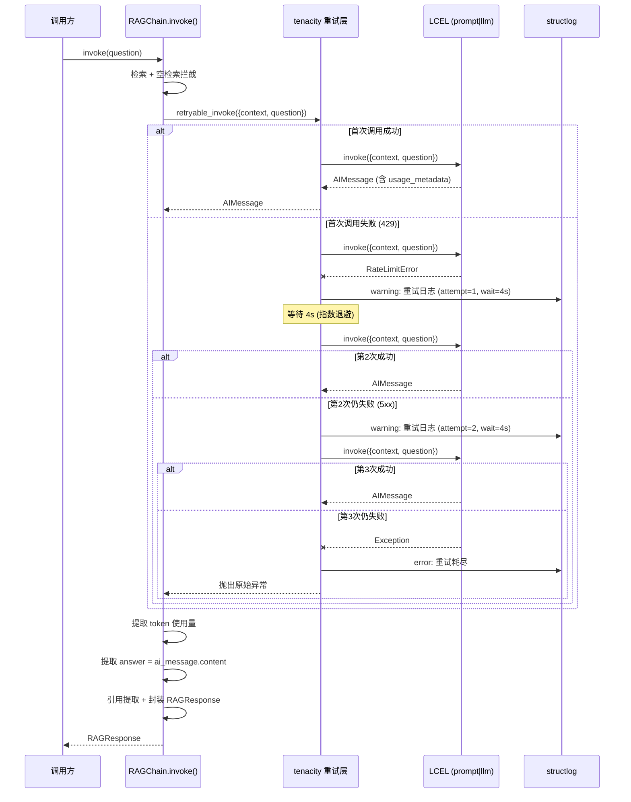
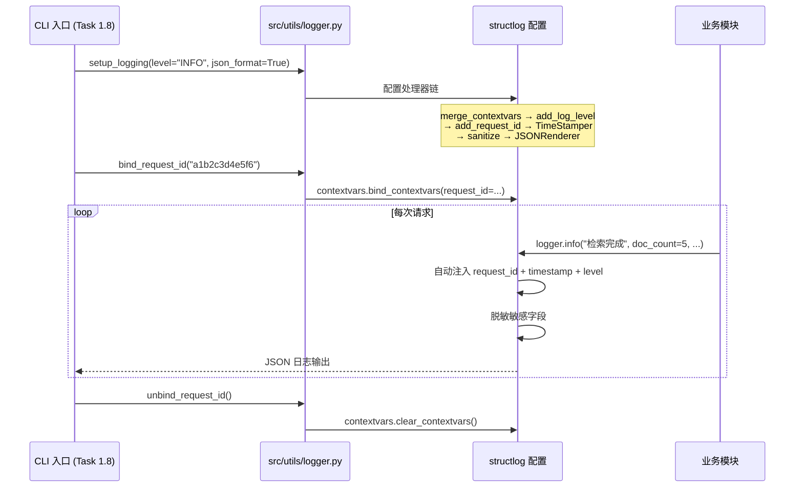

# Task 1.7 LLM 调用重试与结构化日志 — 架构设计

> **原始需求**：`.project_outline/phase_1_reliable_base/task_1.7_retry_logger.md`
> **涉及文件**：`src/core/exceptions.py`、`src/utils/retry.py`、`src/utils/logger.py`、`src/generation/rag_chain.py`、`src/generation/exceptions.py`、`src/retriever/base_retriever.py`、`src/core/__init__.py`、`src/utils/__init__.py`、`tests/test_retry.py`、`tests/test_logger.py`、`tests/test_exceptions.py`

---

## 架构决策与权衡

### 决策 1：重试机制的集成方式

- **选项 A**：使用 LangChain 的 `Runnable.with_retry()` 方法
  - 优点：LangChain 原生 API，与 LCEL 链无缝集成
  - 缺点：`with_retry()` 的回调机制不如 tenacity 灵活（无法自定义重试日志格式），底层实现随 LangChain 版本变化，不便于面试时讲清 tenacity 的原理
- **选项 B**：用 tenacity 装饰器包装 RAGChain 的内部 LLM 调用方法
  - 优点：完整展示 tenacity 原生 API（装饰器 + 指数退避 + 错误分类 + 回调），日志格式完全可控，重试逻辑独立于 LangChain 版本
  - 缺点：需要将 LCEL 链拆分调用（prompt → llm → parser 三步），不如一行 LCEL 链优雅
- **选项 C**：在 LCEL 链外层包装重试（`with_retry(chain.invoke)(...)`)
  - 优点：LCEL 链不变，改动最小
  - 缺点：重试粒度过粗——StrOutputParser 失败也会触发重试；且无法提取 token 使用量（经 StrOutputParser 后丢失 AIMessage 元信息）
- **结论**：选 B。Task 1.7 的核心目标是**展示 tenacity 原生用法**（面试要求），同时需要提取 token 使用量（验收标准）。将 LCEL 链拆为 `prompt | llm` + 手动取 `content`，既保留了 LCEL 组合能力（`prompt | llm` 仍是 LCEL 链），又获得了重试和 token 追踪的精确控制。流式路径仍使用完整 LCEL 链 `prompt | llm | StrOutputParser()`

### 决策 2：异常体系的迁移策略

- **选项 A**：完全迁移 — 将所有异常定义移到 `src/core/exceptions.py`
  - 优点：集中管理
  - 缺点：违反模块自治原则，生成模块的异常定义脱离了生成模块
- **选项 B**：基类迁移 — 公共基类 `RAGSystemError` 在 `src/core/exceptions.py`，模块异常仍在各自模块但继承基类
  - 优点：模块自治 + 全局统一捕获，上层 `except RAGSystemError` 可捕获所有系统异常
  - 缺点：异常类跨模块继承，修改基类需注意影响面
- **选项 C**：只添加新类 — 不修改现有异常继承关系，只添加 `RAGSystemError` 和 `RetryableError`
  - 优点：改动最小
  - 缺点：`GenerationError` 和 `RetrievalError` 无法被统一基类捕获，不符合架构分层的依赖倒置原则
- **结论**：选 B。`.project_todo.md` 中已标注 `TODO(Task 1.7): 将 GenerationError 公共基类迁移到 src/core/exceptions.py`，这正是本 Task 的职责。让 `GenerationError` 和 `RetrievalError` 都继承 `RAGSystemError`，上层统一捕获 `RAGSystemError` 即可处理所有系统异常（依赖倒置），同时各模块的异常类仍定义在各自模块（模块自治）

### 决策 3：Token 使用量追踪方式

- **选项 A**：从 LCEL 链中添加自定义 Parser（继承 StrOutputParser），解析时记录 token 信息
  - 优点：LCEL 链不变
  - 缺点：自定义 Parser 需访问 AIMessage 的 usage_metadata，而 StrOutputParser 设计上只返回 str，强行在 Parser 中记录日志违反单一职责
- **选项 B**：将 LCEL 链拆分为 `prompt | llm`（返回 AIMessage）+ 手动取 `content`，在中间提取 token 信息
  - 优点：最直接、最可靠，token 信息从 AIMessage 的 `usage_metadata` / `response_metadata` 中获取，不增加额外复杂度
  - 缺点：与决策 1 一致，LCEL 链不再是完整的 `prompt | llm | parser`
- **选项 C**：使用 LangChain Callback Handler 追踪 token 使用量
  - 优点：不改变链结构
  - 缺点：Callback 机制复杂，需管理回调注册/注销，测试困难，对中级开发者理解负担大
- **结论**：选 B。与决策 1 统一，拆分后同时满足重试和 token 追踪。`prompt | llm` 仍是 LCEL 链，只是不再包含 StrOutputParser——这不影响 LCEL 知识展示，因为 `stream()` 方法仍使用完整链

### 决策 4：结构化日志的初始化方式

- **选项 A**：在 `config.py` 中自动初始化（模块导入时配置）
  - 优点：零配置，使用方无需显式调用
  - 缺点：模块导入时的副作用难以预测（如测试环境可能不需要 JSON 日志），违反显式优于隐式原则
- **选项 B**：提供 `setup_logging()` 函数，由调用方（CLI/FastAPI）显式调用
  - 优点：调用方根据环境选择不同配置（开发用 ConsoleRenderer，生产用 JSONRenderer），测试时可跳过初始化
  - 缺点：忘记调用则日志为默认格式
- **结论**：选 B。显式初始化更可控，符合 12-Factor App 的配置管理原则。CLI 入口（Task 1.8）和 FastAPI 入口（Task 5.1）在启动时调用 `setup_logging()`，测试不需要调用

### 决策 5：request_id 的上下文传播方式

- **选项 A**：使用 structlog 原生 `contextvars` 支持（`structlog.contextvars.bind_contextvars`）
  - 优点：structlog 内置支持，与 asyncio 兼容（contextvars 天然支持协程切换），API 简洁
  - 缺点：structlog 版本需 ≥ 20.2（当前 25.5.0 ✅）
- **选项 B**：使用 Python 原生 `contextvars` + 自定义处理器注入
  - 优点：不依赖 structlog 的 contextvars 实现
  - 缺点：需自行实现日志注入逻辑，与 structlog 的处理器链协作可能冲突
- **选项 C**：使用线程本地存储（`threading.local`）
  - 优点：简单
  - 缺点：与 asyncio 不兼容（Task 4.5 异步优化、Task 5.2 SSE 流式都使用 asyncio）
- **结论**：选 A。structlog 的 contextvars 是官方推荐的上下文绑定方式，与 asyncio 天然兼容，为后续 Task 4.5 和 Task 5.2 的异步场景做准备

---

## 模块结构

### 文件组织
```
src/
├── core/
│   ├── __init__.py        # 更新导出，添加 RAGSystemError
│   ├── config.py          # 不变
│   └── exceptions.py      # 新增：统一异常基类
├── utils/
│   ├── __init__.py        # 新增：公共导出
│   ├── retry.py           # 新增：tenacity 重试机制
│   └── logger.py          # 新增：structlog 结构化日志配置
├── generation/
│   ├── exceptions.py      # 修改：GenerationError 继承 RAGSystemError，LLMCallError 增加 is_retryable
│   ├── rag_chain.py       # 修改：接入重试 + token 追踪 + 统一日志
│   ├── citation_chain.py  # 不变
│   └── prompts.py         # 不变
└── retriever/
    ├── base_retriever.py  # 修改：RetrievalError 继承 RAGSystemError
    └── __init__.py        # 修改：更新导出
```

### 依赖关系
```
src/core/exceptions.py
├── (无外部依赖，纯 Python 标准库)

src/utils/logger.py
├── structlog              # 结构化日志框架
├── logging                # Python 标准库日志（structlog 底层依赖）

src/utils/retry.py
├── tenacity               # 重试库
├── structlog              # 重试日志记录

src/generation/rag_chain.py（改造后新增依赖）
├── src/utils/retry.py     # with_retry 重试包装
├── src/utils/logger.py    # setup_logging（仅 CLI 入口调用，rag_chain 不直接调用）
├── src/core/exceptions.py # RAGSystemError（间接，通过 GenerationError 继承）
```

### 职责边界
```
src/core/exceptions.py 职责：
✅ 包含：RAGSystemError 公共基类定义
✅ 包含：RetryableError / NonRetryableError 分类标记（供 retry.py 判断）
❌ 不包含：模块级具体异常（GenerationError 属于 generation，RetrievalError 属于 retriever）

src/utils/retry.py 职责：
✅ 包含：LLM 调用错误分类逻辑（_is_retryable_error）
✅ 包含：tenacity 重试装饰器工厂（create_llm_retry_decorator）
✅ 包含：重试日志记录回调（_log_retry）
✅ 包含：便捷包装函数（with_retry）
❌ 不包含：业务逻辑（不知道 RAGChain 的存在）
❌ 不包含：重试配置的外部化（由调用方传入参数）

src/utils/logger.py 职责：
✅ 包含：structlog 全局配置（setup_logging）
✅ 包含：request_id 上下文管理（bind_request_id / unbind_request_id）
✅ 包含：敏感信息脱敏处理器（_sanitize_processor）
❌ 不包含：具体业务日志语句（仍在各业务模块中）
❌ 不包含：日志文件轮转（当前仅控制台输出，Task 5.5 可扩展）
```

---

## 核心接口设计

### 1. RAGSystemError（src/core/exceptions.py）

```python
class RAGSystemError(Exception):
    """RAG 系统公共异常基类。

    设计意图：
        为所有 RAG 系统异常提供统一捕获点。上层调用方只需
        except RAGSystemError 即可处理所有系统级错误，无需关心
        具体是检索失败还是生成失败。

    为什么需要这个基类：
        1. 依赖倒置：上层依赖抽象基类而非具体异常
        2. 统一处理：FastAPI 全局异常处理器可注册 RAGSystemError，
           返回统一的错误响应格式
        3. LangGraph 路由：按异常类型做条件边时，可基于基类判断

    子类约定：
        所有子类应在 docstring 中说明触发场景和包含的上下文信息。
    """

class RetryableError(RAGSystemError):
    """可重试错误标记基类。

    设计意图：
        当异常属于可重试类型（429 Rate Limit、5xx 服务器错误、网络超时）
        时，继承此基类。tenacity 的 retry_if_exception_type 可直接
        使用此类判断是否重试。

    为什么用标记基类而非属性：
        1. tenacity 的 retry_if_exception_type 基于 isinstance 判断，
           继承关系天然支持
        2. 异常类型本身就有语义（RetryableError 语义清晰）
        3. 避免在异常实例上添加属性后遗忘设置
    """

class NonRetryableError(RAGSystemError):
    """不可重试错误标记基类。

    触发场景：
        401 认证失败、400 请求格式错误、配额耗尽等。
        这些错误不会因重试而成功，反而浪费 API 配额。
    """
```

### 2. 重试模块（src/utils/retry.py）

```python
def _is_retryable_error(exc: BaseException) -> bool:
    """判断异常是否可重试。

    为什么不直接用 tenacity 的 retry_if_exception_type：
        LangChain 内部抛出的异常类型因 SDK 不同而不同
        （openai.RateLimitError vs httpx.HTTPStatusError），
        且可能被多层包装（__cause__ 链）。需要统一的分类逻辑。

    判断策略（按优先级）：
        1. 异常本身是 RetryableError 子类 → 可重试
        2. 异常本身是 NonRetryableError 子类 → 不可重试
        3. 检查 status_code 属性（遍历 __cause__ 链）：
           - 429 → 可重试
           - 5xx → 可重试
           - 4xx（非 429）→ 不可重试
        4. 检查异常类名模式：含 Timeout/Connect → 可重试
        5. 默认 → 不可重试（安全默认值，避免无意义重试）
    """

def _log_retry(retry_state: RetryCallState) -> None:
    """tenacity before_sleep 回调：记录重试日志。

    为什么用 before_sleep 而非其他回调：
        before_sleep 在等待间隔前触发，此时可获取：
        - retry_state.attempt_number：当前第几次重试
        - retry_state.next_action.sleep：即将等待的秒数
        - retry_state.outcome.exception()：触发重试的异常
        这三个信息足以判断重试行为是否正常。
    """

def create_llm_retry_decorator(
    max_attempts: int = 3,
    min_wait: float = 4,
    max_wait: float = 10,
    multiplier: float = 1,
) -> Callable:
    """创建配置好的 LLM 重试装饰器（工厂函数）。

    设计意图：
        封装 tenacity 的配置细节，调用方只需指定业务参数
        （最大重试次数、等待范围），无需了解 tenacity 的
        stop/wait/retry 等原语。

    为什么是工厂函数而非固定装饰器：
        不同场景的重试策略可能不同：
        - LLM 调用：3 次重试，指数退避 4-10s
        - 向量库查询：2 次重试，固定间隔 1s
        工厂函数支持灵活配置，避免硬编码。

    Args:
        max_attempts: 最大尝试次数（含首次调用），默认 3
        min_wait: 指数退避最小等待秒数，默认 4
        max_wait: 指数退避最大等待秒数，默认 10
        multiplier: 指数退避乘数，默认 1
            等待时间 = multiplier * 2^(attempt-1)，受 min/max 约束
            第1次重试等待: 1*2^0 = 1s → clamp to 4s (min_wait)
            第2次重试等待: 1*2^1 = 2s → clamp to 4s (min_wait)
            第3次重试等待: 1*2^2 = 4s → 4s

    Returns:
        tenacity 装饰器，可直接装饰函数或方法
    """

def with_retry(
    func: Callable[..., T],
    max_attempts: int = 3,
    min_wait: float = 4,
    max_wait: float = 10,
    multiplier: float = 1,
) -> Callable[..., T]:
    """便捷函数：用重试逻辑包装给定函数。

    为什么需要此函数（而不仅仅提供装饰器）：
        RAGChain 的 LLM 调用是实例方法，需要在 __init__ 中
        动态包装（因为 self._prompt_llm_chain 在 __init__ 中创建），
        装饰器无法在实例方法上动态使用。

    用法示例：
        # 在 RAGChain.__init__ 中
        self._retryable_invoke = with_retry(
            self._prompt_llm_chain.invoke,
            max_attempts=3,
        )

        # 在 invoke() 中
        ai_message = self._retryable_invoke({"context": context, "question": question})
    """
```

### 3. 日志模块（src/utils/logger.py）

```python
_SENSITIVE_KEYS: frozenset[str]  # 敏感字段名集合

def _sanitize_processor(
    logger, method_name: str, event_dict: dict
) -> dict:
    """structlog 处理器：脱敏敏感字段。

    为什么作为处理器而非在业务代码中手动脱敏：
        1. 统一保证：无论业务代码是否忘记脱敏，处理器兜底
        2. 零侵入：业务代码正常传递完整值，脱敏在输出层自动完成
        3. 可测试：处理器可独立测试，无需覆盖每个业务调用点

    脱敏策略：
        字段值长度 > 4：保留前2后2，中间用 **** 替换
        字段值长度 ≤ 4：整体替换为 ****
        示例："sk-d2874cb013704833" → "sk****33"
    """

def setup_logging(
    level: str = "INFO",
    json_format: bool = True,
) -> None:
    """配置全局结构化日志。

    设计意图：
        一次调用完成 structlog 和标准库 logging 的双重配置，
        确保两者协作一致（structlog 使用 stdlib 模式）。

    为什么需要同时配置 structlog 和 logging：
        structlog 的 stdlib 模式下，structlog 是标准库 logging 的
        前端处理器。未配置 logging 的 level 时，DEBUG 级别的
        structlog 日志会被标准库过滤掉。

    Args:
        level: 日志级别，默认 "INFO"。
            可选："DEBUG"、"INFO"、"WARNING"、"ERROR"
        json_format: 是否输出 JSON 格式，默认 True。
            True → 生产环境，便于 ELK/Loki 采集
            False → 开发环境，使用 ConsoleRenderer（带颜色、对齐）

    配置后的日志输出格式（JSON 模式）：
        {
            "event": "LLM 调用失败，准备重试",
            "request_id": "a1b2c3d4e5f6",
            "timestamp": "2026-04-17T10:30:00.123456+08:00",
            "level": "warning",
            "logger_name": "src.utils.retry",
            "attempt": 2,
            "wait_seconds": 4.0,
            "error": "Rate limit exceeded",
            "error_type": "RateLimitError"
        }
    """

def bind_request_id(request_id: Optional[str] = None) -> str:
    """绑定 request_id 到日志上下文。

    为什么需要 request_id：
        在并发/分布式场景中，多条请求的日志交错，无法按请求追溯。
        request_id 让每条日志都属于一个请求链路，在 ELK/Loki 中
        按 request_id 过滤即可还原完整请求轨迹。

    为什么用 structlog.contextvars 而非手动传递：
        手动传递 request_id 需要修改每个函数签名（侵入式），
        contextvars 在协程间自动隔离，零侵入。

    Args:
        request_id: 若不提供则自动生成 12 位十六进制 UUID
            为什么是 12 位：UUID4 共 32 位，12 位足够避免碰撞，
            且日志中不会过长影响可读性

    Returns:
        绑定的 request_id（便于调用方记录或传递）
    """

def unbind_request_id() -> None:
    """清除日志上下文中的 request_id。

    为什么需要显式清除：
        contextvars 在协程复用时（如 FastAPI 的 async 路由）
        可能残留上一个请求的 request_id，导致日志错乱。
        在请求处理完成后调用此函数，确保上下文干净。
    """
```

---

## 交互时序图

### LLM 调用重试流程



### 结构化日志初始化流程



---

## 代码骨架

### src/core/exceptions.py

```python
"""RAG 系统统一异常体系。

设计意图：
    为整个 RAG 系统提供分层异常基类。上层调用方（CLI/FastAPI/LangGraph）
    可通过捕获 RAGSystemError 统一处理所有系统异常，也可通过捕获
    RetryableError/NonRetryableError 做重试决策。

异常层次：
    RAGSystemError                    # 公共基类（统一捕获点）
    ├── GenerationError               # 生成模块异常（定义在 generation/exceptions.py）
    │   ├── LLMCallError              # LLM 调用失败
    │   ├── EmptyRetrievalError       # 空检索
    │   └── CitationExtractionError   # 引用提取失败
    ├── RetrievalError                # 检索模块异常（定义在 retriever/base_retriever.py）
    │   └── UnsupportedSearchTypeError
    ├── RetryableError                # 可重试错误标记
    └── NonRetryableError             # 不可重试错误标记

迁移说明：
    Task 1.6 在 generation/exceptions.py 中定义了 GenerationError，继承 Exception。
    Task 1.7 将 GenerationError 的基类从 Exception 改为 RAGSystemError，
    同时将 retriever/base_retriever.py 中的 RetrievalError 基类改为 RAGSystemError。
    具体异常类仍在各自模块定义（模块自治），仅基类统一到 core。
"""


class RAGSystemError(Exception):
    """RAG 系统公共异常基类。

    为什么需要这个基类：
        1. 依赖倒置：上层依赖抽象基类而非具体异常类型，
           切换 LLM 提供商时无需修改异常处理代码
        2. 统一处理：FastAPI 全局异常处理器可注册 RAGSystemError，
           返回统一的错误响应格式（Task 5.1）
        3. LangGraph 路由：条件边可基于异常类型做路由决策
           （Task 2.6 自适应路由）

    上层使用方式：
        # 统一捕获所有系统异常
        try:
            result = chain.invoke(question)
        except RAGSystemError as e:
            # 处理任何 RAG 系统错误
            logger.error("RAG 系统异常", error=str(e))
    """

    pass


class RetryableError(RAGSystemError):
    """可重试错误标记基类。

    为什么用标记基类而非 is_retryable 属性：
        1. tenacity 的 retry_if_exception_type 基于 isinstance 判断，
           继承关系天然支持，无需在每次捕获时检查属性
        2. 异常类型本身携带语义——看到 RetryableError 就知道可重试
        3. 避免在异常实例上添加属性后遗忘设置，导致重试逻辑失效

    使用方式：
        # 自定义可重试异常
        class RateLimitExceeded(RetryableError):
            pass

        # tenacity 自动识别
        @retry(retry=retry_if_exception_type(RetryableError))
        def call_llm(): ...
    """

    pass


class NonRetryableError(RAGSystemError):
    """不可重试错误标记基类。

    什么时候应该继承此类：
        1. 认证/授权失败（401/403）— 重试不会让错误的 Key 变正确
        2. 请求格式错误（400）— 重试同样的错误请求无意义
        3. 配额耗尽（402/422）— 重试只会浪费更多配额
        4. 业务逻辑错误 — 如 EmptyRetrievalError，重试结果相同
    """

    pass
```

### src/utils/retry.py

```python
"""LLM 调用重试机制。

设计意图：
    使用 tenacity 库实现可配置的指数退避重试策略，核心关注点：
    1. 错误分类：区分可重试错误（429/5xx/超时）和不可重试错误（401/400）
    2. 重试日志：每次重试记录 attempt、wait_time、error 信息
    3. 配置外部化：重试参数（次数、等待范围）通过函数参数注入

为什么用 tenacity 而非手写重试：
    1. 指数退避 + 抖动的数学计算容易写错（tenacity 内置正确实现）
    2. 装饰器模式简洁，不侵入业务逻辑
    3. 社区广泛使用，面试时能讲清原理即可

为什么不用 LangChain 的 with_retry：
    1. Task 1.7 要求展示 tenacity 原生用法（面试要求）
    2. with_retry 的回调机制不如 tenacity 灵活（无法自定义日志格式）
    3. with_retry 底层也用 tenacity，直接使用 tenacity 更透明
"""

from typing import Callable, TypeVar

from tenacity import (
    RetryCallState,
    before_sleep_log,
    retry,
    retry_if_exception,
    stop_after_attempt,
    wait_exponential,
)
import structlog

from src.core.exceptions import NonRetryableError, RetryableError

logger = structlog.get_logger(__name__)

T = TypeVar("T")


def _is_retryable_error(exc: BaseException) -> bool:
    """判断异常是否可重试。

    判断策略（按优先级短路求值）：
        步骤 1：异常是 NonRetryableError 子类 → return False
            # NonRetryableError 是显式声明，优先级最高
        步骤 2：异常是 RetryableError 子类 → return True
            # RetryableError 是显式声明，优先级次高
        步骤 3：遍历 __cause__ 链（最多 5 层，防止无限循环），
            对每个异常检查 status_code 属性：
            - status_code == 429 → return True（Rate Limit，可重试）
            - 500 <= status_code < 600 → return True（服务器错误，可重试）
            - 400 <= status_code < 500 → return False（客户端错误，不可重试）
        步骤 4：检查异常类名是否包含超时/连接关键词：
            - 类名含 "Timeout" → return True
            - 类名含 "Connect" → return True
        步骤 5：默认 return False
            # 安全默认值：未知错误不重试，避免无意义重试浪费配额

    为什么遍历 __cause__ 链而非只看当前异常：
        LangChain 的 LCEL 链可能将底层 SDK 异常包装为自己的异常类型，
        原始的 status_code 信息保存在 __cause__ 链中。
        例如：langchain 的 ChatModel 抛出的异常可能包装了
        openai.RateLimitError，后者才有 status_code=429。

    Args:
        exc: 待判断的异常对象

    Returns:
        True = 可重试，False = 不可重试
    """
    # 步骤 1：检查 NonRetryableError（显式不可重试，最高优先级）
    if isinstance(exc, NonRetryableError):
        return False

    # 步骤 2：检查 RetryableError（显式可重试）
    if isinstance(exc, RetryableError):
        return True

    # 步骤 3：遍历 __cause__ 链，检查 status_code
    # 当前异常 + __cause__ 链最多 5 层
    current = exc
    depth = 0
    while current is not None and depth < 5:
        # 步骤 3a：获取 status_code 属性
        # 优先检查 status_code（openai SDK 用此属性名）
        status_code = getattr(current, "status_code", None)
        # 备选检查 http_status（某些 HTTP 库用此属性名）
        if status_code is None:
            status_code = getattr(current, "http_status", None)

        if status_code is not None:
            # 步骤 3b：按状态码分类
            # 429 Rate Limit → 可重试（服务端限流，稍后可恢复）
            if status_code == 429:
                return True
            # 5xx 服务器错误 → 可重试（服务端临时故障）
            if 500 <= status_code < 600:
                return True
            # 4xx 客户端错误（非 429）→ 不可重试（请求本身有问题）
            if 400 <= status_code < 500:
                return False

        # 步骤 3c：沿 __cause__ 链继续查找
        current = current.__cause__
        depth += 1

    # 步骤 4：检查类名模式（超时/连接错误）
    # 为什么用类名而非 isinstance：避免在 utils 层导入特定 SDK 的异常类（依赖倒置）
    exc_type_name = type(exc).__name__
    timeout_keywords = ("Timeout", "APITimeoutError")
    connect_keywords = ("ConnectError", "ConnectionError")
    if any(kw in exc_type_name for kw in timeout_keywords + connect_keywords):
        return True

    # 步骤 5：安全默认值 — 未知错误不重试
    return False


def _log_retry(retry_state: RetryCallState) -> None:
    """tenacity before_sleep 回调：记录重试日志。

    为什么用 before_sleep 回调：
        before_sleep 在"决定重试后、开始等待前"触发，此时：
        - retry_state.attempt_number：已尝试的次数（含本次失败）
        - retry_state.next_action.sleep：即将等待的秒数
        - retry_state.outcome.exception()：触发重试的异常
        这三个信息足以判断重试行为是否正常，也便于在 ELK 中
        按时间线重建重试过程。

    Args:
        retry_state: tenacity 内部状态对象
    """
    # 步骤 1：从 retry_state 提取信息
    # attempt_number = 已尝试次数（含首次 + 重试次数）
    # next_action.sleep = 下次重试前的等待秒数
    # outcome.exception() = 触发重试的异常对象
    attempt = retry_state.attempt_number
    wait_seconds = retry_state.next_action.sleep
    exception = retry_state.outcome.exception()

    # 步骤 2：记录 warning 级别日志
    # 为什么用 warning 而非 info：重试意味着异常发生，值得关注
    logger.warning(
        "LLM 调用失败，准备重试",
        attempt=attempt,
        wait_seconds=round(wait_seconds, 1),
        error=str(exception),
        error_type=type(exception).__name__,
    )


def create_llm_retry_decorator(
    max_attempts: int = 3,
    min_wait: float = 4,
    max_wait: float = 10,
    multiplier: float = 1,
) -> Callable:
    """创建配置好的 LLM 重试装饰器（工厂函数）。

    设计意图：
        封装 tenacity 的配置细节，调用方只需指定业务参数
        （最大重试次数、等待范围），无需了解 tenacity 的
        stop/wait/retry 等原语。

    Args:
        max_attempts: 最大尝试次数（含首次调用），默认 3
            # 含首次调用的含义：max_attempts=3 → 最多重试 2 次
        min_wait: 指数退避最小等待秒数，默认 4
        max_wait: 指数退避最大等待秒数，默认 10
        multiplier: 指数退避乘数，默认 1
            # 等待时间 = multiplier * 2^(attempt_number-1)
            # 第1次重试: 1*2^1 = 2s → clamp to min_wait = 4s
            # 第2次重试: 1*2^2 = 4s → 4s
            # 第3次重试: 1*2^3 = 8s → 8s

    Returns:
        tenacity 装饰器函数，可直接 @装饰 目标函数

    示例：
        decorator = create_llm_retry_decorator(max_attempts=3)

        @decorator
        def call_api():
            ...
    """
    # 步骤 1：组合 tenacity 配置
    # stop: 达到最大尝试次数后停止
    # wait: 指数退避策略，受 min/max 约束
    # retry: 仅当 _is_retryable_error 返回 True 时重试
    # before_sleep: 每次重试前记录日志
    # reraise: 重试耗尽后抛出原始异常（非 tenacity 的 RetryError）
    return retry(
        stop=stop_after_attempt(max_attempts),
        wait=wait_exponential(
            multiplier=multiplier, min=min_wait, max=max_wait
        ),
        retry=retry_if_exception(_is_retryable_error),
        before_sleep=_log_retry,
        reraise=True,
    )


def with_retry(
    func: Callable[..., T],
    max_attempts: int = 3,
    min_wait: float = 4,
    max_wait: float = 10,
    multiplier: float = 1,
) -> Callable[..., T]:
    """便捷函数：用重试逻辑包装给定函数。

    设计意图：
        RAGChain 的 LLM 调用是实例方法，需要在 __init__ 中
        动态包装（因为 self._prompt_llm_chain 在 __init__ 中创建），
        装饰器无法在实例方法上动态使用，因此提供此便捷函数。

    为什么不直接用 tenacity 的 @retry 装饰器：
        装饰器在类定义时绑定，而重试的函数（self._prompt_llm_chain.invoke）
        在实例化时才可用。with_retry 支持运行时动态包装。

    Args:
        func: 需要重试包装的可调用对象
        max_attempts: 最大尝试次数，默认 3
        min_wait: 最小等待秒数，默认 4
        max_wait: 最大等待秒数，默认 10
        multiplier: 退避乘数，默认 1

    Returns:
        包装后的可调用对象，调用时自动应用重试逻辑

    用法示例：
        # 在 RAGChain.__init__ 中
        self._retryable_invoke = with_retry(
            self._prompt_llm_chain.invoke,
            max_attempts=3,
        )

        # 在 invoke() 中
        ai_message = self._retryable_invoke({"context": context, "question": question})
    """
    # 步骤 1：创建重试装饰器
    decorator = create_llm_retry_decorator(
        max_attempts=max_attempts,
        min_wait=min_wait,
        max_wait=max_wait,
        multiplier=multiplier,
    )
    # 步骤 2：装饰目标函数并返回
    return decorator(func)
```

### src/utils/logger.py

```python
"""结构化日志配置模块。

设计意图：
    基于 structlog 实现生产级结构化日志，核心关注点：
    1. JSON 格式输出：便于 ELK/Loki 采集和分析
    2. request_id 上下文绑定：单次请求全链路追踪
    3. 敏感信息脱敏：日志中不暴露 API Key 等敏感数据
    4. 开发/生产双模式：开发用 ConsoleRenderer，生产用 JSONRenderer

为什么用 structlog 而非标准库 logging：
    1. 原生支持键值对日志（logger.info("事件", key=value)），
       标准 logging 需要格式化字符串或 loguru 风格的占位符
    2. 处理器链架构：每个处理器关注一个维度（时间戳、脱敏、格式化），
       符合单一职责原则
    3. contextvars 原生支持：零侵入的 request_id 传播
    4. LangGraph 生态已内置 structlog（项目中已使用）

为什么 structlog 的 stdlib 模式：
    stdlib 模式让 structlog 和标准库 logging 协作：
    - 第三方库（如 httpx、chromadb）使用 logging 的日志也会
      经过 structlog 的处理器链，格式统一
    - structlog.get_logger() 返回的 logger 同时支持两种风格
"""

import logging
import uuid
from typing import Optional

import structlog

# 敏感字段名集合（全部小写，匹配时忽略大小写）
# 为什么用 frozenset：不可变，查找 O(1)，语义表明这是常量
_SENSITIVE_KEYS: frozenset[str] = frozenset({
    "api_key", "apikey", "key",        # API 密钥
    "password", "passwd", "pwd",       # 密码
    "token", "access_token",           # 认证令牌
    "secret", "api_secret",            # 密钥
    "authorization",                   # HTTP Authorization 头
})


def _sanitize_processor(
    logger, method_name: str, event_dict: dict
) -> dict:
    """structlog 处理器：自动脱敏敏感字段。

    设计意图：
        在日志输出前的最后一道防线，确保任何包含敏感字段名的
        键值对都被遮盖，无论业务代码是否主动脱敏。

    为什么作为处理器而非在业务代码中手动脱敏：
        1. 统一保证：即使业务代码遗漏，处理器兜底
        2. 零侵入：业务代码正常传递完整值，脱敏在输出层完成
        3. 可独立测试：处理器可单独测试，无需覆盖每个调用点

    脱敏策略：
        - 字段值长度 > 4：保留前2后2，中间 ****
          示例："sk-d2874cb013704833982de93d9387701f" → "sk****1f"
        - 字段值长度 ≤ 4：整体 ****
          示例："key1" → "****"

    注意：
        此处理器应在 JSONRenderer 之前执行，确保脱敏后的值
        进入最终输出。在 setup_logging 的处理器链中，
        _sanitize_processor 排在 renderer 之前。

    Args:
        logger: structlog 内部 logger 对象（不使用）
        method_name: 日志方法名（不使用）
        event_dict: 事件字典，包含所有键值对日志数据

    Returns:
        脱敏后的事件字典（原地修改，返回引用）
    """
    # 步骤 1：遍历 event_dict 的所有键
    for key in list(event_dict.keys()):
        # 步骤 2：键名转小写后检查是否在敏感字段集合中
        if key.lower() in _SENSITIVE_KEYS:
            # 步骤 3：获取原始值并转为字符串
            value = str(event_dict[key])
            # 步骤 4：根据长度选择脱敏方式
            if len(value) > 4:
                # 保留前2后2，中间用 **** 替换
                event_dict[key] = value[:2] + "****" + value[-2:]
            else:
                # 过短则全部遮盖
                event_dict[key] = "****"
    # 步骤 5：返回修改后的事件字典
    return event_dict


def setup_logging(
    level: str = "INFO",
    json_format: bool = True,
) -> None:
    """配置全局结构化日志。

    设计意图：
        一次调用完成 structlog 和标准库 logging 的双重配置，
        确保两者协作一致（structlog 使用 stdlib 模式）。

    调用时机：
        - CLI 入口（Task 1.8）：程序启动时调用一次
        - FastAPI 入口（Task 5.1）：app.on_event("startup") 中调用
        - 测试：不需要调用（使用 structlog 默认配置）

    Args:
        level: 日志级别，默认 "INFO"
            # "DEBUG"：开发调试，输出所有日志
            # "INFO"：生产默认，输出 info/warning/error
            # "WARNING"：精简模式，仅输出 warning/error
        json_format: 是否输出 JSON 格式，默认 True
            # True → 生产环境，便于 ELK/Loki 采集
            # False → 开发环境，使用 ConsoleRenderer（带颜色、对齐）

    配置后的日志输出示例（JSON 模式）：
        {
            "event": "LLM 调用失败，准备重试",
            "request_id": "a1b2c3d4e5f6",
            "timestamp": "2026-04-17T10:30:00.123456+08:00",
            "level": "warning",
            "logger_name": "src.utils.retry",
            "attempt": 2,
            "wait_seconds": 4.0,
            "error": "Rate limit exceeded",
            "error_type": "RateLimitError"
        }
    """
    # 步骤 1：配置标准库 logging
    # 为什么需要 force=True：防止已被其他库配置过的 logging 设置残留
    # format="%(message)s"：让 structlog 控制格式，标准库不额外包装
    logging.basicConfig(
        format="%(message)s",
        level=getattr(logging, level.upper(), logging.INFO),
        force=True,
    )

    # 步骤 2：设置第三方库的日志级别
    # 为什么需要设置：httpx、chromadb 等库的日志级别默认 INFO，
    # 在生产环境中过于嘈杂，设置为 WARNING 仅显示警告以上
    for noisy_logger in ("httpx", "chromadb", "httpcore", "urllib3"):
        logging.getLogger(noisy_logger).setLevel(logging.WARNING)

    # 步骤 3：构建 structlog 处理器链
    # 处理器按顺序执行，每个处理器接收并返回事件字典
    shared_processors = [
        # 3a. 合并 contextvars 中的上下文变量（如 request_id）
        structlog.contextvars.merge_contextvars,
        # 3b. 根据日志级别过滤（与标准库 logging 协作）
        structlog.stdlib.filter_by_level,
        # 3c. 添加 logger_name 字段（来自 structlog.get_logger(__name__)）
        structlog.stdlib.add_logger_name,
        # 3d. 添加 level 字段（info/warning/error 等）
        structlog.stdlib.add_log_level,
        # 3e. 添加 timestamp 字段（ISO 8601 格式）
        # 为什么用 ISO 格式：便于 ELK/Loki 自动解析为时间类型
        structlog.processors.TimeStamper(fmt="iso"),
        # 3f. 渲染堆栈信息（异常发生时自动附加）
        structlog.processors.StackInfoRenderer(),
        # 3g. 格式化异常信息（将 exc_info 转为可读字符串）
        structlog.processors.format_exc_info,
        # 3h. Unicode 解码（确保中文日志正确输出）
        structlog.processors.UnicodeDecoder(),
        # 3i. 敏感信息脱敏（在渲染前最后处理）
        _sanitize_processor,
    ]

    # 步骤 4：选择渲染器
    if json_format:
        # JSON 渲染器：生产环境，输出 JSON Lines（每行一个 JSON 对象）
        renderer = structlog.processors.JSONRenderer()
    else:
        # 控制台渲染器：开发环境，带颜色和对齐
        renderer = structlog.dev.ConsoleRenderer()

    # 步骤 5：配置 structlog
    # wrapper_class=BoundLogger：让 structlog.get_logger() 返回的 logger
    #   支持 info/warning/error 等标准方法
    # context_class=dict：上下文数据存储为普通字典（简洁够用）
    # logger_factory=PrintLoggerFactory：输出到 stdout（便于 Docker 采集）
    # cache_logger_on_first_use=True：首次使用后缓存配置（性能优化）
    structlog.configure(
        processors=shared_processors + [structlog.stdlib.ProcessorFormatter.wrap_for_formatter, renderer]
            if json_format
            else shared_processors + [renderer],
        wrapper_class=structlog.stdlib.BoundLogger,
        context_class=dict,
        logger_factory=structlog.PrintLoggerFactory(),
        cache_logger_on_first_use=True,
    )


def bind_request_id(request_id: Optional[str] = None) -> str:
    """绑定 request_id 到日志上下文。

    设计意图：
        为当前协程/线程的所有日志自动注入 request_id，
        无需在每个 logger.info() 调用中手动传递。

    为什么用 structlog.contextvars 而非手动传递：
        手动传递需要在每个函数签名中添加 request_id 参数（侵入式），
        contextvars 在协程间自动隔离，零侵入。

    Args:
        request_id: 若不提供则自动生成 12 位十六进制 UUID
            # 为什么是 12 位：UUID4 共 32 位十六进制字符，
            # 12 位提供约 2^48 = 281 万亿种组合，碰撞概率极低，
            # 且在日志中不会过长影响可读性

    Returns:
        绑定的 request_id（便于调用方记录或传递给下游服务）
    """
    # 步骤 1：生成 request_id（若未提供）
    if request_id is None:
        # uuid4().hex 生成 32 位十六进制，取前 12 位
        request_id = uuid.uuid4().hex[:12]

    # 步骤 2：清除旧上下文（防止上一个请求的上下文残留）
    structlog.contextvars.clear_contextvars()

    # 步骤 3：绑定 request_id 到上下文
    # 绑定后，后续所有 structlog.get_logger() 产出的日志
    # 都会自动包含 request_id 字段
    structlog.contextvars.bind_contextvars(request_id=request_id)

    # 步骤 4：返回 request_id
    return request_id


def unbind_request_id() -> None:
    """清除日志上下文中的 request_id。

    为什么需要显式清除：
        contextvars 在协程复用时（如 FastAPI 的 async 路由）
        可能残留上一个请求的 request_id，导致日志错乱。
        在请求处理完成后调用此函数，确保上下文干净。

    调用时机：
        - CLI：每次问答结束后
        - FastAPI：每个请求的 after_request 钩子中
    """
    structlog.contextvars.clear_contextvars()
```

### src/generation/exceptions.py（改造部分）

```python
"""生成模块异常定义。

设计意图：
    定义生成模块的专用异常体系，将底层 LLM SDK 异常（openai.APIError、
    httpx.HTTPError 等）转换为语义明确的业务异常，上层调用方只需
    捕获 GenerationError 基类即可处理所有生成相关错误。

Task 1.7 改动：
    1. GenerationError 基类从 Exception 改为 RAGSystemError
    2. LLMCallError 增加 is_retryable 属性，供重试机制判断
    3. EmptyRetrievalError 和 CitationExtractionError 继承 NonRetryableError
       （这些错误重试无意义）
"""

from typing import Optional

from src.core.exceptions import NonRetryableError, RAGSystemError, RetryableError


class GenerationError(RAGSystemError):
    """生成模块异常基类。

    为什么继承 RAGSystemError 而非 Exception：
        Task 1.7 统一异常体系后，上层可捕获 RAGSystemError
        统一处理所有系统异常（依赖倒置原则）。
        GenerationError 仍作为生成模块的捕获入口：
        except GenerationError 只捕获生成相关异常。

    所有子类异常的 message 应包含：
        - 发生错误的上下文（如问题文本截断）
        - 原始错误信息（如 API 返回的 error message）
    """

    pass


class LLMCallError(GenerationError):
    """LLM API 调用失败时抛出。

    Task 1.7 新增：
        is_retryable 属性标记此异常是否可重试。
        retry.py 的 _is_retryable_error 函数会检查此属性。

    触发场景：
        - 网络超时（openai.APITimeoutError）→ is_retryable=True
        - API Key 无效（openai.AuthenticationError）→ is_retryable=False
        - Rate Limit 超限（openai.RateLimitError）→ is_retryable=True
        - 服务器错误（openai.APIStatusError with 5xx）→ is_retryable=True
        - 连接失败（httpx.ConnectError）→ is_retryable=True

    Attributes:
        original_error: 被包装的原始异常对象
        is_retryable: 是否可重试（供重试机制判断）
    """

    def __init__(
        self,
        message: str,
        original_error: Optional[Exception] = None,
        is_retryable: bool = True,
    ):
        # 步骤 1：调用父类初始化
        super().__init__(message)
        # 步骤 2：保存原始异常引用
        self.original_error = original_error
        # 步骤 3：保存可重试标记
        # 为什么默认 True：LLM 调用失败多数是临时性的（网络/限流），
        # 显式设置 is_retryable=False 的场景较少（认证失败等）
        self.is_retryable = is_retryable


class EmptyRetrievalError(GenerationError, NonRetryableError):
    """检索返回空文档列表时抛出。

    为什么同时继承 GenerationError 和 NonRetryableError：
        - GenerationError：空检索是生成流程中的事件，上层可通过
          except GenerationError 统一捕获
        - NonRetryableError：空检索是确定性的业务结果，重试结果相同，
          不应触发重试

    触发场景和设计理由同 Task 1.6。
    """

    pass


class CitationExtractionError(GenerationError, NonRetryableError):
    """引用提取失败时抛出。

    为什么同时继承 NonRetryableError：
        引用提取失败通常是因为输出格式不符合预期，重试 LLM
        会产生不同的输出（非幂等），且额外 LLM 调用不值得。
        直接返回 citations=[] 的降级结果更合理。

    触发场景和设计理由同 Task 1.6。
    """

    pass
```

### src/retriever/base_retriever.py（改造部分）

```python
# 仅修改 RetrievalError 的基类
# 原始：class RetrievalError(Exception):
# 改为：
from src.core.exceptions import NonRetryableError, RAGSystemError

class RetrievalError(RAGSystemError):
    """检索过程中的通用异常基类。

    Task 1.7 改动：基类从 Exception 改为 RAGSystemError，
    上层可捕获 RAGSystemError 统一处理所有系统异常。
    """

class UnsupportedSearchTypeError(RetrievalError, NonRetryableError):
    """当传入的 search_type 参数不被支持时抛出。

    Task 1.7 改动：同时继承 NonRetryableError，
    因为错误的搜索类型是确定性错误，重试无意义。
    """
```

### src/generation/rag_chain.py（改造部分 — invoke 方法）

```python
# 新增导入
from src.utils.retry import with_retry
from src.utils.logger import setup_logging  # 仅 CLI 入口调用，rag_chain 不直接调用

class RAGChain:
    def __init__(self, ...):
        # ... 原有初始化代码 ...

        # Task 1.7 新增：拆分 LCEL 链以支持重试和 token 追踪
        # 完整链（用于流式输出，不需要重试和 token 追踪）
        self._generation_chain = self._prompt | self._llm | StrOutputParser()
        # 仅 prompt + llm（用于同步调用，返回 AIMessage 可提取 token 信息）
        self._prompt_llm_chain = self._prompt | self._llm

        # 创建带重试的调用函数
        # 为什么在 __init__ 中创建：self._prompt_llm_chain 在此才可用
        self._retryable_invoke = with_retry(
            self._prompt_llm_chain.invoke,
            max_attempts=3,
            min_wait=4,
            max_wait=10,
        )

    def invoke(self, question: str) -> RAGResponse:
        """同步调用完整 RAG 管道（带重试和 token 追踪）。"""
        total_start = time.perf_counter()

        # ===== 第1步：检索（不变）=====
        # ... 原有检索代码 ...

        # ===== 第2步：空检索拦截（不变）=====
        # ... 原有空检索代码 ...

        # ===== 第3步：格式化文档（不变）=====
        context = format_docs(docs)
        sources = [doc.metadata.get("source", "") for doc in docs]

        # ===== 第4步：LLM 生成（改造：带重试 + token 追踪）=====
        generation_start = time.perf_counter()
        try:
            # 步骤 4a：带重试的 LLM 调用，返回 AIMessage
            # 为什么不用 self._generation_chain.invoke：
            #   1. 需要 AIMessage 以提取 token 使用量
            #   2. 需要在 LLM 层面加重试（不含 StrOutputParser）
            ai_message = self._retryable_invoke(
                {"context": context, "question": question}
            )
        except Exception as e:
            # 步骤 4b：异常处理
            latency_ms = (time.perf_counter() - generation_start) * 1000
            logger.error(
                "LLM 调用失败（重试耗尽）",
                question=question[:50],
                error=str(e),
                error_type=type(e).__name__,
                latency_ms=round(latency_ms, 1),
            )
            raise LLMCallError(
                f"LLM 调用失败，问题: '{question[:50]}...': {e}",
                original_error=e,
                is_retryable=False,  # 重试耗尽后不再可重试
            ) from e

        generation_ms = (time.perf_counter() - generation_start) * 1000

        # 步骤 4c：提取 token 使用量
        # AIMessage 的 usage_metadata 是 LangChain 统一格式：
        #   {"input_tokens": 123, "output_tokens": 456, "total_tokens": 579}
        # response_metadata 是原始 SDK 返回的元数据（格式因提供商而异）
        usage = getattr(ai_message, "usage_metadata", None) or {}
        input_tokens = usage.get("input_tokens", 0)
        output_tokens = usage.get("output_tokens", 0)
        total_tokens = usage.get("total_tokens", 0)

        # 步骤 4d：提取回答文本
        # ai_message.content 等价于 StrOutputParser().invoke(ai_message)
        answer = ai_message.content

        logger.info(
            "生成完成",
            question=question[:50],
            answer_length=len(answer),
            latency_ms=round(generation_ms, 1),
            input_tokens=input_tokens,
            output_tokens=output_tokens,
            total_tokens=total_tokens,
        )

        # ===== 第5-6步：引用提取 + 封装返回（不变）=====
        # ... 原有代码 ...
```

---

## 关键配置项

| 参数 | 默认值 | 说明 | 调优场景 |
|------|--------|------|----------|
| `max_attempts` | 3 | 最大尝试次数（含首次调用） | DeepSeek 免费 API 限流严格时可增至 5；内部部署 LLM 可降至 2 |
| `min_wait` | 4s | 指数退避最小等待秒数 | 本地 LLM 响应快时可降至 2；云 API 限流恢复慢时可增至 6 |
| `max_wait` | 10s | 指数退避最大等待秒数 | 避免单次等待过长影响用户体验；可与 max_attempts 联动调整 |
| `multiplier` | 1 | 指数退避乘数 | 通常不需调整；退避过快时增大（如 2），过慢时减小 |
| `level` | "INFO" | 日志级别 | 开发调试时设为 "DEBUG"；生产环境用 "INFO" |
| `json_format` | True | 是否输出 JSON 格式 | 开发环境设为 False（可读性好）；生产环境设为 True（便于采集） |

---

## 常见坑点

1. **tenacity reraise=True 的重要性**：tenacity 默认在重试耗尽后抛出 `RetryError` 而非原始异常，这会导致上层 `except LLMCallError` 捕获失败。必须设置 `reraise=True`，让原始异常透传。漏设此参数的后果：所有重试耗尽的异常都变成 RetryError，丢失原始异常类型和错误码信息

2. **structlog 的 cache_logger_on_first_use 陷阱**：设置 `cache_logger_on_first_use=True` 后，第一次 `get_logger()` 调用会缓存配置。若在 `setup_logging()` 之前就调用了 `structlog.get_logger()`，日志将以默认配置输出（非 JSON）。解决方法：确保 `setup_logging()` 在所有业务代码之前调用（CLI 入口第一行）

3. **contextvars 与 asyncio 的协程泄漏**：`bind_request_id()` 绑定后，若不在请求结束时调用 `unbind_request_id()`，当前协程的后续日志都会携带过期的 request_id。FastAPI 使用协程池复用协程，残留的 request_id 会导致日志错乱。解决方法：在请求处理完成后（`finally` 块中）显式调用 `unbind_request_id()`

4. **__cause__ 链深度限制的必要性**：某些异常的 `__cause__` 链可能形成循环引用（虽然 Python 标准库不会，但第三方库可能）。`_is_retryable_error` 限制最多遍历 5 层 `__cause__`，防止无限循环。若确实存在更深的嵌套，可适当增加限制

5. **EmptyRetrievalError 的双重继承解析顺序**：`EmptyRetrievalError(GenerationError, NonRetryableError)` 的 MRO（方法解析顺序）中 `GenerationError` 在前，`isinstance(exc, GenerationError)` 和 `isinstance(exc, NonRetryableError)` 都返回 True。`_is_retryable_error` 中先检查 `NonRetryableError`（步骤 1），确保不可重试的判定优先

---

## 10维最佳实践落地

| 维度 | 本 Task 落地方式 |
|------|------------------|
| 1. 模块分离 | `core/exceptions.py`（异常基类）、`utils/retry.py`（重试逻辑）、`utils/logger.py`（日志配置）三文件职责清晰，互不交叉 |
| 2. 架构分层 | 基础设施层（utils/）→ 领域层（core/exceptions）→ 业务层（generation/retriever），业务层依赖基础设施层的抽象，不反向依赖 |
| 3. SOLID 原则 | 单一职责：retry.py 只管重试，logger.py 只管日志；开闭：新增错误类型只需继承 RetryableError/NonRetryableError，无需修改 `_is_retryable_error`；依赖倒置：rag_chain 依赖 `with_retry` 函数而非 tenacity 内部实现 |
| 4. 封装与抽象 | 公共 API 仅暴露 `setup_logging()`、`with_retry()`、`bind_request_id()` 三个函数，tenacity/structlog 的配置细节封装在内部 |
| 5. 设计模式 | 装饰器模式（tenacity 重试装饰器）；工厂模式（`create_llm_retry_decorator` 工厂函数返回配置好的装饰器）；标记模式（RetryableError/NonRetryableError 标记基类）。未使用策略模式，因为错误分类逻辑固定，无需运行时切换 |
| 6. 可观测性 | 所有重试操作记录 warning 日志（attempt、wait_seconds、error）；LLM 调用记录 info 日志（latency_ms、input_tokens、output_tokens）；日志为 JSON 格式含 request_id，可导入 ELK/Loki |
| 7. 配置管理 | 重试参数（max_attempts/min_wait/max_wait）通过函数参数注入，有合理默认值；日志级别和格式通过 `setup_logging()` 参数配置；第三方库日志级别统一设置 |
| 8. 鲁棒性/容错 | 异常分类（_is_retryable_error 区分可重试/不可重试）；__cause__ 链深度限制防无限循环；安全默认值（未知错误不重试）；脱敏处理器兜底防敏感信息泄漏 |
| 9. 可测试性 | `_is_retryable_error` 是纯函数，可直接用 Mock 异常测试；`with_retry` 可注入自定义函数测试重试行为；`setup_logging` 参数化，测试时可跳过或用 ConsoleRenderer |
| 10. 可扩展性 | 新增错误类型只需继承 RetryableError/NonRetryableError；日志处理器链可插入新处理器（如 Task 4.6 的 metrics 采集）；预留 `setup_logging` 的文件输出扩展点（Task 5.5） |

---

## 验收标准

### 功能验收
- [ ] 模拟 API 返回 429 错误（Mock LLM 抛出 RateLimitError），观察日志确认发生了 3 次尝试（1 次首次 + 2 次重试）
- [ ] 日志输出为 JSON 格式，包含 `timestamp`、`level`、`event`、`request_id` 字段
- [ ] 正常问答过程中，日志记录了检索耗时、LLM 调用耗时、Token 使用量（input_tokens、output_tokens、total_tokens）
- [ ] 401 认证错误不触发重试（_is_retryable_error 返回 False）
- [ ] 5xx 服务器错误触发重试

### 质量验收
- [ ] GenerationError 和 RetrievalError 都继承自 RAGSystemError
- [ ] EmptyRetrievalError 和 CitationExtractionError 同时继承 NonRetryableError
- [ ] 敏感字段（api_key、password、token）在日志中被脱敏
- [ ] structlog 的 contextvars 支持 request_id 自动注入

### 性能验收
- [ ] 重试等待时间符合指数退避策略（4s → 4s → 8s，受 min/max 约束）
- [ ] 日志初始化（setup_logging）耗时 < 50ms
- [ ] 正常路径（无重试）的日志开销可忽略（< 1ms/条）

---

## 前瞻性设计

### 与后续 Task 的接口衔接
- **Task 1.8（CLI 交互入口）**：CLI 启动时调用 `setup_logging()` 初始化日志，每次问答前调用 `bind_request_id()` 绑定请求 ID，问答结束后调用 `unbind_request_id()`
- **Task 2.2（核心节点）**：LangGraph 节点可通过 `except RAGSystemError` 统一捕获异常
- **Task 2.6（自适应路由）**：条件边可基于 `RetryableError`/`NonRetryableError` 做路由决策
- **Task 4.5（异步处理）**：structlog 的 contextvars 天然支持 asyncio，bind_request_id 可直接在 async 函数中使用
- **Task 4.6（性能监控埋点）**：可在 structlog 处理器链中插入 metrics 采集处理器
- **Task 5.1（FastAPI）**：FastAPI 中间件中调用 `bind_request_id()`/`unbind_request_id()`
- **Task 5.5（配置管理）**：`setup_logging()` 参数可从配置文件读取

### 预留 TODO
- [ ] TODO(Task 4.5): 为 `with_retry` 添加异步版本 `async_with_retry`（使用 tenacity 的 `AsyncRetrying`）
- [ ] TODO(Task 5.5): 为 `setup_logging` 添加文件输出和日志轮转支持
- [ ] TODO(Task 5.1): FastAPI 中间件自动管理 request_id 的绑定和解绑
- [ ] TODO: 考虑在 _is_retryable_error 中添加对 openai.APIConnectionError 的类名匹配

---

## 参考技术文档

- [tenacity_retry.md](../../docs/task_1.7/tenacity_retry.md) - tenacity 重试机制深度解析
- [structlog_logging.md](../../docs/task_1.7/structlog_logging.md) - structlog 结构化日志深度解析
