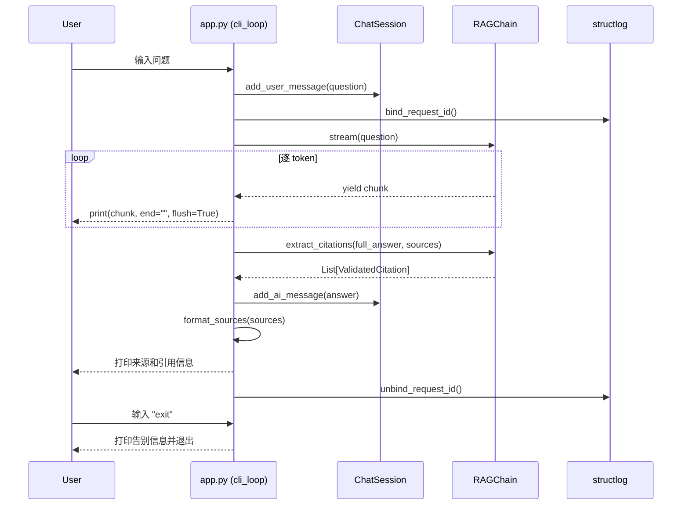

# Task 1.8 CLI 交互入口与端到端测试 - 架构设计

> **原始需求**：`.project_outline/phase_1_reliable_base/task_1.8_cli_e2e.md`
> **涉及文件**：`src/app.py`、`tests/test_e2e.py`

---

## 架构决策与权衡

### 决策 1：会话状态管理方式

- **选项 A**：在 `app.py` 的 `cli_loop()` 中直接维护 `List[BaseMessage]`，每次 invoke 时手动拼接 — 优点：实现简单直观；缺点：状态散落在函数局部变量中，无法独立测试
- **选项 B**：创建 `ChatSession` 类封装会话状态（history + turn_count），提供 `add_user_message()` / `add_ai_message()` / `get_history()` 方法 — 优点：单一职责、可独立测试、为 Task 2.5 对话记忆预留扩展点；缺点：多一个类
- **结论**：选 B。虽然当前仅是简单的内存列表，但 ChatSession 类将"会话状态管理"与"CLI 交互逻辑"分离，符合单一职责和可测试性。且 Task 2.5 的 LangGraph 对话记忆可直接复用 ChatSession 的 history 数据结构。

### 决策 2：CLI 输出模式（同步 vs 流式）

- **选项 A**：仅使用 `RAGChain.invoke()` 同步调用，等待完整回答后一次性打印 — 优点：实现最简；缺点：用户等待体验差，看不到打字效果
- **选项 B**：默认使用 `RAGChain.stream()` 流式输出，逐 token 打印 — 优点：打字效果体验好，为 Task 5.2 SSE 做前置验证；缺点：流式模式下无法直接获取 RAGResponse（含引用），需后置提取
- **选项 C**：支持 `--stream` 命令行参数切换同步/流式模式 — 优点：灵活性最高；缺点：增加 CLI 参数解析复杂度，当前阶段过度设计
- **结论**：选 B。流式输出是 CLI 问答系统的基本用户体验预期，且 stream() 已在 Task 1.6 实现。流式完成后，再调用 `chain.extract_citations()` 获取引用信息打印。不选 C 是因为当前不需要命令行参数解析（Task 2.7 CLI 升级时再引入 argparse）。

### 决策 3：E2E 测试策略

- **选项 A**：直接调用 RAGChain.create() + 本地向量库做真实检索 + Mock LLM — 优点：验证真实检索路径；缺点：依赖本地 Chroma 数据库和数据完整性，测试不够独立
- **选项 B**：完全 Mock RAGChain.invoke()，仅验证 CLI 层的输入输出行为 — 优点：测试完全独立，不依赖外部资源；缺点：未验证检索→生成的集成链路
- **结论**：选 B。E2E 测试的边界在 Task 需求中已明确："不依赖外部网络（使用 Mock 或本地向量库）"。完全 Mock RAGChain 保证测试的独立性和稳定性，真正的集成验证留给手动 `python src/app.py` 运行。同时补充一个集成测试用例验证 RAGChain.create() 能正常初始化（不调用 invoke），确保各模块的组装链路正确。

### 决策 4：ChatSession history 传入 RAGChain 的方式

- **选项 A**：当前 invoke() 不传 history，仅做单轮问答 — 优点：最简实现，与当前 RAGChain 接口一致；缺点：CLI 收集了 history 却没用
- **选项 B**：创建 RAGChain 时设置 `include_chat_history=True`，invoke 时传入 chat_history — 优点：验证多轮对话功能；缺点：Prompt 的 chat_history 占位符需要 history 数据，当前 LLM 单轮已能正确回答，过早启用可能导致 Prompt 过长
- **结论**：选 A。当前 Task 1.8 的验收标准是"5 轮问答程序不崩溃"，不要求上下文连贯。ChatSession 收集 history 是为 Task 2.5 预留数据结构，但不在当前启用 `include_chat_history=True`。在 CLI 的 TODO 中明确标注后续衔接点。

---

## 模块结构

### 文件组织
```
src/
├── app.py              # CLI 交互入口（REPL + ChatSession + main）
├── core/
│   ├── config.py       # 现有：LLM/Embedding 配置 + load_dotenv
│   └── exceptions.py   # 现有：RAGSystemError 异常体系
├── generation/
│   └── rag_chain.py    # 现有：RAGChain（invoke/stream/extract_citations）
├── retriever/
│   └── base_retriever.py  # 现有：VectorRetriever
└── utils/
    ├── logger.py       # 现有：setup_logging/bind_request_id/unbind_request_id
    └── retry.py        # 现有：with_retry

tests/
└── test_e2e.py         # 端到端测试
```

### 依赖关系
```
app.py
├── src.generation.rag_chain   # RAGChain.create() / invoke() / stream() / extract_citations()
├── src.utils.logger           # setup_logging() / bind_request_id() / unbind_request_id()
├── src.core.exceptions        # RAGSystemError（统一异常捕获）
├── src.core.config            # load_dotenv（确保环境变量加载）
└── langchain_core.messages    # HumanMessage / AIMessage（会话历史类型）
```

### 职责边界
```
app.py 职责：
✅ 包含：CLI 交互循环、会话状态管理、输出格式化、优雅退出、环境初始化
✅ 包含：ChatSession 类（封装对话历史）
✅ 包含：main() 入口函数（日志初始化 + RAGChain 创建 + REPL 循环）
❌ 不包含：业务逻辑（检索、生成、引用提取）← 属于 RAGChain
❌ 不包含：命令行参数解析 ← 属于 Task 2.7 CLI 升级（argparse）
❌ 不包含：异步处理 ← 属于 Task 4.5
```

---

## 核心接口设计

### 1. ChatSession

```python
class ChatSession:
    """
    CLI 会话状态管理器。

    设计意图：
        将"对话历史收集"与"CLI 交互循环"解耦，使会话状态可独立测试，
        且为 Task 2.5 LangGraph 对话记忆预留数据结构兼容性。

    为什么用 List[BaseMessage] 而非 List[str]：
        LangChain 的 Prompt 模板 chat_history 占位符期望
        List[BaseMessage] 类型，直接使用此类型避免后续转换。

    Args:
        max_turns: 最大保留的对话轮数（默认 10）。
            超过时自动丢弃最早的一轮（1 HumanMessage + 1 AIMessage）。
            为什么需要限制：长对话的 history 会导致 Prompt token 爆炸，
            限制轮数是简单有效的截断策略。

    Attributes:
        history: 对话历史消息列表（只读，通过 add_user_message/add_ai_message 修改）
        turn_count: 当前对话轮数
    """
    def add_user_message(self, content: str) -> None:
        """将用户消息添加到历史，turn_count +1。"""
        ...
    def add_ai_message(self, content: str) -> None:
        """将 AI 回复添加到历史。"""
        ...
    def get_history(self) -> List[BaseMessage]:
        """返回当前对话历史的只读副本。"""
        ...
    def clear(self) -> None:
        """清空对话历史，重置 turn_count。"""
        ...
    def _trim_if_needed(self) -> None:
        """当 history 条目数 > max_turns * 2 时，移除最早一轮。"""
        ...
```

### 2. cli_loop()

```python
def cli_loop(chain: RAGChain, session: ChatSession) -> None:
    """
    REPL 主循环：读取用户输入 → 调用 RAGChain → 打印回答。

    设计意图：
        将 REPL 循环逻辑与 main() 的初始化逻辑分离，
        使 cli_loop 可接收 Mock 的 chain 进行测试。

    为什么不在 cli_loop 中创建 RAGChain：
        依赖倒置 — cli_loop 依赖 RAGChain 接口而非具体创建过程，
        便于测试时注入 Mock 对象。

    Args:
        chain: 已初始化的 RAGChain 实例
        session: 会话状态管理器

    退出条件：
        - 用户输入 "exit" / "quit"（不区分大小小）
        - KeyboardInterrupt（Ctrl+C）
        - EOFError（Ctrl+D / Ctrl+Z+Enter）
    """
    ...
```

### 3. format_sources()

```python
def format_sources(sources: List[str]) -> str:
    """
    将来源 URL 列表格式化为可读字符串。

    为什么单独抽取为函数：
        格式化逻辑可能变化（如添加编号、去重、截断过长 URL），
        独立函数便于修改和测试。

    Args:
        sources: 来源 URL 列表（可能有重复）

    Returns:
        格式化后的字符串，如：
        "📚 来源：\n  [1] https://...\n  [2] https://..."
        空列表返回空字符串。
    """
    ...
```

### 4. main()

```python
def main() -> None:
    """
    CLI 入口函数：初始化 → 创建链 → 启动 REPL。

    初始化顺序（为什么这样排序）：
        1. load_dotenv() — 确保 API Key 可用（config.py 导入时需要）
        2. setup_logging() — 配置日志（后续所有操作都有日志）
        3. RAGChain.create() — 创建链（依赖 config.py 中的 LLM 和检索器）
        4. cli_loop() — 启动 REPL（依赖 chain 实例）

    Raises:
        SystemExit: 初始化失败时（如向量库不存在）以非零状态码退出
    """
    ...
```

---

## 交互时序图



---

## 代码骨架

### ChatSession 类

```python
class ChatSession:
    """CLI 会话状态管理器。

    设计意图：
        将"对话历史收集"与"CLI 交互循环"解耦，使会话状态可独立测试，
        且为 Task 2.5 LangGraph 对话记忆预留数据结构兼容性。

    为什么用 List[BaseMessage] 而非 List[str]：
        LangChain 的 Prompt 模板 chat_history 占位符期望
        List[BaseMessage] 类型，直接使用此类型避免后续转换。

    Args:
        max_turns: 最大保留的对话轮数（默认 10）。
            超过时自动丢弃最早的一轮（1 HumanMessage + 1 AIMessage）。
            为什么需要限制：长对话的 history 会导致 Prompt token 爆炸，
            限制轮数是简单有效的截断策略。

    Attributes:
        history: 对话历史消息列表（只读，通过 add_user_message/add_ai_message 修改）
        turn_count: 当前对话轮数
    """

    def __init__(self, max_turns: int = 10):
        """初始化会话。

        步骤：
            # 步骤 1：创建空历史列表 self._history: List[BaseMessage] = []
            # 步骤 2：设置 self._max_turns = max_turns
            # 步骤 3：设置 self.turn_count = 0
        """
        ...

    def add_user_message(self, content: str) -> None:
        """将用户消息添加到历史。

        步骤：
            # 步骤 1：创建 HumanMessage(content=content) 并 append 到 self._history
            # 步骤 2：self.turn_count += 1
            # 步骤 3：调用 self._trim_if_needed() 检查是否超出最大轮数
        """
        ...

    def add_ai_message(self, content: str) -> None:
        """将 AI 回复添加到历史。

        步骤：
            # 步骤 1：创建 AIMessage(content=content) 并 append 到 self._history
            # 注意：不加 turn_count，一轮 = 1 HumanMessage + 1 AIMessage
        """
        ...

    def get_history(self) -> List[BaseMessage]:
        """返回当前对话历史的只读副本。

        步骤：
            # 返回 list(self._history)（浅拷贝，防止外部修改内部状态）
        """
        ...

    def clear(self) -> None:
        """清空对话历史，重置 turn_count。

        步骤：
            # 步骤 1：self._history.clear()
            # 步骤 2：self.turn_count = 0
        """
        ...

    def _trim_if_needed(self) -> None:
        """当 history 条目数 > max_turns * 2 时，移除最早一轮。

        为什么是 max_turns * 2：一轮包含 2 条消息（Human + AI），
            所以 history 的最大条目数 = max_turns * 2。

        步骤：
            # 步骤 1：计算 max_messages = self._max_turns * 2
            # 步骤 2：若 len(self._history) > max_messages →
            #   移除 self._history 的前 2 个元素（最早的一轮对话）
            #   为什么一次移除 2 个：保持 Human/AI 消息成对，避免孤立的 AIMessage
            # 步骤 3：记录 debug 日志（当前 history 长度、被移除的轮数）
        """
        ...
```

### format_sources() 函数

```python
def format_sources(sources: List[str]) -> str:
    """将来源 URL 列表格式化为可读字符串。

    为什么单独抽取为函数：
        格式化逻辑可能变化（如添加编号、去重、截断过长 URL），
        独立函数便于修改和测试。

    Args:
        sources: 来源 URL 列表（可能有重复）

    Returns:
        格式化后的字符串，如：
        "📚 来源：\n  [1] https://...\n  [2] https://..."
        空列表返回空字符串。
    """
    # 步骤 1：若 sources 为空 → 返回 ""
    # 步骤 2：去重 — 用 dict.fromkeys(sources) 保持顺序去重
    #   为什么用 dict.fromkeys 而非 set：set 不保持顺序，用户期望按检索排名展示
    # 步骤 3：用 enumerate 从 1 开始编号，每行格式 "  [N] URL"
    # 步骤 4：拼接为 "📚 来源：\n" + 编号列表
    ...
```

### format_citations() 函数

```python
def format_citations(citations: List[ValidatedCitation]) -> str:
    """将引用验证结果格式化为可读字符串。

    Args:
        citations: 引用验证结果列表

    Returns:
        格式化后的字符串，如：
        "✅ 引用验证：\n  [1] ✅ https://...\n  [2] ❌ https://..."
        空列表返回空字符串。
    """
    # 步骤 1：若 citations 为空 → 返回 ""
    # 步骤 2：遍历 citations，每条格式 "  [N] ✅/❌ URL"
    #   is_valid=True → ✅，is_valid=False → ❌
    # 步骤 3：拼接为 "✅ 引用验证：\n" + 验证列表
    ...
```

### cli_loop() 函数

```python
def cli_loop(chain: RAGChain, session: ChatSession) -> None:
    """REPL 主循环：读取用户输入 → 调用 RAGChain → 打印回答。

    设计意图：
        将 REPL 循环逻辑与 main() 的初始化逻辑分离，
        使 cli_loop 可接收 Mock 的 chain 进行测试。

    为什么不在 cli_loop 中创建 RAGChain：
        依赖倒置 — cli_loop 依赖 RAGChain 接口而非具体创建过程，
        便于测试时注入 Mock 对象。

    Args:
        chain: 已初始化的 RAGChain 实例
        session: 会话状态管理器

    退出条件：
        - 用户输入 "exit" / "quit"（不区分大小小）
        - KeyboardInterrupt（Ctrl+C）
        - EOFError（Ctrl+D / Ctrl+Z+Enter）
    """
    # 步骤 1：打印欢迎信息
    #   内容：分隔线 + "🤖 RAG 问答系统 v1.0（Phase 1 基础版）" + "输入问题开始对话，输入 exit/quit 退出" + 分隔线
    #   为什么需要欢迎信息：用户首次启动需要知道系统已就绪和退出方式

    # 步骤 2：进入无限循环（while True），每次循环代表一轮问答
    #   循环体内按顺序执行 步骤 2a ~ 2m，异常由 步骤 3~6 统一处理

    # 步骤 2a：读取用户输入
    #   使用内置 input 函数，提示符为 "\n🤔 你："
    #   得到用户输入的原始字符串

    # 步骤 2b：去除输入首尾空白字符，若结果为空字符串 → 跳过本轮（continue）
    #   为什么：用户可能误按回车，空行不应触发问答

    # 步骤 2c：退出判断 — 将输入转为小写，若为 "exit" 或 "quit" → 打印告别信息 → 跳出循环（break）
    #   为什么不区分大小写：用户可能输入 EXIT / Quit 等变体
    #   告别信息常量："👋 感谢使用，再见！"

    # 步骤 2d：将用户输入通过 session.add_user_message() 记录到会话历史
    #   这一步必须在业务逻辑之前，确保历史完整性

    # 步骤 2e：调用 bind_request_id() 为本轮问答绑定唯一追踪 ID
    #   绑定后，后续所有 structlog 日志自动附带 request_id 字段

    # 步骤 2f：流式输出 — 调用 chain.stream(user_input)
    #   步骤 2f-1：打印前缀 "\n🤖 答："（end="" 不换行，flush=True 立即显示）
    #   步骤 2f-2：遍历 stream 返回的每个 chunk，逐个 print（end="", flush=True）实现打字效果
    #   步骤 2f-3：将每个 chunk 拼接到 full_answer 字符串变量
    #   步骤 2f-4：流式完成后，若 full_answer 末尾不是换行符 → print() 补一个换行
    #     为什么：stream 最后一个 chunk 不含换行，后续输出（来源信息）会紧跟在回答后面
    #   步骤 2f-5（异常处理）：
    #     若 stream 过程中抛出 RAGSystemError → 直接向上传播（raise），由外层统一处理
    #     若 stream 过程中抛出其他异常 → 记录 warning 日志，回退到 chain.invoke(user_input)
    #       若 invoke 也抛出 RAGSystemError → 向上传播（raise）
    #       若 invoke 也抛出其他异常 → full_answer 保持为空字符串
    #   为什么 RAGSystemError 必须向上传播：
    #     保持异常处理路径一致，所有 RAGSystemError 都在外层打印统一的 "❌ 系统错误" 消息

    # 步骤 2g：获取来源 URL 列表
    #   步骤 2g-1：调用 chain.retrieve(user_input) 获取文档列表
    #   步骤 2g-2：遍历文档列表，提取每个文档 metadata 中的 "source" 字段，组成 sources 列表
    #     若 metadata 中无 "source" → 用空字符串占位
    #   步骤 2g-3：若 retrieve 失败 → 记录 warning 日志，sources 保持为空列表
    #   注意：retrieve 会触发二次检索（stream 内部已检索过），这是当前最简实现的已知技术债
    #   TODO(Task 2.2): LangGraph 节点将 sources 写入状态对象，避免二次检索

    # 步骤 2h：提取并验证引用
    #   前提：full_answer 非空 且 sources 非空
    #   调用 chain.extract_citations(full_answer, sources) 获取引用验证结果列表
    #   若提取失败 → 记录 warning 日志，citations 保持为空列表
    #   为什么引用提取失败不中断主流程：引用是增强功能，回答文本本身仍然有效

    # 步骤 2i：打印来源信息 — 调用 format_sources(sources)
    #   仅在返回值非空时打印（空 sources 返回空字符串，不打印）

    # 步骤 2j：打印引用验证结果 — 调用 format_citations(citations)
    #   仅在返回值非空时打印

    # 步骤 2k：将 AI 回复通过 session.add_ai_message(full_answer) 记录到会话历史
    #   仅在 full_answer 非空时记录

    # 步骤 2l：调用 unbind_request_id() 清除请求上下文
    #   为什么必须清除：防止下一轮问答的日志携带上一轮的 request_id

    # 步骤 2m：打印分隔线（40 个破折号 "—"），视觉上分隔每轮问答

    # 步骤 3：捕获 KeyboardInterrupt → 优雅退出
    #   打印换行 + 告别信息 → 跳出循环（break）
    #   为什么不 re-raise：用户主动中断不应产生 traceback
    #   为什么单独捕获：Ctrl+C 是用户最常见的退出方式

    # 步骤 4：捕获 EOFError → 优雅退出
    #   打印换行 + 告别信息 → 跳出循环（break）
    #   为什么单独处理：Windows 下 Ctrl+Z+Enter 触发 EOFError 而非 KeyboardInterrupt
    #   如果只捕获 KeyboardInterrupt，Windows 用户无法通过 Ctrl+Z 退出

    # 步骤 5：捕获 RAGSystemError → 业务异常处理
    #   打印 "❌ 系统错误：{异常信息}"（用户友好的错误提示）
    #   记录 error 级别 structlog 日志，包含 error 和 error_type 字段
    #   调用 unbind_request_id() 清理请求上下文
    #   打印分隔线
    #   不跳出循环 — 系统异常后继续等待下一个问题
    #   为什么不退出：一次 LLM 调用失败不应终止整个会话

    # 步骤 6：捕获其他 Exception → 兜底处理
    #   打印 "❌ 未预期的错误：{异常信息}"
    #   记录 error 级别 structlog 日志
    #   调用 unbind_request_id() 清理请求上下文
    #   打印分隔线
    #   不跳出循环 — 继续等待下一个问题（最大容错）
```

### main() 函数

```python
def main() -> None:
    """CLI 入口函数：初始化 → 创建链 → 启动 REPL。

    初始化顺序（为什么这样排序）：
        1. load_dotenv() — 确保 API Key 可用（config.py 导入时需要）
        2. setup_logging() — 配置日志（后续所有操作都有日志）
        3. RAGChain.create() — 创建链（依赖 config.py 中的 LLM 和检索器）
        4. cli_loop() — 启动 REPL（依赖 chain 实例）

    Raises:
        SystemExit: 初始化失败时（如向量库不存在）以非零状态码退出
    """
    # 步骤 1：加载环境变量
    #   调用 load_dotenv(override=True) 确保 .env 文件中的变量被加载
    #   为什么在 main 中再次调用：config.py 模块级调用只执行一次，
    #   但 app.py 作为入口需显式确保环境变量就绪

    # 步骤 2：配置结构化日志
    #   调用 setup_logging，参数 level="INFO", json_format=False
    #   为什么 json_format=False：CLI 开发环境使用控制台渲染器（带颜色、可读性好）
    #   TODO(Task 5.5): 日志级别和格式可从配置文件读取

    # 步骤 3：记录启动日志
    #   调用 logger.info，事件为 "RAG CLI 启动"

    # 步骤 4：创建 RAGChain 实例（带异常处理）
    #   步骤 4a：调用 RAGChain.create() 尝试创建链
    #   步骤 4b：若捕获 RAGSystemError →
    #     记录 error 日志（"RAGChain 初始化失败"）
    #     打印用户可见的 "❌ 初始化失败：{异常信息}"
    #     以退出码 1 调用 sys.exit
    #   步骤 4c：若捕获其他 Exception →
    #     同样记录 error 日志 + 打印提示 + sys.exit(1)
    #   为什么初始化失败直接退出：向量库或 LLM 不可用时，后续所有操作都无法执行，退出是最合理的选择

    # 步骤 5：创建 ChatSession 实例
    #   调用 ChatSession(max_turns=10)

    # 步骤 6：启动 REPL 循环
    #   调用 cli_loop(chain, session)

    # 步骤 7：记录退出日志
    #   调用 logger.info，事件为 "RAG CLI 退出"
```

### if __name__ == "__main__" 块

```python
# 标准入口守卫
# 步骤：判断 __name__ == "__main__"，若为真则调用 main()
```

---

## 关键配置项

| 参数 | 默认值 | 说明 | 调优场景 |
|------|--------|------|----------|
| `ChatSession.max_turns` | `10` | 最大保留对话轮数 | 对话过长导致 token 爆炸时调小；需要更长的上下文窗口时调大 |
| `setup_logging.level` | `"INFO"` | CLI 日志级别 | 调试时设为 `"DEBUG"`；生产部署时保持 `"INFO"` |
| `setup_logging.json_format` | `False` | CLI 日志格式 | 开发用 `False`（ConsoleRenderer）；生产用 `True`（JSONRenderer） |
| `RAGChain.create()` 参数 | 默认值 | 向量库路径、Prompt 版本等 | 通过修改 RAGChain.create() 的参数调整 |

---

## 常见坑点

1. **Windows 下的 EOFError**：Windows 中 Ctrl+Z+Enter 产生 EOFError 而非 KeyboardInterrupt，必须同时捕获两者。如果只捕获 KeyboardInterrupt，Windows 用户无法通过 Ctrl+Z 退出。

2. **流式输出后缺少换行**：stream() 返回的最后一个 chunk 不包含换行符，打印完所有 chunk 后必须 `print()` 补换行，否则后续输出（来源信息）会紧跟在回答文本后面。

3. **二次检索问题**：流式模式下，stream() 内部已经执行了检索但未返回 sources。为获取 sources 需要再次调用 retrieve()，导致同一问题检索两次。这是当前阶段的最简实现，Task 2.2 LangGraph 节点会将 sources 写入状态对象，避免二次检索。

4. **input() 阻塞与 Ctrl+C**：Python 的 `input()` 函数在 Windows 上对 Ctrl+C 的响应不如 Unix 及时。在 while True 循环中捕获 KeyboardInterrupt 是必要的，但用户体验可能略有延迟。

5. **ChatSession history 的内存泄漏**：长对话场景下 history 无限增长。通过 `max_turns` 限制并自动 trim 避免此问题。但注意 trim 只在 `add_user_message` 时触发（新轮次开始），不会在 `add_ai_message` 时触发。

---

## 10维最佳实践落地

| 维度 | 本 Task 落地方式 |
|------|------------------|
| 1. 模块分离 | `app.py` 仅处理 CLI 交互和会话管理；`ChatSession` 类封装状态；`format_sources`/`format_citations` 独立为纯函数 |
| 2. 架构分层 | CLI 层 → RAGChain 层 → 检索/生成层，层间通过 RAGChain 接口交互；ChatSession 与 cli_loop 解耦 |
| 3. SOLID 原则 | 单一职责：ChatSession 管状态，cli_loop 管交互，format_* 管格式化；依赖倒置：cli_loop 接收 RAGChain 实例而非内部创建 |
| 4. 封装与抽象 | ChatSession 的 history 通过 add_user_message/add_ai_message 修改，外部无法直接操作内部列表；get_history() 返回只读副本 |
| 5. 设计模式 | REPL 模式（while True + input）；工厂方法（RAGChain.create()）；ChatSession 采用封装模式（非传统设计模式，但符合信息隐藏原则） |
| 6. 可观测性 | 每轮问答 bind_request_id → unbind_request_id；RAGSystemError 统一捕获并记录 structlog；启动/退出均有 info 日志 |
| 7. 配置管理 | ChatSession.max_turns 可配置；日志级别/格式可配置；RAGChain.create() 参数可配置；所有配置均为函数参数，无硬编码 |
| 8. 鲁棒性/容错 | 捕获 KeyboardInterrupt/EOFError 优雅退出；RAGSystemError 不中断 REPL 循环；未知异常兜底不退出；初始化失败 sys.exit(1) |
| 9. 可测试性 | cli_loop 接收注入的 chain 实例（可 Mock）；ChatSession 可独立测试；format_sources/format_citations 为纯函数；E2E 测试完全 Mock |
| 10. 可扩展性 | ChatSession 为 Task 2.5 对话记忆预留；TODO 标注 stream → extract_citations 的二次检索问题；预留 Task 2.7 CLI 参数解析扩展点 |

---

## 验收标准

### 功能验收
- [ ] `python src/app.py` 启动后显示欢迎信息
- [ ] 连续 5 轮问答（包含一个无关问题）程序不崩溃
- [ ] 输入 `exit` 或 `quit` 正常退出并显示告别信息
- [ ] Ctrl+C 和 Ctrl+Z+Enter 能优雅退出
- [ ] 流式输出逐 token 显示打字效果

### 质量验收
- [ ] `pytest tests/test_e2e.py` 全部通过
- [ ] ChatSession 单元测试覆盖 add/trim/clear/get_history
- [ ] format_sources 和 format_citations 纯函数测试
- [ ] RAGSystemError 不中断 REPL 循环
- [ ] 所有日志使用 structlog，包含 request_id

### 性能验收
- [ ] CLI 启动时间 < 5 秒（含 Chroma 加载）
- [ ] 单轮问答端到端延迟 < 10 秒（含 LLM 调用）

---

## 前瞻性设计

### 与后续 Task 的接口衔接
- **Task 2.5（对话记忆）**：ChatSession.get_history() 返回 List[BaseMessage]，可直接传入 RAGChain.invoke(chat_history=...)；需在 RAGChain 创建时设置 `include_chat_history=True`
- **Task 2.7（CLI 升级）**：main() 中的 RAGChain.create() 参数可改为 argparse 解析；欢迎信息中的版本号可从配置读取
- **Task 4.5（异步处理）**：cli_loop 中可替换为 async 版本，使用 `ainvoke()` / `astream()`
- **Task 5.1（FastAPI）**：ChatSession 的 history 结构与 FastAPI 的 session 管理兼容
- **Task 5.2（SSE 流式）**：stream() 的逐 token 输出模式与 SSE 推送协议一致

### 预留 TODO
- [ ] TODO(Task 2.5): 启用 include_chat_history=True，将 ChatSession.get_history() 传入 RAGChain
- [ ] TODO(Task 2.2): LangGraph 节点将 sources 写入状态，避免流式模式下的二次检索
- [ ] TODO(Task 2.7): 引入 argparse 支持 --stream/--no-stream、--debug 等命令行参数
- [ ] TODO(Task 4.5): cli_loop 异步化，使用 astream() 替代 stream()
- [ ] TODO(Task 5.5): setup_logging() 参数从配置文件读取

---

## 参考技术文档

- [repl_design.md](../../docs/task_1.8/repl_design.md) - REPL 设计模式与 Python 实现详解
- [e2e_testing.md](../../docs/task_1.8/e2e_testing.md) - 端到端测试策略与 Mock 技巧
