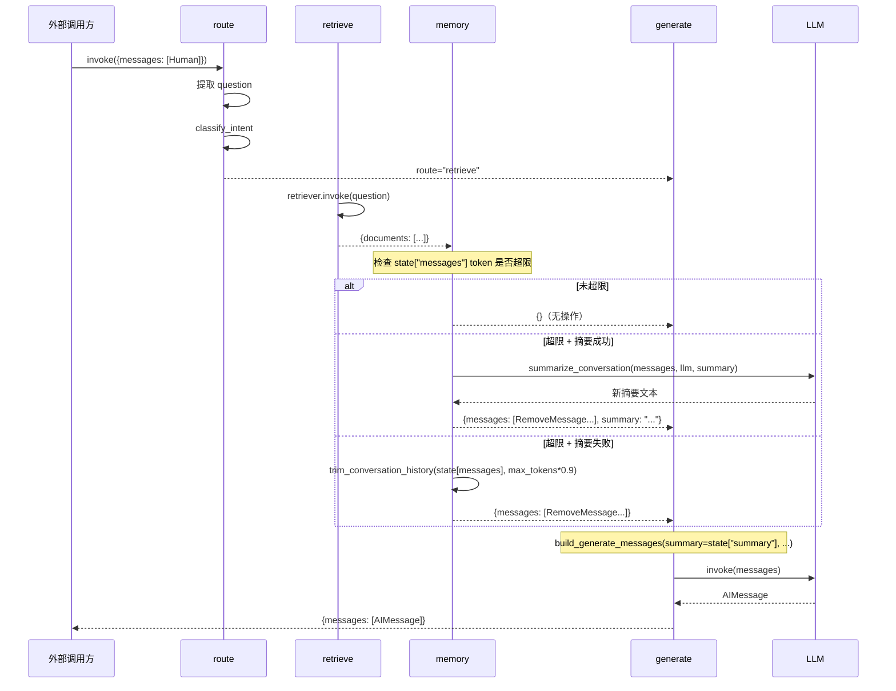

# Task 2.5 对话记忆管理 - 架构设计

> **原始需求**：`.project/outline/phase_2_langgraph/task_2.5_draft.md`
>
> **涉及文件**：
> - `src/memory/__init__.py`（新建）
> - `src/memory/conversation.py`（新建）
> - `src/memory/summary.py`（新建）
> - `src/workflow/state.py`（修改 — GraphState 增 summary 字段、GraphContext 增 max_tokens 字段）
> - `src/workflow/nodes.py`（修改 — 新增 memory_node 闭包）
> - `src/workflow/builder.py`（修改 — 图拓扑插入 memory 节点）
> - `src/workflow/prompts.py`（修改 — build_generate_messages 增 summary 入参）
> - `tests/test_memory.py`（新建）
> - `tests/test_workflow_nodes.py`（修改 — 验证 memory_node 注册）
> - `tests/test_workflow_builder.py`（修改 — 验证含 memory 的完整图流程）

---

## 架构决策与权衡

### 先读：这不是"插入一个记忆管理节点"的事

大多数教程展示的是"用 `trim_messages` 裁剪消息列表"的 3 行代码。但在本项目中：

1. **摘要存在哪**决定了 GraphState 是否需要新字段（独立 `summary` 字段 vs 塞进 messages 列表），以及 prompt 构建时如何让 LLM 感知到历史压缩
2. **memory 节点在图中的位置**决定了 generate 节点看到的 messages 形态——放在 retrieve 之前还是之后，影响当前轮 HumanMessage 是否被误删
3. **memory 节点的混合写回策略**（RemoveMessage + 新消息的组合）因为 add_messages reducer 的"先删后加"语义，摘要场景需要全量重建而非差异删除，否则摘要消息会排在最后
4. **降级链**：摘要失败→裁剪，决定了多轮对话在 LLM 故障时是否能优雅降级

---

### 入口判定

1. **摘要存在哪**：独立 `summary` 状态字段 vs AIMessage 塞进 messages 列表。换方案改变 GraphState 定义和 prompt 构建方式。**命中**。

2. **memory 节点在图拓扑中的位置**：retrieve 之前还是之后。换方案改变当前轮 HumanMessage 的保护策略和 Task 2.6 循环中的行为。**命中**。

3. **memory 节点写回策略**：差异删除 vs 全量重建。换方案改变 memory_node 返回的 messages 结构和 add_messages reducer 的处理结果。**命中**。

4. **增量摘要策略**：官档的显式增量（state.summary 扩展） vs 全量重压缩。换方案改变 summarize_conversation 的接口签名和存储模式。**命中**。

5. **Token 计数策略**：`count_tokens_approximately`（官档默认、无模型依赖） vs `llm.get_num_tokens_from_messages`（精确、需 LLM 实例）。换方案影响 memory_node 是否需要 LLM 依赖。**命中**。

---

### 决策 1：摘要存储 — 独立 `summary` 字段

**语境**：摘要压缩后生成的内容需要在下轮对话中注入给 LLM。它可以存在 messages 列表中（作为一条特殊的 AIMessage），也可以存在独立的 `state["summary"]` 字段中。官档的 [summarize_conversation 示例](https://docs.langchain.com/oss/python/langgraph/add-memory) 使用独立字段模式。

**候选对比**：

- **方案 A**（选）：GraphState 新增 `summary: str` 字段
  - 本项目优势：
    - 官档标准模式——官档的 `summarize_conversation` 示例直接用 `state.get("summary", "")`
    - 增量扩展自然——`旧摘要 + 新消息 → LLM 扩展 → 新摘要`
    - prompt 构建时通过 `build_generate_messages(summary=state["summary"])` 注入，不污染 messages 列表
    - `route_node` 的反向遍历不受影响（messages 中无摘要消息混入）
  - 本项目硬伤：多一个状态字段的序列化/反序列化成本（str 类型，成本可忽略）

- **方案 B**：摘要作为 AIMessage(content=prefix + 摘要文本) 塞进 messages 列表
  - 优势：不改 GraphState；摘要自动参与 add_messages 的追踪
  - 硬伤：
    - `route_node` 反向遍历 messages 找最后一条 HumanMessage——虽然摘要 AIMessage 不影响"按 type 过滤"逻辑，但 messages 长度增加了（摘要消息占用一条位置）
    - `state["messages"][:-1]` 传给 `build_generate_messages` 时混入了摘要消息，需要特殊过滤
    - 增量扩展需要从 messages 中识别哪条是摘要（靠 content 前缀匹配），不如独立字段直接
    - 摘要占用 token 配额——它本身是历史压缩，但作为消息会参与下一轮的 token 计数

**反驳推演**：如果选方案 B，需要在三个地方处理摘要消息的特殊性：(1) `route_node` 遍历 messages 时过滤摘要 AI 消息，(2) `build_generate_messages` 的 `chat_history` 参数可能需要排除摘要，(3) memory 节点检测"已存在摘要"时需要 `content.startswith(prefix)` 而非直接 `state.get("summary")`。方案 B 节省了一个字段，但增加了三处过滤逻辑——且每个都是"不做会出错，做了但其他开发者不知道"的隐形 bug 来源。

**结论**：选 A。GraphState 新增 `summary: str`。`build_generate_messages` 在 SystemMessage 之后注入摘要。官档采用此模式且推理一致。

**反事实自检**：

- [x] 方案 B 不再失效（如果所有读 messages 的地方都有统一的摘要过滤层），两方案都可行 → "读 messages 的地方分布在 route_node（反向遍历）、build_generate_messages（切片[:-1]）、memory_node（全量扫描）三个独立模块中"正是让统一过滤层无法成立的原因 → 验证通过

---

### 决策 2：memory 节点在图中的位置 — `retrieve → memory → generate`

**语境**：当前拓扑 `retrieve → generate → END`。需要将 memory 节点插入到 retrieve 和 generate 之间。

**候选对比**：

- **方案 A**（选）：`retrieve → memory → generate`
  - 本项目优势：
    - memory 在 generate 之前执行，压缩后的 chat_history 被 generate 使用
    - memory 读取 `state["messages"]` 时当前轮 HumanMessage 已在 `messages[-1]`，是安全位置（不会被压缩）
    - Task 2.6 循环路径 `rewrite → retrieve` 会再次经过 memory，提供二次压缩机会
  - 硬伤：当前轮生成的 AI 回复尚未存在，memory 无法压缩它——但这不是问题，因为 memory 只压缩"上一轮及以前"的消息

- **方案 B**：`memory → route → retrieve → generate`（路由前压缩）
  - 优势：route 节点也能看到压缩后的 messages
  - 硬伤：`route_node` 只从 messages 取最后一条 HumanMessage 的内容——即使 messages 有一万条，它也只看最后一条。压缩对 route 节点零收益，只是让它在每次执行前额外跑一次 token 计算（但可能无操作），增加不必要的执行次数

- **方案 C**：`generate → memory`（生成后压缩供下轮使用）
  - 硬伤：当前轮 generate 节点接收的是**未压缩的完整历史**——如果超限，generate 在调用 LLM 时就可能抛 `ContextLengthExceededError`。且 Task 2.6 的循环路径中，第一次循环的 rewrite 到第二次 retrieve 后不经过 memory，可能导致循环中消息超限

**反驳推演**：方案 C 在 Task 2.6 循环场景中失败：假设第二次循环（rewrite → retrieve → generate），generate 接收的消息包含了第一次循环的完整结果——如果第一次循环结束后 AI 回复很长，第二次循环的 messages 可能刚好超限。方案 A 中 `rewrite → retrieve → memory → generate` 让 memory 每次都在 generate 前执行，确保 generate 的输入始终被压缩。

**结论**：选 A。图拓扑从 `retrieve → generate` 改为 `retrieve → memory → generate`。

**反事实自检**：

- [x] 方案 B 不再失效（如果 route_node 需要读取完整的 messages 历史来做意图分类），两方案都可行 → "route_node 只取最后一条 HumanMessage 的 content，完全不依赖 messages 长度和历史内容"正是让方案 B 的"让 route 看到压缩后消息"优势失效的原因 → 验证通过

---

### 决策 3：memory 节点写回策略 — Trim 差异删除、Summary 全量重建

**语境**：memory 节点通过 `{"messages": [RemoveMessage(...), ...]}` 写回状态。add_messages reducer 的处理顺序是先删除指定的消息 ID，再追加新消息（追加到列表末尾）。如果摘要场景只删除旧消息然后追加摘要 AIMessage，摘要会出现在列表末尾而非期望的头部。

**候选对比**：

- **方案 A**（选）：Trim 用差异删除 + Summary 用全量重建
  - 本项目优势：
    - Trim 场景：`trim_messages` 返回的消息是原对象引用，已在 state 中。只需对"不在保留集中"的消息发 RemoveMessage。
    - Summary 场景：需要改变消息顺序（摘要放头部、最近 KEEP_LAST_N 条紧随其后），因此删除所有旧消息，重新构造完整列表：`[summary_aimsg] + kept_messages`
  - 硬伤：两种场景写回方式不同，增加了 memory_node 内部的复杂度

- **方案 B**：统一用"删除所有 + 重新构造"
  - 优势：代码一致
  - 硬伤：Trim 场景中删除了所有消息又逐条重加，LangGraph checkpoint 追踪的消息 ID 链被断开——对于 Task 2.7 的检查点时间旅行调试有副作用。且效率更低（不必要的全量重建）

**Trim 差异删除的机制**：
```python
# state 中的消息：[msg1(id=a), msg2(b), msg3(c), msg4(d)]
# trim 保留：[msg3(c), msg4(d)]
# 差异：a, b 不在保留集中
# 返回：{messages: [RemoveMessage(id="a"), RemoveMessage(id="b")]}
# 结果 state：[msg3(c), msg4(d)]（msg3, msg4 保持引用不变）
```

**Summary 全量重建的机制**：
```python
# state 中的消息：[msg1(a), msg2(b), msg3(c), msg4(d)]
# keep_last_n=2，消息 1-2 被摘要
# 返回：{
#   messages: [
#     RemoveMessage(id="a"), RemoveMessage(id="b"),
#     RemoveMessage(id="c"), RemoveMessage(id="d"),  # 全部删除
#     AIMessage(content="summary..."),               # 摘要放最前
#     msg3(c), msg4(d),                              # 保留消息紧随其后
#   ]
# }
# 结果 state：[AIMessage("summary..."), msg3(c), msg4(d)]
```

**反驳推演**：如果统一用方案 B，Trim 场景中所有消息的 ID 被删除重建，检查点中的 message_id 链断裂——当 Task 2.7 尝试用 `get_state_history` 做时间旅行调试时，无法通过 ID 追踪从哪个版本裁剪了消息。这是未来调试能力的隐性损失。当前两套写回策略的差异不是过度设计，而是与检查点系统生命周期的契约对齐（Trim：保留追踪链；Summary：重构追踪链）。

**结论**：选 A。两种场景明确区分。memory_node 内部用 if/else 分支选择写回策略。

**反事实自检**：

- [x] 方案 B 不再失效（如果项目不使用 checkpoint，或不需要通过 ID 追踪消息历史），两方案都可行 → "项目使用 SqliteSaver 检查点持久化，且 Task 2.7 将需要 get_state_history 时间旅行调试"正是让方案 B 的 ID 重建失去追踪能力的原因 → 验证通过

---

### 决策 4：增量摘要策略 — 官档显式增量

**语境**：官档的 [summarize_conversation 示例](https://docs.langchain.com/oss/python/langgraph/add-memory) 使用显式增量模式：将已有摘要和新消息一同发给 LLM 扩展。这与"每次全量重压缩"的区别在于：有摘要时 LLM 输入包含旧摘要 + 新消息（O(1) 扩展），无摘要时 LLM 压缩全部历史（O(n) 全量）。

此决策不改变代码结构（都是 `summarize_conversation(messages, llm, existing_summary)` 的签名），但改变 LLM 调用的 prompt 构建逻辑，且直接关联决策 1 中 `summary` 字段的存在意义。

**候选对比**：

- **方案 A**（选）：显式增量 — `summarize_conversation` 接收 `existing_summary: str` 参数
  - 本项目优势：
    - 与官档模式完全一致
    - 每次 LLM 调用处理的消息数 ≈ KEEP_LAST_N + 1（摘要中未覆盖的新消息），不会随对话轮次增长
    - `existing_summary` 来自 `state["summary"]`，字段天生为空字符串起步，逻辑简洁
  - 硬伤：多次增量扩展后摘要文本可能逐渐冗长（潜伏期长，至少 20+ 轮对话后才可能观察到）

- **方案 B**：全量重压缩 — 每次将所有待压缩消息重新摘要，不读 `existing_summary`
  - 优势：不依赖 state["summary"]，summarize_conversation 签名更简单（只需 messages + llm）
  - 硬伤：每次 O(n)，n 随对话轮次增大；浪费了已在摘要中的历史信息

**增量 VS 全量的 LLM 输入差异**：

```
增量模式（方案 A）：
  System: 你是一个对话摘要助手...
  Human:  这是已有的对话摘要：
          摘要：用户询问了 LangGraph 的 StateGraph 概念，确认了其核心功能。
          以下是需要合并到摘要中的新对话：
          Human: 它和 MessageGraph 有什么区别？
          AI: StateGraph 是通用图，MessageGraph 是专用于消息的简化版...
          请扩展已有摘要，将新对话合并进去。

全量模式（方案 B）：
  System: 你是一个对话摘要助手...
  Human:  以下是需要摘要的对话历史：
          Human: LangGraph 的 StateGraph 是什么？
          AI: StateGraph 是核心类...
          Human: 它和 MessageGraph 有什么区别？
          AI: StateGraph 是通用图，MessageGraph 是专用于消息的简化版...
          请压缩以上对话为一段摘要。
```

**反驳推演**：方案 B 在对话达到约 10 轮时，每次传递给摘要 LLM 的消息数 ≈ 20 条（10 轮 × 2 条）。如果每条消息平均 200 tokens，则 4000 tokens——等于 `max_tokens` 自身。摘要 LLM 收到与自己输出预算等长的输入，效率低且可能超时。方案 A 的增量模式每次处理的消息数 ≈ 4(keep_last_n) + 1(当前历史) + 1(摘要扩展指令) ≤ 6 条，始终可控。

**结论**：选 A。`summarize_conversation` 签名增加 `existing_summary: str`，使用官档的增量 extension pattern。

**反事实自检**：

- [x] 方案 B 不再失效（如果项目限制了最多对话轮数，如最多 5 轮），两方案都可行 → "Task 2.5 的验收约束未限制对话轮数，理论上对话可无限持续"正是让方案 B 的 O(n) 退化不可接受的原因 → 验证通过

---

### 决策 5：Token 计数 — `count_tokens_approximately`

**语境**：官档所有示例统一使用 `count_tokens_approximately`（来自 `langchain_core.messages.utils`）。另一个选项是用模型特定 tokenizer 如 `llm.get_num_tokens_from_messages`。

**候选对比**：

- **方案 A**（选）：`count_tokens_approximately`
  - 本项目优势：
    - 官档标准做法
    - 无模型依赖——memory_node 不需要 LLM 实例来做 token 计数
    - `trim_messages` 的 `token_counter` 参数签名是 `Callable[[BaseMessage], int]`，`count_tokens_approximately` 直接匹配
    - 中文场景下计数偏差不影响阈值判断——我们需要的是"是否超过阈值"的 yes/no，不是精确的 token 数
  - 硬伤：计数不精确（中文大约 1 char ≈ 1-2 token，实际约 3-5 char/token），但后果只是"过早触发记忆管理"而非功能错误

- **方案 B**：`llm.get_num_tokens_from_messages`
  - 优势：使用实际模型 tokenizer，精确
  - 硬伤：
    - memory_node 需要持有 LLM 实例——只能通过闭包注入，增加依赖
    - `get_num_tokens_from_messages` 接收 `list[BaseMessage]`，而 `trim_messages` 的 `token_counter` 需 `Callable[[BaseMessage], int]`，需额外桥接
    - 不同模型（DeepSeek vs Qwen）tokenizer 不同，切换提供者时计数行为变化

**反驳推演**：方案 B 的核心动机是"精确计数"——但精确到 token 级别的计数在本场景中没有实际收益。我们的阈值是"约 4000 tokens"，`count_tokens_approximately` 计出 4500 或 3800（实际也是 4000 左右），触发时机差一轮对话——不是问题。如果用精确计数器算到 4012 vs 3987，区别是什么？——没有区别。精确计数增加的复杂度和耦合与它解决的问题不匹配。

**结论**：选 A。全系统使用 `count_tokens_approximately`。

**反事实自检**：

- [x] 方案 B 不再失效（如果当前使用的 LLM 上下文窗口极短，token 预算需精确利用——如 2048 tokens），两方案都可行 → "本项目 LLM 上下文窗口 ≥ 8K tokens（DeepSeek-chat 64K），memory 阈值设为 4000 tokens 有充足余量"正是让"精确计数"失去必要性的原因 → 验证通过

---

### 非关键决策

#### 决策 1：memory_node 读取 `max_tokens` 通过 `Runtime[GraphContext]`

`generate_node` 已通过 `Runtime[GraphContext]` 读取 `max_iterations`：
```python
def generate_node(state: GraphState, runtime: Runtime[GraphContext]) -> dict:
    max_iterations = runtime.context.max_iterations if runtime.context is not None else 3
```

memory_node 使用完全相同的模式读取 `max_tokens`。与 `max_iterations` 一样，`max_tokens` 是 per-request 可配置的阈值（不同 thread_id 可用不同值），放入 `GraphContext` 而非模块常量符合验收约束要求。

如果 `max_tokens` 是模块常量，memory_node 不需要 `Runtime` 参数——但验收约束明确要求"阈值为 `max_tokens` 放在 context_schema 中"。这是验收硬约束。

#### 决策 2：摘要 LLM 复用 generate 的 llm 实例

不在 summary.py 内部创建 LLM 实例。llm 由 `create_workflow_nodes` 的闭包（memory_node）传入 `summarize_conversation(messages, llm, existing_summary)`。测试时传入 `FakeChatModel`。

复用意味着摘要使用与生成相同的 LLM 提供商/模型。如果未来需要独立配置（如摘要用小模型降低成本），可扩展但当前不超前实现。

#### 决策 3：`build_generate_messages` 增加 `summary` 参数

当前签名：
```python
def build_generate_messages(*, context, question, chat_history, version, include_few_shot)
```

改为：
```python
def build_generate_messages(*, context, question, chat_history, summary="", version, include_few_shot)
```

摘要注入位置：在 SystemMessage 之后、Few-shot 示例之前插入一条带有摘要标记的 SystemMessage：
```
[SystemMessage(全局指令)]
[SystemMessage("以下是对话摘要：...\n注意：摘要是对之前对话的压缩，不是完整对话记录。")]  ← 新增
[Few-shot 示例]
[chat_history(压缩后的)]
[HumanMessage(当前轮)]
```

为什么用 SystemMessage 而非放在 chat_history 中：摘要描述的是**对话的语义压缩**，是 meta 信息而非对话记录。放在 SystemMessage 区域让 LLM 将它视为"对话上下文说明"而非"历史对话"，减少对 LLM 回答格式的干扰。官档示例对此无明确定义，但从 `summarize_conversation` 的 prompt 设计（`f"This is a summary to date: {summary}"`）推断，作为上下文注入是合理的。

#### 决策 4：摘要失败时降级精度

摘要 LLM 调用失败降级到 `trim_messages` 时，使用 `max_tokens * 0.9` 作为 trim 参数。原因：`trim_messages` 的 `end_on=("human",)` 参数是包含性约束——裁剪后列表的末端必须是一条 HumanMessage。如果 budget 刚耗尽时恰好遇到 HumanMessage，保留的消息可能**刚好略高于** `max_tokens`（多保留了一对消息来满足 end_on 条件）。用 90% 阈值做 buffer，确保降级后 token 数严格小于 `max_tokens`。

这与验收约束 5 直接对应："降级后必须确保消息列表 token 数降到阈值以下"。

---

### 与后续 Task 的接口衔接

- Task 2.6（循环安全阀）：memory 节点位于 `retrieve → generate` 之间。Task 2.6 新增 `rewrite → retrieve` 循环路径后，memory 会在每次循环中 generate 之前自动执行，无需修改 graph 拓扑。
- Task 2.7（检查点回溯）：summary 字段会随着 checkpointer 持久化。`get_state_history` 回滚时可回溯到任意版本的 summary 值。

**已知后续替换**：

> 当前 `count_tokens_approximately` 为 Token 计数的默认实现。如果项目切换的 LLM 提供商上下文窗口极窄（如 ≤ 2K tokens）且需精确控制 token 预算，可替换为 `llm.get_num_tokens_from_messages`。
> 接口契约不变：`Callable[[BaseMessage], int]`——`trim_messages` 的 `token_counter` 参数和 `summarize_conversation` 内部的计数调用均兼容。

---

### 质量准则豁免

| 维度 | 落地方式 |
|------|---------|
| 模块分离 | memory 包职责独立（conversation.py：纯裁剪、summary.py：LLM 摘要）；与 workflow 包通过 `nodes.py` 的 memory_node 适配器交互 ✅ |
| 架构分层 | memory_node（适配层）→ trim_conversation_history/summarize_conversation（业务层）→ count_tokens_approximately（工具层）✅ |
| SOLID | SRP：conversation.py 只做裁剪、summary.py 只做摘要；OCP：新增记忆策略只需加新文件、不改现有节点；DIP：`trim_conversation_history` 不依赖具体计数实现（注入 token_counter）✅ |
| 封装与抽象 | memory 包隐藏 trim/summary 实现细节，暴露 Node-usable 函数签名 ✅ |
| 设计模式 | 工厂闭包（memory_node 通过闭包注入 llm）、纯函数+适配器模式 ✅ |
| 可观测性 | memory_node 日志记录触发决策、摘要 token 数、降级事件 ✅ |
| 配置管理 | `max_tokens` 在 GraphContext（per-request）、`KEEP_LAST_N` 在模块常量 ✅ |
| 鲁棒性/容错 | 摘要失败→裁剪降级、count_tokens_approximately 零依赖 ✅ |
| 可测试性 | trim_conversation_history 纯函数、summarize_conversation 可 Mock LLM、memory_node 通过工厂注入 FakeChatModel ✅ |
| 可扩展性 | Task 2.6 循环路径无需修改拓扑预留 ✅ |

无需豁免。

---

## 模块结构

### 文件组织

```
src/memory/
├── __init__.py              # 导出公开 API（trim_conversation_history, summarize_conversation, KEEP_LAST_N）
├── conversation.py          # 对话消息裁剪（trim_messages 封装 + 模块常量）
└── summary.py               # LLM 增量摘要（summarize_conversation + 摘要 prompt）

src/workflow/
├── state.py                 # 修改：GraphState 新增 summary, GraphContext 新增 max_tokens
├── nodes.py                 # 修改：create_workflow_nodes 新增 memory_node 闭包
├── builder.py               # 修改：注册 memory 节点 + retrieve→memory→generate 边
└── prompts.py               # 修改：build_generate_messages 增 summary 参数

tests/
├── test_memory.py           # 新建：trim + summary + memory_node 测试
├── test_workflow_nodes.py   # 修改：验证 memory 节点在工厂函数中
└── test_workflow_builder.py # 修改：验证含 memory 的图完整流程
```

### 关键外部依赖（仅列非标准库）

```
src/memory/conversation.py
├── langchain_core.messages.utils.trim_messages        # 内置消息裁剪
├── langchain_core.messages.utils.count_tokens_approximately  # 近似 token 计数
└── langchain_core.messages.BaseMessage                # 消息类型

src/memory/summary.py
├── langchain_core.language_models.BaseChatModel       # LLM 抽象
├── langchain_core.messages.AIMessage/BaseMessage/HumanMessage/SystemMessage  # 消息类型
└── src.memory.conversation                            # KEEP_LAST_N 常量
```

### 职责边界

```
src/memory/conversation.py 职责：
✅ 包含：trim_conversation_history（纯消息列表裁剪）
✅ 包含：模块常量 KEEP_LAST_N、MAX_MEMORY_TOKENS
❌ 不包含：LLM 调用 ← 属于 summary.py
❌ 不包含：RemoveMessage 构造 ← 属于 nodes.py 的 memory_node

src/memory/summary.py 职责：
✅ 包含：summarize_conversation（LLM 摘要压缩）
✅ 包含：摘要 Prompt 模板
✅ 包含：增量扩展逻辑（已有摘要 vs 新摘要）
❌ 不包含：触发决策（何时摘要何时裁剪）← 属于 memory_node
❌ 不包含：Token 计数 ← 使用 conversation.py 的工具

src/memory/__init__.py 职责：
✅ 包含：公开 API 导出
❌ 不包含：任何业务逻辑
```

---

## 错误处理策略

| 异常/异常场景 | 捕获位置 | 处理方式 | 中断主流程？ | 理由 |
|------|---------|---------|------------|------|
| messages token 超限 | memory_node | 触发摘要/裁剪流程 | 否 | 这正是 memory 节点的职责 |
| 摘要 LLM 调用失败（超时/限流/格式错误） | memory_node 的 try 块 | 降级为 trim，用 max_tokens*0.9 保底 | 否 | 降级确保 generate 不收到超长消息 |
| `trim_messages` 返回空列表 | memory_node | 保留最后一条 HumanMessage | 否 | 空列表导致 generate 无法构建 chat_history |
| `count_tokens_approximately` 内部异常 | memory_node | 走降级路径（假设超限） | 否 | 安全侧——宁可过度裁剪不可遗漏 |
| build_generate_messages 收到空 chat_history | generate_node（已有） | 生成时跳过 chat_history | 否 | 空历史是可接受的——首轮对话 |

---

## 测试策略

### 可独立测试的函数

- `trim_conversation_history(messages, *, max_tokens)`：纯函数，直接测试。无需 Mock。
- `summarize_conversation(messages, llm, existing_summary)`：需要 mock llm（FakeChatModel）
- `memory_node` 闭包：通过 `create_workflow_nodes(llm=FakeChatModel())` 创建后测试

### Mock 策略

- `FakeChatModel`：已在 `tests/test_workflow_nodes.py` 中定义，返回预设 content
- `FailingChatModel`：继承 `FakeChatModel`，`_generate` 抛异常（已在测试中使用）
- 无需 mock `count_tokens_approximately`（纯函数）
- 无需 mock `trim_messages`（自有函数）

### 必须覆盖的关键测试场景

| # | 测试场景 | 输入 | 预期 | 对应约束 |
|---|---------|------|------|---------|
| 1 | 未超阈值 | 3 条短消息，总计 ≤ max_tokens | memory_node 返回 `{}` | 约束 1：不释放也不抛异常 |
| 2 | trim 超阈值 | 20 条消息 > max_tokens | 返回 ≤ max_tokens | 约束 1+5 |
| 3 | trim 保留配对 | trim 后检查是否有孤立 AIMessage | 每轮保持 Human+AI 配对 | 约束 2 |
| 4 | summary 正常 | 超阈值 + FakeChatModel | 返回带 SUMMARY_PREFIX 的 AIMessage | 约束 4 |
| 5 | summary LLM 失败 | 超阈值 + FailingChatModel | 降级为 trim，返回 RemoveMessage | 约束 3 |
| 6 | summary 增量 | 已有旧摘要 + 新消息 | LLM prompt 包含旧摘要内容 | 隐式 |
| 7 | memory_node summary | 超阈值 + llm 正常 | messages 含 RemoveMessage + summary + 最近消息正确排序 | 约束 4 |
| 8 | memory_node trim | 超阈值 + FailingChatModel | messages 含 RemoveMessage 且 token ≤ max_tokens | 约束 3+5 |
| 9 | build_generate_messages 含 summary | summary="用户问了 X" | 输出中有 SystemMessage(摘要) | 隐式 |
| 10 | 图完整流程 | 含 memory 的 graph 执行 3 轮对话 | messages 不超限、无异常 | 约束 1 |

---

## 代码蓝图：施工图纸级别

### 模块常量与配置

#### `src/memory/conversation.py`

模块级常量定义在文件顶部、import 之后：

```python
KEEP_LAST_N: int = 4
"""摘要时保留的最近消息轮数（Human+AI 算一轮）。选 4 保留最近 4 轮共 8 条消息。
选 2 保留太少——摘要粒度粗；选 6 保留太多——摘要收益低。
4 轮 × 平均每轮 200 tokens ≈ 800 tokens + 摘要 200 tokens ≈ 1000 tokens，4000 阈值有 3000 余量。
"""
```

#### `GraphState`（`src/workflow/state.py`）新增字段

```python
class GraphState(TypedDict):
    messages: Annotated[list[BaseMessage], add_messages]
    question: str
    documents: list[Document]
    iteration_count: int
    route_decision: str
    summary: str  # ← 新增：对话摘要文本，空字符串表示无摘要
```

摘要字段生命周期说明：
- 初始值为 `""`（空字符串）
- `memory_node` 摘要成功后写入新值
- `build_generate_messages` 读取此值注入 prompt
- `trim` 降级不修改 `summary` 字段（裁剪不生成摘要，保留旧摘要或空值）

#### `GraphContext`（`src/workflow/state.py`）新增字段

```python
@dataclass
class GraphContext:
    max_iterations: int = 3
    max_tokens: int = 4000  # ← 新增：memory 触发阈值
```

选择 4000 的理由：
- 目标 LLM（DeepSeek-chat）上下文窗口 64K，远大于此值
- 4000 tokens ≈ 中等长度的技术对话约 10 轮
- 即使保留最近 4 轮（≈800 tokens）+ 摘要（≈200 tokens）+ 当前轮 prompt 组装（≈500 tokens）+ 文档上下文（≈1500 tokens），总计约 3000 tokens，仍有 1000 余量
- 如果未来阈值需要调整，通过 GraphContext 配置即可——不需要改代码

---

### `src/memory/conversation.py`

```python
"""对话消息裁剪工具 — 使用 LangChain 内置 trim_messages 实现滑动窗口。

设计意图：
    trim_messages 是 LangChain 内置的消息裁剪工具，封装了"保留最近 N tokens"
    的滑动窗口逻辑。本项目将其封装为 trim_conversation_history，提供项目级
    的默认参数和常量。

为什么是独立文件而非在 nodes.py 内联（功能取舍）：
    1. trim_conversation_history 是纯函数——不需要 LLM、不需要状态适配。
       放在 nodes.py 会与 LangGraph 节点代码混在一起，不利于独立测试。
    2. 与 routing.py（纯函数）→ nodes.py（route_node 包装）的模式一致。
"""

KEEP_LAST_N: int = 4


def trim_conversation_history(
    messages: list[BaseMessage],
    *,
    max_tokens: int,
) -> list[BaseMessage]:
    """裁剪消息列表使其 token 总数不超过 max_tokens。

    使用 LangChain 内置 trim_messages 的 "last" 策略：
    保留最近的消息直到 token 数 ≤ max_tokens。

    为什么用 start_on="human" + end_on=("human",) 双约束（陷阱规避）：
        start_on 确保保留的第一个消息是 HumanMessage——避免以 AI 消息开头的
        不完整对话。end_on 确保保留的最后一个消息是 HumanMessage——因为 LLM
        的 chat_history 需要在 HumanMessage 后拼接当前轮的 HumanMessage，
        如果最后一条是 AIMessage，拼接后会出现"AI→Human"的反直觉顺序。
        end_on 是包含性约束——列表的末端是一条 HumanMessage，而不是在它之后截断。

    Args:
        messages: 待裁剪的消息列表（原文不会修改——trim_messages 返回子集视图）
        max_tokens: 裁剪后最大 token 数

    Returns:
        保留的消息子集（原对象的引用，ID 不变）
    """
    # 步骤 1：调用 trim_messages，传入以下参数
    #   strategy="last"（保留最近消息）
    #   token_counter=count_tokens_approximately
    #   max_tokens（从参数传入，调用方决定）
    #   start_on="human"（保留块以 HumanMessage 开头）
    #   end_on=("human",)（保留块以 HumanMessage 结束）
    #   include_system=True（始终保留 SystemMessage——它是全局行为指令）
    # 日志：debug 记录裁剪前后消息数/总 token 数
    # 返回 trim_messages 的结果
```

---

### `src/memory/summary.py`

```python
"""对话摘要压缩工具 — 调用 LLM 将早期对话压缩为一段摘要。

设计意图：
    本模块实现官档的 summarize_conversation 模式，将已有摘要和新消息
    发给 LLM 进行增量扩展。增量而非全量是性能关键——每次 LLM 调用只处理
    新增消息（KEEP_LAST_N 条），不重新处理已压缩的历史。

为什么独立文件而非在 nodes.py 内联（设计决策）：
    summarize_conversation 与 trim_conversation_history 不同——它持有
    LLM 调用的 Prompt 模板和业务逻辑。放在独立文件中：
    1. 修改摘要 Prompt 不需要动 workflow 代码
    2. 可单独对 Prompt 模板做单元测试（验证模板格式正确）
    3. 如果未来独立配置摘要 LLM 模型，只改此文件
"""

_SUMMARY_SYSTEM_PROMPT = (
    "你是一个对话摘要助手。你的任务是将对话历史压缩为一段简洁的摘要，"
    "保留关键信息（用户问题、系统回答的核心结论）。摘要用中文。"
)
"""系统指令：定义摘要任务的角色、输出格式、语言。"""


def summarize_conversation(
    messages: list[BaseMessage],
    llm: BaseChatModel,
    existing_summary: str,
    keep_last_n: int = 4,
) -> tuple[str, list[BaseMessage]]:
    """将消息列表增量压缩为摘要，返回(新摘要文本, 应保留的消息子集)。

    遵循官档增量扩展模式：
        1. 分离待压缩历史（前 N-KEEP_LAST_N 条）和保留的最新消息
        2. 判断已有摘要是否存在，构造对应 prompt
        3. 调用 LLM 生成/扩展摘要
        4. 返回(新摘要文本, 保留的消息子集)

    为什么返回保留的消息子集而非 RemoveMessage（职责分配）：
        summarize_conversation 是纯摘要逻辑——它告诉调用方"哪些消息应保留"。
        构造 RemoveMessage 是 memory_node 的职责（因为 memory_node 持有
        state 引用，知道消息 ID）。这保持了两层的职责边界。

    Args:
        messages: 完整消息列表（包含所有历史 + 当前轮 HumanMessage）
        llm: 用于摘要的 LLM 实例（闭包注入，可 Mock）
        existing_summary: 已有摘要文本（空字符串表示无摘要）
        keep_last_n: 保留的最新消息条数（不计摘要和 system 消息）

    Returns:
        (new_summary, kept_messages) 二元组：
        - new_summary: LLM 生成的新摘要文本
        - kept_messages: 保留的最近消息列表（原对象引用，ID 不变）

    Raises:
        LLM 调用失败时重抛异常——memory_node 据此降级到 trim。
        不在此函数内捕获，因为"摘要失败怎么办"是调用方的策略决策。
    """

    # 步骤 1：分离 SystemMessage（始终保留）和普通消息

    # 步骤 2：分离待压缩消息（前 keep_last_n 条之前）和保留消息（最近 keep_last_n 条）
    # 注意：只压缩"非当前轮"的旧消息——当前轮（最后一条 HumanMessage）始终在
    # 保留区域内：messages[-keep_last_n:] 必然包含它

    # 步骤 3：构建摘要 prompt
    #   ├─ existing_summary 非空 → 构造扩展 prompt
    #   │     "这是已有的对话摘要：{summary} 以下是需要合并的新对话：{new_msgs}"
    #   └─ existing_summary 为空 → 构造创建 prompt
    #         "以下是需要摘要的对话历史：{history}"

    # 步骤 4：调用 LLM，传入 [SystemPrompt, HumanPrompt(s)]
    # 步骤 5：提取 llm 返回的 content 作为 new_summary
    # 日志：info 记录摘要前消息数、摘要后长度、是否增量

    # 步骤 6：返回 (new_summary, kept_messages)
```

---

### `src/workflow/prompts.py` — `build_generate_messages` 修改

```python
def build_generate_messages(
    *,
    context: str,
    question: str,
    chat_history: Iterable[BaseMessage],
    summary: str = "",           # ← 新增：对话摘要文本
    version: PromptVersion = PromptVersion.V2,
    include_few_shot: bool = True,
) -> list[BaseMessage]:
    """构建生成节点的 LLM 输入消息列表。
    ...
    """

    # 步骤 1：获取当前版本的模板（不变）

    # 步骤 2：组装消息列表
    messages: list[BaseMessage] = []

    # 2a：SystemMessage — 全局行为指令（不变）
    messages.append(SystemMessage(content=templates["system"]))

    # 2b：摘要注入（新增）
    # 如果有摘要，插入 SystemMessage 说明——放在指令和 few-shot 之间，
    # 既不干扰系统指令的全局性，又不被后续 few-shot 稀释影响力
    # 为什么用 SystemMessage 而非 HumanMessage（设计决策）：
    #   摘要是对对话历史的元描述（"刚才讨论了 X"），不是对话记录本身。
    #   SystemMessage 区域适合放置 meta 信息，HumanMessage 区域放具体对话。
    #   放在 chat_history 前面会导致 chat_history 中的具体消息与摘要重复，
    #   让 LLM 不确定哪个更可信。

    # 2c：Few-shot 示例（不变）

    # 2d：Chat history（不变）

    # 2e：HumanMessage — 当前轮问题 + 文档上下文（不变）
```

---

### `src/workflow/nodes.py` — `memory_node` 新增

在 `create_workflow_nodes` 工厂函数中新增 `memory_node` 闭包。

```python
def memory_node(state: GraphState, runtime: Runtime[GraphContext]) -> dict:
    """记忆管理节点：检查消息长度，必要时触发裁剪或摘要。

    执行流程：
        1. 计算 messages 近似 token 总数
        2. 未超阈值 → 返回 {}（无操作）
        3. 超阈值 → 尝试增量摘要
        4. 摘要失败 → 降级为 trim（用 max_tokens * 0.9）
        5. 构造 RemoveMessage 列表写回

    memory_node 执行时 state["messages"] 包含：
        [历史消息..., HumanMessage(当前轮)]
    当前轮 HumanMessage（即 messages[-1]）必须保留——memory 只压缩历史。

    memory_node 不碰 question / documents / route_decision / iteration_count
    字段——它们由其他节点管理（SRP）。

    Returns:
        {"messages": [RemoveMessage(...), ...], "summary": "..."} 或 {}
        返回 {} 表示无操作（不触发记忆管理）。
    """
    # 步骤 1：读取状态 + 配置
    #   从 state["messages"] 取消息列表（空列表则返回 {}）
    #   从 runtime.context.max_tokens 取阈值（无 context 时默认 4000）
    # 日志：debug 记录当前消息数和估计 token 数

    # 步骤 2：判断是否超限
    #   调用 count_tokens_approximately 逐条累加，与 max_tokens 比较
    #   ├─ 未超限 → 返回 {}（无操作）
    #   └─ 超限 → 继续步骤 3
    # 日志：info 记录触发记忆管理（当前/阈值）

    # 步骤 3：尝试摘要（增量扩展）
    #   调用 summarize_conversation，传入：
    #     messages=state["messages"], llm=闭包注入的 llm,
    #     existing_summary=state.get("summary", ""), keep_last_n=KEEP_LAST_N
    #   ├─ 成功 → 进入步骤 4（摘要成功路径）
    #   │  收到 (new_summary, kept_messages)
    #   └─ 异常 → 进入步骤 5（降级路径）
    # 日志：error 记录摘要失败，准备降级

    # 步骤 4: 摘要成功 — 全量重建消息列表
    #   构造：messages = [
    #     RemoveMessage(id=m.id) for m in state["messages"]  # 删除所有
    #     if hasattr(m, 'id') and m.id
    #   ] + [
    #     AIMessage(content=f"[对话摘要] {new_summary}"),  # 摘要放最前
    #   ] + list(kept_messages)  # 保留的最近消息
    #   返回：{messages, "summary": new_summary}
    # 日志：info 记录摘要完成（新摘要长度、保留消息数）

    # 步骤 5：摘要失败—降级到 trim
    #   调用 trim_conversation_history，传入 max_tokens=int(max_tokens * 0.9)
    #   构造差异删除 RemoveMessage——对比原 messages 和 trim 返回的 kept
    #   id_delta = {m.id for m in messages} - {m.id for m in kept}
    #   返回：{messages: [RemoveMessage(id=m.id) for m.id in id_delta if m.id]}
    #   注意：trim 场景不修改 state["summary"]（保留旧摘要或空）
    # 日志：info 记录降级 trim（保留消息数、删除消息数）
```

---

### `src/workflow/builder.py` — 图拓扑修改

```python
# 在 build_graph 函数中：

# 第4步添加节点（新增 memory 节点）
nodes = create_workflow_nodes(retriever=retriever, llm=llm)
graph.add_node("route", nodes["route"])
graph.add_node("retrieve", nodes["retrieve"])
graph.add_node("memory", nodes["memory"])          # ← 新增
graph.add_node("generate", nodes["generate"])
graph.add_node("greeting", _greeting_node)
graph.add_node("fallback", _fallback_node)

# 第5步添加边（修改 retrieve 的出边）
graph.add_edge(START, "route")
graph.add_conditional_edges("route", route_after_classification)
graph.add_edge("retrieve", "memory")               # ← retrieve→memory（单向）
graph.add_edge("memory", "generate")               # ← memory→generate（单向）
graph.add_edge("generate", END)
graph.add_edge("greeting", END)
graph.add_edge("fallback", END)
```

变更前后图拓扑对比：

```
变更前：
    START → route → [retrieve | greeting | fallback]
            retrieve → generate → END
            greeting → END
            fallback → END

变更后：
    START → route → [retrieve | greeting | fallback]
            retrieve → memory → generate → END   ← memory 节点
            greeting → END
            fallback → END
```

---

## 交互时序图



---

## 常见坑点

1. **Summary 写回的消息顺序陷阱**：add_messages reducer 处理 `[RemoveMessage(id=all), AIMessage(summary), msg3, msg4]` 时，先删除所有旧消息，再**依次追加**新消息。因此 `[AIMessage, msg3, msg4]` 按传入顺序追加——这正是期望的：摘要在前、保留消息在后。但如果只传 `[RemoveMessage(id=old), AIMessage(summary)]` 而不传保留消息，摘要会被追加到列表末尾（在未被删除的消息之后）。必须在 summary 场景中删除**所有**旧消息并**显式追加摘要+保留消息**。

2. **摘要 prompt 中已有摘要的存在感**：增量扩展时，LLM 可能忽略已有摘要、重新生成（导致旧信息丢失）。这是因为 prompt 末端的指令权重最高。应将"基于已有摘要扩展"的指令明确放在 HumanMessage 的末尾（而非开头），利用末端注意力权重确保 LLM 遵从扩展语义而非重写。

3. **当前轮 HumanMessage 误删**：`state["messages"]` 中最后一条是当前轮的 HumanMessage。如果 `trim_messages` 的 `max_tokens` 设置极低（如 200），它可能连最后一条 HumanMessage 都保不住。`end_on=("human",)` 保证保留块的末端是一条 HumanMessage，意味着至少这条 HumanMessage 会被保留。但如果 `max_tokens * 0.9` 后的阈值仍然极低，`trim_messages` 返回的结果可能只包含一条 HumanMessage——这已经是最小安全状态。

4. **memory 节点在 greeting/fallback 路径不执行**：memory 节点只在 `route → retrieve → memory → generate` 路径中被调用。如果路由走 greeting 或 fallback 路径，memory 节点不被执行，`state["summary"]` 保持不变。这是正确的——非知识问答路径不需要记忆管理（它们不经历 generate 节点的长历史输入问题）。

5. **`count_tokens_approximately` 对中文的高估**：此函数使用 `len(text) / 4` 估算 token 数（英文约 4 char/token，中文约 1-3 char/token）。中文文本下高估约 2-3 倍。后果是记忆管理**提前触发**而非延迟触发——安全测度，只会增加摘要频率，不会导致超限遗漏。如果实际使用中发现频率过高导致 LLM 调用成本上升，可切换为精确计数器。
