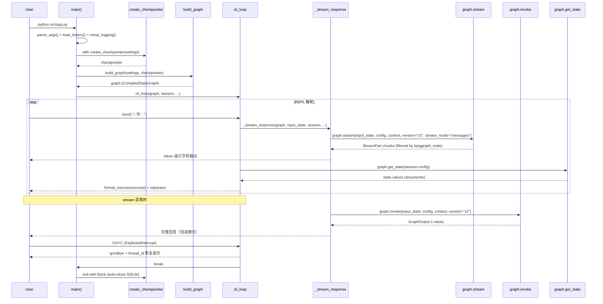

# Task 2.7 CLI 升级与端到端测试 - 架构设计

> **原始需求**：`.project/outline/phase_2_langgraph/task_2.7_cli_upgrade.md`
>
> **涉及文件**：
> - `src/app.py`（重命名为 `chain_app.py`，新建 Phase 2 CLI）
> - `src/chain_app.py`（重命名自当前 `app.py`，Phase 1 保留不动）
> - `tests/conftest.py`（新建 — fixture 声明）
> - `tests/_helpers.py`（新建 — 共享测试类和工具函数）
> - `tests/test_e2e_graph.py`（新建 — LangGraph 端到端测试）
> - `tests/test_e2e.py`（修改 — import 路径 `src.app` → `src.chain_app`）
> - `tests/test_workflow_nodes.py`（修改 — 删除内联 FakeChatModel/FailingChatModel）
> - `tests/test_workflow_builder.py`（修改 — 删除内联 _build_graph_with_mocks）
> - `tests/test_workflow_checkpointer.py`（修改 — 删除内联 helpers）

---

## 架构决策与权衡

### 先读：这不是"换一个入口函数"的事

大多数教程展示的是"把 `chain.invoke()` 换成 `graph.stream()`"的 5 行代码。但在本项目中：

1. **来源信息获取方式**决定了 CLI 层是依赖图状态还是自己二次检索——Phase 1 用 `chain.retrieve()` 单独获取，Phase 2 的图执行后 documents 已在状态中，路径完全不同
2. **内部 LLM 调用的过滤**决定了用户终端是否会被 route/grade/rewrite 节点的中间 token 污染——`stream_mode="messages"` 会产出图中所有 LLM 调用的 token，而非仅 generate 节点
3. **对话历史的 ownership**从 CLI 层的 `ChatSession._history`（持有数据）迁移到 checkpointer 的 `thread_id`（持有引用），这是架构层级的变更
4. **流式回退的边界**：stream 迭代可能在中途失败（已输出部分 token），回退 invoke 会导致用户看到重复内容

---

### 入口判定

1. **来源信息获取方式**：从 `chain.retrieve()` 单独获取 vs `graph.get_state()` 从图状态取 vs 依赖 LLM 回复文本。换方案改变 CLI 层与图层的耦合方式。**命中**。
2. **内部 LLM 调用的流式输出过滤**：运行时 `metadata["langgraph_node"]` 过滤 vs `tags=["nostream"]` 标签。换方案决定是否需要修改 workflow 层代码。**命中**。
3. **测试 helper 共享方式**：全部放 conftest.py vs conftest + _helpers.py 分层。换方案改变测试代码的组织方式和复用模式。**命中**。
4. **ChatSession 类是否保留**：checkpointer 完全替代 vs 保留轻量 SessionInfo。换方案改变 CLI 层的状态管理结构。**命中**。
5. **stream 异常回退 invoke 的边界**：任何异常回退 vs 仅特定异常回退。换方案改变用户在部分输出场景下的体验。**命中**。

---

### 决策 1：来源信息获取 — `graph.get_state()` 从图状态取

**语境**：Phase 1 CLI 通过 `chain.retrieve(user_input)` 单独获取来源（会触发二次检索，代码中已标注 TODO）。Phase 2 的图执行后 `documents` 已写入 GraphState（retrieve 写入、grade 过滤），CLI 层需要展示来源。获取方式决定了 CLI 层与图层的数据流耦合。

**候选对比**：

- **方案 A**（选）：流结束后 `graph.get_state(config).values["documents"]` 从图状态取
  - 本项目优势：
    - 数据权威性——拿到的是 retrieve + grade 处理后的最终结果，与 AI 回复引用的文档对齐
    - 零额外调用——不需要二次检索，不需要在 stream 迭代中缓存中间状态
    - 流式/非流式统一——非流式模式下 `result.value["documents"]` 同理，可抽取为 `_extract_sources(state_values)` 统一
  - 本项目硬伤：要求 checkpointer 非 None——CLI 必须在 `with create_checkpointer()` 内运行

- **方案 B**：`stream_mode=["messages","updates"]` 组合，从 updates 事件提取 documents
  - 本项目优势：不需要 `get_state()` 调用，数据在流中自然获取
  - 本项目硬伤：
    - updates 中 retrieve 节点的 documents 是 grade 前的原始输出，还需要等 grade 的 updates 才能得到过滤后结果——增加了流迭代中的状态缓存复杂度
    - 组合 mode 产出 chunk 数量翻倍（每个 super-step 产出 messages + updates 两种 chunk），增加无谓开销

- **方案 C**：依赖 LLM 回复中的来源文本
  - 本项目优势：零额外代码
  - 本项目硬伤：LLM 遵从率非 100%——空检索返回预设回复（`EMPTY_RETRIEVAL_RESPONSE`）不含来源；greeting/fallback 节点不含来源；LLM 可能遗漏来源列表

**反驳推演**：如果选方案 B，CLI 层需要在流迭代中维护 `_cached_documents` 临时变量，且需同时监听 retrieve 和 grade 两个节点的 updates 事件才能拿到过滤后的结果。这比方案 A 的"流结束后一次 get_state 调用"复杂得多。方案 B 的唯一优势是"不需要 get_state 调用"——但 get_state 是读本地 SQLite，延迟微秒级，不是瓶颈。

**结论**：选 A。根本理由：图执行后 documents 已在状态中（retrieve 写入、grade 过滤），从状态取是零额外开销的权威数据源。若 `documents` 字段语义变为累积（当前是覆盖，每轮独立），需改回方案 B 以获取增量。

**反事实自检**：

- [x] 方案 B 不再失效（如果不需要 grade 过滤后的结果，只需 retrieve 原始输出），两方案都可行 → "需要 grade 过滤后的结果"正是让方案 B 需要缓存两个节点 updates 的原因 → 验证通过

---

### 决策 2：内部 LLM 调用的流式过滤 — 运行时 `metadata["langgraph_node"]` 过滤

**语境**：`stream_mode="messages"` 会产出图中所有 LLM 调用的 token 级事件。当前图有 route/grade/rewrite/generate 四个节点内部调用 LLM，但用户终端只应显示 generate 节点的输出。LangGraph 官方文档提供了两种过滤方式：按 `metadata["langgraph_node"]` 过滤和按 `tags` 过滤。

**候选对比**：

- **方案 A**（选）：运行时过滤 `metadata.get("langgraph_node") == "generate"`
  - 本项目优势：
    - 零改动——不需要修改 workflow 层任何代码，仅在 CLI 层的 stream 迭代中加 if 条件
    - 官方文档推荐模式——`metadata["langgraph_node"]` 过滤是 LangGraph streaming 文档的标准示例
    - 与当前单 LLM 闭包设计对齐——`create_workflow_nodes` 接收单个 `llm` 参数，所有节点共享同一 LLM 实例，节点名过滤正好匹配此架构
  - 本项目硬伤：节点重命名时过滤条件需同步更新（可提取为常量缓解）

- **方案 B**：给 route/grade/rewrite 节点的 LLM 加 `tags=["nostream"]`
  - 本项目优势：从源头排除，stream 产出的 chunk 本身就不含内部 LLM 的 token
  - 本项目硬伤：
    - 需要拆分 LLM 实例——当前 `create_workflow_nodes` 只接收一个 `llm`，所有节点共享同一实例。要给内部 LLM 加 tags，需创建 `internal_llm = llm.bind(tags=["nostream"])` 并传入各内部节点——需要修改 `create_workflow_nodes` 签名和内部实现
    - `with_structured_output()` 与 `tags` 的兼容性不确定——grade 节点使用 `llm.with_structured_output(GradeList)`，tags 绑定可能与结构化输出的 RunnableBinding 冲突

**反驳推演**：如果选方案 B，需要修改 `nodes.py` 的 `create_workflow_nodes` 签名（增加 `internal_tags` 参数或内部创建 `internal_llm`）、修改 `builder.py` 的调用方式。这些修改的目的是"让 stream 产出更干净"——但当前方案 A 的运行时过滤已足够干净（一个 if 条件），且不侵入 workflow 层。方案 B 的改动量远超其收益。

**结论**：选 A。根本理由：当前图拓扑是线性的，每个节点最多一个 LLM 调用，节点名过滤精确且零侵入。若 Phase 4 引入并行节点（同一节点内多个 LLM 调用需差异化过滤），需切换为 tags 方案。

**反事实自检**：

- [x] 方案 B 不再失效（如果当前图拓扑不是线性的，同一节点内有多个 LLM 调用），两方案都可行 → "当前图拓扑线性，每个节点最多一个 LLM 调用"正是让节点名过滤足够精确的原因 → 验证通过

---

### 决策 3：测试 helper 共享方式 — conftest.py + _helpers.py 分层

**语境**：当前 `FakeChatModel`（60 行）仅在 `test_workflow_nodes.py` 内联定义，`_build_graph_with_mocks` 在 `test_workflow_builder.py` 和 `test_workflow_checkpointer.py` 中各有一份（逻辑相同但接口略有差异），`_make_settings` 和 `_invoke_with_thread_id` 仅在 checkpointer 测试中。Task 2.7 新增 `test_e2e_graph.py` 需要复用这些 helper，重复定义不可接受。

**候选对比**：

- **方案 A**：全部放 `conftest.py`
  - 本项目优势：pytest 自动发现，无需显式导入
  - 本项目硬伤：conftest.py 膨胀到 100+ 行，FakeChatModel 类定义放在 fixture 声明文件中语义混乱

- **方案 C**（选）：`conftest.py` 仅放 fixture 声明，类和函数定义放 `tests/_helpers.py`
  - 本项目优势：
    - 职责分离——conftest.py 是 pytest 约定的 fixture/hooks 声明文件，不是类定义场所
    - 灵活性——测试文件可 `from tests._helpers import FakeChatModel` 显式导入（e2e_graph 测试需要直接使用类），也可通过 fixture 自动注入
    - 统一接口——`_build_graph_with_mocks(settings=None, checkpointer=None)` 合并 builder 和 checkpointer 两个版本的差异签名
  - 本项目硬伤：多一个文件需要维护

**反驳推演**：如果选方案 A，`conftest.py` 会包含 FakeChatModel/FailingChatModel 的完整类定义（~60 行）、build_graph_with_mocks 工厂函数、make_settings 工厂函数、invoke_with_thread_id 辅助函数——总计约 120 行。这远超 conftest.py 的合理大小（通常 < 50 行），且混合了"pytest 声明"和"工具类定义"两种职责。

**结论**：选 C。根本理由：FakeChatModel 是测试工具类（有 60 行完整实现），不是 fixture 声明；conftest.py 的 pytest 约定是 fixture + hooks，不是类定义场所。若 helper 代码量降至 < 30 行（如只有简单 fixture），可直接放 conftest.py。

**反事实自检**：

- [x] 方案 A 不再失效（如果 FakeChatModel 只有 10 行简单 mock），两方案都可行 → "FakeChatModel 有 60 行完整 BaseChatModel 子类实现"正是让 conftest.py 膨胀的原因 → 验证通过

---

### 决策 4：ChatSession 类的存废 — 保留轻量 SessionInfo

**语境**：Phase 1 的 `ChatSession` 管理 `_history: List[BaseMessage]`、`turn_count`、`_trim_if_needed()`。Phase 2 的 checkpointer 通过 `thread_id` 自动管理 messages 历史，`memory_node` 在图内部处理裁剪/摘要。CLI 层不再需要手动维护对话历史。但 `thread_id` 需要一个明确的 ownership 对象。

**候选对比**：

- **方案 A**：不保留任何类，`thread_id` 和 `config` 作为裸变量散落在 main/cli_loop 参数中
  - 本项目优势：最简单
  - 本项目硬伤：`thread_id` 和 `config` 的关联（config 包含 thread_id）需要调用方自行保证一致性；KeyboardInterrupt 时需要打印 thread_id 恢复提示，裸变量散落增加了信息传递复杂度

- **方案 B**（选）：保留轻量 `SessionInfo` dataclass，仅持有 `thread_id` + `config`
  - 本项目优势：
    - thread_id 的 ownership 明确——一个对象封装 `thread_id` 和 `config` 的关联
    - 与 Phase 1 的对比学习价值——Phase 1 的 `ChatSession._history`（持有数据本身）vs Phase 2 的 `SessionInfo.thread_id`（持有数据的引用/句柄），是从"持有数据"到"持有引用"的架构升级
    - `turn_count` 不独立维护——可从 `graph.get_state(config).values["messages"]` 中 HumanMessage 的数量推导，避免数据不一致风险
  - 本项目硬伤：多一个小类（~15 行），但职责清晰

**反驳推演**：如果选方案 A，`main()` 中 `thread_id` 变量需要传给 `cli_loop(graph, thread_id, ...)`，`cli_loop` 内部构造 `config = {"configurable": {"thread_id": thread_id}}`。看似简单，但 `thread_id` 至少在 3 处被使用（graph.stream 的 config 参数、get_state 的 config 参数、KeyboardInterrupt 时的打印提示），散落在 `main()`、`cli_loop()`、`_stream_response()` 中。方案 B 的 `SessionInfo` 将 thread_id 和 config 绑定为一体，调用方只传 `session`。

**结论**：选 B。根本理由：`thread_id` 和 `config` 是强关联的（config 包含 thread_id），需要封装保证一致性。若 CLI 层完全不需要会话元数据（如不需要 KeyboardInterrupt 时打印 thread_id），方案 A 可行。

**反事实自检**：

- [x] 方案 A 不再失效（如果 CLI 层不需要在任何地方打印/记录 thread_id），两方案都可行 → "KeyboardInterrupt 时需打印 thread_id 恢复提示"正是让裸变量传递复杂化的原因 → 验证通过

---

### 决策 5：stream 异常回退 invoke 的边界 — 任何异常回退 + 部分输出检测

**语境**：Phase 1 的 `cli_loop` 已实现"stream 异常 → 回退 invoke"的逻辑（第 293-308 行）。但 Phase 2 有一个 Phase 1 不存在的场景：stream 可能迭代到一半失败（已向用户终端输出部分 token），此时回退 invoke 会导致用户看到重复内容。

**候选对比**：

- **方案 A 原始版**：任何 stream 异常回退 invoke，无部分输出检测
  - 本项目优势：与 Phase 1 逻辑一致，简单
  - 本项目硬伤：stream 部分输出后回退 invoke，用户看到"前半段 + 完整回答"的重复

- **方案 A 改良版**（选）：任何 stream 异常回退 invoke，增加部分输出检测
  - 本项目优势：
    - 生产级鲁棒性——用户输入问题后，宁延迟获取完整回答，也不只显示错误信息
    - 部分输出检测——如果 `full_answer` 非空（已向用户输出部分 token），回退前打印换行 + 提示（如 `[流式中断，重新获取完整回答...]`），避免内容重复
    - 异常分类不可行——LangGraph 的 stream 内部可能抛出各种异常（框架异常、LLM SDK 异常、序列化异常），CLI 层不可能穷举所有临时性异常
  - 本项目硬伤：部分输出场景下 invoke 返回的完整回答可能与已显示的部分内容有轻微重复，但 CLI 容忍此程度

- **方案 B**：仅特定异常回退（网络超时等），其他直接抛出
  - 本项目优势：用户看到更精确的错误信息
  - 本项目硬伤：异常分类困难——LangChain 的 LLM 调用可能抛出 `APITimeoutError`（临时）、`AuthenticationError`（永久）等，但 CLI 层不应依赖特定 SDK 的异常类型

**反驳推演**：如果选方案 B，需要维护一个"可回退异常类型"列表。但 LangGraph 的 stream 可能抛出框架层异常（如 `GraphRecursionError`）、LangChain 层异常（如 `OutputParserException`）、底层 SDK 异常（如 `openai.APITimeoutError`）。CLI 层依赖这些具体类型违背抽象原则——换一个 LLM provider 就需要更新异常列表。

**结论**：选 A 改良版。根本理由：CLI 容忍轻微重复，不容忍"用户输入问题后只看到错误信息"。若 stream 异常变为极少发生（如网络 99.99% 可用），回退逻辑可简化为直接报错。

**反事实自检**：

- [x] 方案 B 不再失效（如果异常类型可穷举且分类稳定），两方案都可行 → "LangGraph stream 可能抛出的异常类型不可穷举（跨框架/SDK/序列化三层）"正是让精确分类不可行的原因 → 验证通过

---

### 非关键决策确认

#### 决策 1：StreamPart 的访问风格 — dict 风格 `chunk["type"]`
- **选项 A**：dict 风格 `chunk["type"]` / `chunk["data"]` — LangGraph 官方文档标准写法
- **选项 B**：属性风格 `chunk.type` / `chunk.data` — 部分旧教程和 api_refs 中使用
- **结论**：选 A。官方文档明确展示 dict 风格访问，且 `StreamPart` 是 TypedDict 子类。项目 api_refs 中两种风格混用，以官方文档为准。

#### 决策 2：`_STREAM_OUTPUT_NODES` 常量 vs 硬编码
- **选项 A**：`_STREAM_OUTPUT_NODES = {"generate"}` 常量集合 — 未来扩展友好
- **选项 B**：直接硬编码 `metadata.get("langgraph_node") == "generate"` — 简单
- **结论**：选 A。当前只有 generate 节点需要流式输出，但用集合常量表达意图更清晰，且扩展成本为零。不够格进方案对比——两种写法结构等价，只是表达方式差异。

#### 决策 3：SessionInfo 是否包含 turn_count 属性
- **选项 A**：不包含，每轮从 get_state 推导 — 避免数据不一致
- **选项 B**：包含，作为实例变量独立维护 — 减少图状态查询
- **结论**：选 A。checkpointer 已管理 messages，turn_count 可通过 `len([m for m in state["messages"] if isinstance(m, HumanMessage)])` 推导。独立维护会导致 KeyboardInterrupt 后 turn_count 已更新但 messages 未持久化的不一致风险。

---

### 与后续 Task 的接口衔接

- **Task 5.1**（FastAPI 服务封装）：Phase 2 CLI 的 `cli_loop` 与 FastAPI 的路由处理共享同一个 `build_graph` + `create_checkpointer` 模式，但 CLI 层的 REPL 逻辑不会复用——FastAPI 用 SSE 替代 stdin/stdout。CLI 和 API 的分叉点在 `main()` 层，不在 `build_graph` 层。
- **Task 4.1**（Tavily 搜索工具）：图拓扑将增加 `TOOL_CALL` 分支路由（`edges.py` 已预留 `TOOL_CALL` 常量）。CLI 的 `_STREAM_OUTPUT_NODES` 可能需要扩展为 `{"generate", "tool_call"}`。

**已知后续替换**：

> 当前 `_stream_response()` 使用 `stream_mode="messages"` 的同步 `graph.stream()`；Task 4.5 切换为 `graph.astream()` + `stream_mode="messages"`。
> 仅保证 stream_mode 消费逻辑（metadata 过滤、chunk 拼接）可替换，不提前实现 async 结构。

---

### 质量准则豁免

> **设计模式**：不适用。本 Task 不引入新的设计模式——SessionInfo 是简单 dataclass（~15 行），非模式应用场景；cli_loop 的 REPL 模式与 Phase 1 一致；测试 helper 的分层是 pytest 约定而非设计模式。

---

## 模块结构

### 文件组织

```
src/
├── app.py              # Phase 2 LangGraph CLI 主入口（新文件）
├── chain_app.py        # Phase 1 RAGChain CLI（重命名自原 app.py）
├── run.py              # 入口脚本（不变，import src.app.main）
└── workflow/           # 不修改

tests/
├── conftest.py         # fixture 声明（新文件）
├── _helpers.py         # 共享测试类和工具函数（新文件）
├── test_e2e_graph.py   # LangGraph 端到端测试（新文件）
├── test_e2e.py         # Phase 1 e2e 测试（修改 import 路径）
├── test_workflow_nodes.py       # 删除内联 FakeChatModel/FailingChatModel
├── test_workflow_builder.py     # 删除内联 _build_graph_with_mocks
└── test_workflow_checkpointer.py # 删除内联 helpers
```

### 关键外部依赖（仅列非标准库）

```
app.py
├── langgraph.graph         # CompiledStateGraph.stream / .invoke / .get_state
├── langchain_core.messages # HumanMessage, AIMessage, AIMessageChunk
├── structlog               # 结构化日志
├── dotenv                  # load_dotenv
└── argparse                # CLI 参数解析（标准库）

_helpers.py
├── langchain_core.language_models  # BaseChatModel（FakeChatModel 基类）
├── langchain_core.messages         # AIMessage, BaseMessage（FakeChatModel 返回值）
└── langchain_core.outputs          # ChatResult, ChatGeneration
```

### 职责边界

```
app.py 职责：
✅ 包含：CLI 参数解析、REPL 主循环、流式/非流式输出、来源格式化、异常处理、会话管理
❌ 不包含：图构建逻辑（属于 builder.py）、检查点创建（属于 checkpointer.py）、节点逻辑（属于 nodes.py）

_helpers.py 职责：
✅ 包含：FakeChatModel / FailingChatModel 类定义、build_graph_with_mocks 工厂函数、make_settings 工厂函数、invoke_with_thread_id 辅助函数
❌ 不包含：pytest fixture 声明（属于 conftest.py）、具体测试用例（属于 test_*.py）

conftest.py 职责：
✅ 包含：pytest fixture 声明（mock_retriever、initial_state、default_runtime 等）
❌ 不包含：类定义、工具函数实现（属于 _helpers.py）
```

---

## 错误处理策略

| 异常类型 | 捕获位置 | 处理方式 | 是否中断主流程 | 理由 |
|---------|---------|---------|-------------|------|
| `KeyboardInterrupt` | `cli_loop` while True 外层 | 打印 thread_id 恢复提示 + break | 是 | 用户主动退出；checkpointer 已保存最近 super-step 的 checkpoint |
| `EOFError` | `cli_loop` while True 外层 | 打印告别信息 + break | 是 | 用户主动退出（Windows Ctrl+Z+Enter） |
| `RAGSystemError` | `cli_loop` while True 外层 | 打印 `❌ 系统错误` + logger.error + continue | 否 | 一次 LLM 调用失败不应终止整个会话 |
| `Exception` | `cli_loop` while True 外层 | 打印 `❌ 未预期的错误` + logger.error + continue | 否 | 兜底容错，保持 REPL 可用 |
| `RAGSystemError`（初始化） | `main()` try 块 | 打印错误 + `sys.exit(1)` | 是（致命） | 图编译失败等不可恢复错误 |
| `Exception`（初始化） | `main()` try 块 | 打印错误 + `sys.exit(1)` | 是（致命） | 不可恢复的初始化错误 |
| stream 迭代中 `Exception` | `_stream_response` try 块 | 回退 `graph.invoke(version="v2")` | 否 | 优先保证用户得到完整回答；部分输出时打印提示避免重复 |
| invoke 回退也失败 | `_stream_response` 内层 except | full_answer 保持为空，由外层 continue 处理 | 否 | 两次调用都失败已无更多可做 |

---

## 测试策略概要

### 依赖 Mock 策略

| 依赖 | Mock 方式 | 理由 |
|------|---------|------|
| `create_retriever` | `patch("src.workflow.builder.create_retriever", return_value=MagicMock())` | 避免真实向量库依赖 |
| `create_llm` | `patch("src.workflow.builder.create_llm", return_value=mock_llm)` | 避免真实 LLM API 调用 |
| `classify_intent` | `patch("src.workflow.nodes.classify_intent", return_value=GREETING/RETRIEVE/FALLBACK)` | 控制路由走向，精确测试特定路径 |
| `builtins.input` | `patch("builtins.input", side_effect=iter([...]))` | 模拟用户逐轮输入 |
| LLM（节点级） | `FakeChatModel(response_content="...")` | 走 LCEL 管道，支持 `|` 操作符 |
| LLM（grade 节点） | `MagicMock(spec=BaseChatModel)` + `with_structured_output` mock | grade 的 `with_structured_output` 走 RunnableBinding，FakeChatModel 不支持 |

### 可独立测试的函数

- `format_sources(sources)` — 纯函数
- `parse_args()` — 纯函数（argparse）
- `SessionInfo` dataclass — 无副作用
- `_extract_sources(state_values)` — 纯函数

### 关键测试场景

1. 简单问答（route→retrieve→grade→memory→generate 完整路径）
2. 追问多轮对话（2+ 轮，验证 checkpointer 累积 messages + 指代消解）
3. greeting 问候路径（route→greeting→END）
4. fallback 降级路径（route→fallback→END）
5. rewrite 循环（retrieve→grade 空→rewrite→retrieve→grade→memory→generate）
6. `--no-stream` 非流式模式
7. KeyboardInterrupt 中断安全（checkpoint 已持久化 + 打印 thread_id）
8. RAGSystemError 不中断 REPL
9. stream 中途异常回退 invoke
10. `--thread-id` 会话恢复

---

## 代码蓝图：施工图纸级别

### 1. `src/app.py` — Phase 2 LangGraph CLI

#### 常量

```python
# 退出命令集合
_EXIT_COMMANDS = {"exit", "quit"}

# 流式输出允许的节点集合 — 仅 generate 节点的 token 输出到终端
# 为什么用集合而非单字符串：未来 greeting/fallback 如果也用 LLM 生成，扩展只需加元素
_STREAM_OUTPUT_NODES = {"generate"}

# 欢迎信息 — v2.0 标注 Phase 2 LangGraph 版本
_WELCOME_MESSAGE = """========================================
🤖 RAG 问答系统 v2.0（Phase 2 LangGraph 版）
输入问题开始对话，输入 exit/quit 退出
========================================"""

# 告别信息 + thread_id 恢复提示模板
_GOODBYE_MESSAGE = "👋 感谢使用，再见！"
_RESUME_HINT = "💡 恢复会话：python src/app.py --thread-id {thread_id}"

# 分隔线
_SEPARATOR = "—" * 40
```

#### `SessionInfo` dataclass

```python
@dataclass
class SessionInfo:
    """Phase 2 CLI 会话元数据 — 仅持有 handle，不持有数据。

    设计意图：
        Phase 1 的 ChatSession._history 持有数据本身（List[BaseMessage]），
        Phase 2 的 SessionInfo.thread_id 持有数据的引用（checkpointer 中的键）。
        这是从"持有数据"到"持有引用"的架构升级——类比 ORM 对象 vs 外键引用。

    为什么 turn_count 不独立维护：
        checkpointer 已管理 messages，turn_count 可从
        len([m for m in state["messages"] if isinstance(m, HumanMessage)]) 推导。
        独立维护会在 KeyboardInterrupt 后产生数据不一致
        （turn_count 已 +1 但 messages 未持久化到当前轮）。

    反直觉辩护：
        config 不在 main() 中构造后传参，而是由 SessionInfo 封装——
        因为 config 和 thread_id 是强关联的（config 包含 thread_id），
        散落传递需调用方自行保证一致性。
    """
    thread_id: str
    config: dict  # {"configurable": {"thread_id": thread_id}}

    def __init__(self, thread_id: str):
        self.thread_id = thread_id
        self.config = {"configurable": {"thread_id": thread_id}}
```

#### `parse_args()` 函数

```python
def parse_args() -> argparse.Namespace:
    """解析 CLI 参数。

    为什么用 argparse 而非 click/typer：
        项目无 CLI 框架依赖，argparse 是标准库零依赖方案。
        Phase 5 FastAPI 服务化后 CLI 参数可能不再需要，
        不值得为临时性 CLI 引入第三方框架。

    参数优先级：CLI 参数 > 环境变量 > settings.py 默认值
    """
    # 创建 ArgumentParser，描述 Phase 2 LangGraph CLI
    # --thread-id <hex>：恢复已有会话，不传则自动生成
    # --no-stream：关闭流式输出，回退 invoke(version="v2")
    # --debug：日志 DEBUG + stream_mode=["messages","updates"]
    # --max-tokens <int>：覆写 GraphContext.max_tokens，默认 4000
```

#### `format_sources(sources: List[str]) -> str` 函数

```python
    # 与 Phase 1 chain_app.py 逻辑完全一致，从原 app.py 迁移
    # 步骤 1：若 sources 为空 → 返回 ""
    # 步骤 2：去重 — dict.fromkeys(sources) 保持顺序
    # 步骤 3：enumerate 从 1 编号，格式 "  [N] URL"
    # 步骤 4：拼接为 "📚 来源：\n" + 编号列表
```

#### `_extract_sources(state_values: dict) -> List[str]` 函数

```python
def _extract_sources(state_values: dict) -> list[str]:
    """从图状态中提取来源 URL 列表。

    为什么独立为函数：
        流式和非流式模式都需要从状态取来源，但取入口不同：
        流式 = get_state(config).values，非流式 = result.value。
        抽取为函数统一入口，避免两套提取逻辑。

    为什么从 documents 取 source 而非从 messages 解析：
        documents 是结构化数据（每个 Document 有 metadata.source），
        messages 中的来源文本是 LLM 生成的非结构化内容，解析不可靠。
    """
    # 步骤 1：从 state_values["documents"] 取 Document 列表
    # 步骤 2：对每个 doc 取 doc.metadata.get("source", "")
    # 步骤 3：过滤掉空字符串
```

#### `_stream_response()` 函数

```python
def _stream_response(
    graph: CompiledStateGraph,
    input_state: dict,
    session: SessionInfo,
    graph_context: GraphContext,
    debug: bool = False,
) -> str:
    """流式输出核心 — 逐 token 显示 generate 节点的回答。

    设计意图：
        stream_mode="messages" 产出图中所有 LLM 调用的 token，
        通过 metadata["langgraph_node"] 过滤仅显示 generate 节点的输出，
        排除 route/grade/rewrite 等内部 LLM 调用。

    为什么 version="v2" 不可省略：
        stream_mode="messages" 仅在 version="v2" 下生效。
        v1 模式下 messages mode 行为不确定（官方文档明确要求 v2）。

    为什么用 dict 风格 chunk["type"] 而非 chunk.type：
        StreamPart 是 TypedDict 子类，官方文档标准写法为 dict 风格。
        属性访问可能因 TypedDict 实现细节而出错。

    为什么 context=graph_context 每次 stream 都传：
        context 不被 checkpointer 持久化（三层配置架构：
        Settings 进程级 / context invoke 级 / config 框架级），
        每次 invoke/stream 需独立传入。

    返回值：
        完整的回答文本（用于后续来源显示和日志记录）。
        空字符串表示未能获取回答。

    鲁棒性：
        stream 迭代中任何异常 → 回退 invoke(version="v2")。
        部分输出时（full_answer 非空）打印提示避免重复。
    """
    # 步骤 1：确定 stream_mode
    #   ├─ debug=True  → ["messages", "updates"]
    #   └─ debug=False → "messages"

    # 步骤 2：打印 "\n🤖 答："（end="", flush=True）
    # 日志：info 记录开始流式输出

    # 步骤 3：进入 try 块，迭代 graph.stream(input_state, config=session.config, context=graph_context, version="v2", stream_mode=stream_mode)
    #   ├─ chunk["type"] == "messages"
    #   │   解包 msg, metadata = chunk["data"]
    #   │   ├─ isinstance(msg, (AIMessage, AIMessageChunk)) and msg.content and metadata.get("langgraph_node") in _STREAM_OUTPUT_NODES
    #   │   │   → print(msg.content, end="", flush=True)（打字机效果）
    #   │   │   → full_answer += msg.content
    #   │   └─ 其他（非 generate 节点、空 content、非 AI 消息）→ 忽略
    #   └─ chunk["type"] == "updates" and debug
    #       → logger.debug("节点更新", data=chunk["data"])

    # 步骤 4：stream 迭代异常处理（鲁棒性）
    #   except Exception as stream_err:
    #     ├─ full_answer 非空（部分输出已显示）
    #     │   → print("\n[流式中断，重新获取完整回答...]")
    #     └─ full_answer 为空
    #         → 不打印额外提示
    #     logger.warning("流式输出失败，回退到同步模式", error=str(stream_err))
    #     尝试 graph.invoke(input_state, config=session.config, context=graph_context, version="v2")
    #     ├─ invoke 成功
    #     │   → 从 result.value["messages"][-1] 取 AIMessage.content
    #     │   → full_answer = answer; print(answer)
    #     └─ invoke 也失败 → full_answer 保持当前值（可能为空）

    # 步骤 5：补换行
    #   if full_answer and not full_answer.endswith("\n") → print()

    # 步骤 6：返回 full_answer
```

#### `_invoke_response()` 函数

```python
def _invoke_response(
    graph: CompiledStateGraph,
    input_state: dict,
    session: SessionInfo,
    graph_context: GraphContext,
) -> str:
    """非流式输出 — 一次性获取完整回答。

    为什么 invoke 也用 version="v2"：
        与 stream 保持一致——v2 的 invoke 返回 GraphOutput 对象
        （.value 取状态 dict），而非 v1 的裸 dict。
        统一 version 避免取值逻辑分叉。
    """
    # 步骤 1：调用 graph.invoke(input_state, config=session.config, context=graph_context, version="v2")
    #   → result: GraphOutput

    # 步骤 2：从 result.value["messages"][-1] 取 AIMessage
    #   → answer = ai_msg.content

    # 步骤 3：print(f"\n🤖 答：{answer}")

    # 步骤 4：返回 answer
```

#### `cli_loop()` 函数

```python
def cli_loop(
    graph: CompiledStateGraph,
    session: SessionInfo,
    use_stream: bool = True,
    debug: bool = False,
    graph_context: GraphContext | None = None,
) -> None:
    """REPL 主循环：读取用户输入 → 调用 LangGraph 图 → 打印回答。

    设计意图：
        将 REPL 循环逻辑与 main() 的初始化逻辑分离，
        使 cli_loop 可接收编译后的图进行测试。
        与 Phase 1 的 cli_loop(chain, session) 签名对齐——
        第一个参数是核心依赖，第二个参数是会话状态。

    为什么每轮只传 HumanMessage 不传完整历史：
        checkpointer 自动从存储中加载历史 messages 并与新传入的合并
        （add_messages reducer）。完整传入会导致消息重复。

    为什么不用 chain.retrieve() 获取来源：
        Phase 1 用 chain.retrieve() 触发二次检索（代码中已标注 TODO）。
        Phase 2 的图执行后 documents 已写入 GraphState，
        通过 get_state(config) 获取是零额外开销的权威数据源。
    """
    # 步骤 1：打印 _WELCOME_MESSAGE
    # 日志：info 记录会话开始，thread_id=session.thread_id

    # 步骤 2：structlog.contextvars.bind_contextvars(thread_id=session.thread_id)
    #   将 thread_id 绑定到整个请求上下文，所有日志自动携带

    # 步骤 3：while True 循环
    #   try:
    #     步骤 3a：input("\n🤔 你：") 读取用户输入
    #     步骤 3b：strip 输入，若为空 → continue
    #     步骤 3c：若输入.lower() in _EXIT_COMMANDS → print(_GOODBYE_MESSAGE); break

    #     步骤 3d：构造输入状态
    #       input_state = {"messages": [HumanMessage(content=user_input)]}
    #       为什么只传 HumanMessage — checkpointer 自动合并历史，完整传入会重复

    #     步骤 3e：调用流式或非流式输出
    #       ├─ use_stream=True  → full_answer = _stream_response(graph, input_state, session, graph_context, debug)
    #       └─ use_stream=False → full_answer = _invoke_response(graph, input_state, session, graph_context)

    #     步骤 3f：获取来源信息（鲁棒性）
    #       try:
    #         state_values = graph.get_state(session.config).values
    #         sources = _extract_sources(state_values)
    #       except Exception:
    #         logger.warning("获取来源失败"); sources = []

    #     步骤 3g：打印 format_sources(sources)（若非空）

    #     步骤 3h：打印 _SEPARATOR

    #   except KeyboardInterrupt:
    #     打印 f"\n{_GOODBYE_MESSAGE}"
    #     打印 _RESUME_HINT.format(thread_id=session.thread_id)
    #     break
    #     # 为什么打印 thread_id：用户 Ctrl+C 时终端输出可能被中断信号打断，
    #     # 显式打印确保用户能看到恢复凭证

    #   except EOFError:
    #     打印 f"\n{_GOODBYE_MESSAGE}"
    #     break

    #   except RAGSystemError as e:
    #     打印 f"\n❌ 系统错误：{e}"
    #     logger.error("RAG 系统异常", error=str(e), error_type=type(e).__name__)
    #     打印 _SEPARATOR
    #     # 不 break — 一次请求失败不应终止整个会话

    #   except Exception as e:
    #     打印 f"\n❌ 未预期的错误：{e}"
    #     logger.error("未预期异常", error=str(e), error_type=type(e).__name__)
    #     打印 _SEPARATOR
    #     # 不 break — 容错兜底

    # 步骤 4：structlog.contextvars.unbind_contextvars("thread_id")
```

#### `main()` 函数

```python
def main() -> None:
    """CLI 入口函数：初始化 → 创建图 → 启动 REPL。

    初始化顺序（为什么这样排序）：
        1. parse_args() — 解析 CLI 参数，决定后续行为
        2. load_dotenv() — 确保 API Key 可用
        3. setup_logging() — 配置日志（debug 模式下用 DEBUG 级别）
        4. create_checkpointer() — 创建检查点管理器（上下文管理器包裹整个 REPL）
        5. build_graph() — 构建图
        6. cli_loop() — 启动 REPL

    为什么 create_checkpointer 包裹 build_graph + cli_loop：
        checkpointer 是资源（SQLite 连接），其生命周期需要覆盖整个 REPL。
        如果在 main 中分开创建和销毁，异常退出时连接可能泄漏。
        with 块确保退出时连接正确关闭。

    Raises:
        SystemExit: 初始化失败时以非零状态码退出
    """
    # 步骤 1：args = parse_args()

    # 步骤 2：load_dotenv(override=True)

    # 步骤 3：setup_logging(level="DEBUG" if args.debug else "INFO", json_format=False)

    # 步骤 4：生成或使用 thread_id
    #   thread_id = args.thread_id or uuid.uuid4().hex[:8]
    #   为什么 8 位 hex：兼顾唯一性和可读性，2^32 空间碰撞概率极低

    # 步骤 5：创建 SessionInfo(thread_id)

    # 步骤 6：构造 GraphContext(max_tokens=args.max_tokens)

    # 步骤 7：日志记录启动
    #   logger.info("LangGraph RAG CLI 启动", thread_id=session.thread_id)

    # 步骤 8：try 块 — 初始化 + REPL
    #   with create_checkpointer(settings) as checkpointer:
    #     graph = build_graph(settings, checkpointer=checkpointer)
    #     cli_loop(graph, session, use_stream=not args.no_stream, debug=args.debug, graph_context=graph_context)
    #
    #   except RAGSystemError as e:
    #     logger.error("初始化失败", error=str(e))
    #     print(f"❌ 初始化失败：{e}")
    #     sys.exit(1)
    #
    #   except Exception as e:
    #     logger.error("初始化失败", error=str(e))
    #     print(f"❌ 初始化失败：{e}")
    #     sys.exit(1)

    # 步骤 9：logger.info("LangGraph RAG CLI 退出")
```

---

### 2. `tests/_helpers.py` — 共享测试类和工具函数

#### `FakeChatModel(BaseChatModel)` 类

```python
class FakeChatModel(BaseChatModel):
    """可控的 Fake LLM — 返回预设消息，支持 LCEL 链（prompt | llm | parser）。

    为什么用 FakeChatModel 而非 MagicMock（反直觉辩护）：
        LCEL 的 | 操作符对操作数做 coerce_to_runnable() 校验，
        MagicMock 不满足 Runnable 协议会被包装为 RunnableLambda，
        导致 mock()（而非 mock.invoke()）被调用，返回值类型错误。
        FakeChatModel 继承 BaseChatModel，| 操作正常工作，
        同时通过 _response_content 属性控制返回内容。

    限制：
        不支持 with_structured_output()（会触发真实网络调用）。
        grade 节点需用 MagicMock(spec=BaseChatModel) 替代。
    """
    # _response_content: str = "" — 预设返回内容
    # __init__(self, response_content: str = "测试回复") — 设置 _response_content
    # _llm_type → "fake-chat-model"
    # _generate(messages, stop=None, run_manager=None) → ChatResult(generations=[ChatGeneration(message=AIMessage(content=self._response_content))])
    #   同时设置 usage_metadata = {"input_tokens": 100, "output_tokens": 50, "total_tokens": 150}
```

#### `FailingChatModel(BaseChatModel)` 类

```python
class FailingChatModel(BaseChatModel):
    """始终抛异常的 Fake LLM — 用于测试异常路径。"""
    # _error: Exception
    # __init__(self, error: Exception) — 设置 _error
    # _llm_type → "failing-chat-model"
    # _generate → raise self._error
```

#### `build_graph_with_mocks()` 函数

```python
def build_graph_with_mocks(
    settings: Settings | None = None,
    checkpointer: BaseCheckpointSaver | None = None,
) -> tuple[CompiledStateGraph, MagicMock]:
    """用 mock 依赖构建图，返回 (compiled_graph, mock_llm)。

    为什么统一 builder 和 checkpointer 两个版本：
        原来的 _build_graph_with_mocks（builder 测试，不接受 checkpointer）
        和 _build_graph_with_mocks_and_checkpointer（checkpointer 测试，接受
        settings + checkpointer 参数）逻辑相同，仅签名不同。
        统一为 settings=None 时自动创建默认 Settings，
        checkpointer=None 时走无持久化路径。

    注入：patch("src.workflow.builder.create_retriever")、
         patch("src.workflow.builder.create_llm")（均可 Mock）
    """
    # 步骤 1：若 settings 为 None → Settings(deepseek_api_key="test-key", qwen_api_key="test-key")
    # 步骤 2：mock_llm = MagicMock()
    # 步骤 3：patch create_retriever(return_value=MagicMock()) + create_llm(return_value=mock_llm)
    # 步骤 4：graph = build_graph(settings, checkpointer=checkpointer)
    # 步骤 5：return (graph, mock_llm)
```

#### `make_settings()` 函数

```python
def make_settings(checkpoint_db_path: str = ":memory:") -> Settings:
    """创建测试用 Settings 实例。"""
    # return Settings(deepseek_api_key="test-key", qwen_api_key="test-key", checkpoint_db_path=checkpoint_db_path)
```

#### `invoke_with_thread_id()` 函数

```python
def invoke_with_thread_id(graph, messages_state: dict, thread_id: str) -> dict:
    """使用指定 thread_id 调用图。"""
    # config = {"configurable": {"thread_id": thread_id}}
    # return graph.invoke(messages_state, config=config)
```

---

### 3. `tests/conftest.py` — fixture 声明

```python
# 从 _helpers 导入类（供 fixture 和测试文件使用）
from tests._helpers import FakeChatModel, FailingChatModel, build_graph_with_mocks, make_settings, invoke_with_thread_id

@pytest.fixture
def mock_retriever():
    """返回 2 个 Document 的 mock retriever。"""
    # MagicMock(invoke.return_value=[Document(page_content="LangGraph 是一个框架", metadata={"source": "https://..."}), ...])

@pytest.fixture
def build_graph(build_graph_with_mocks):
    """构建 mock 图的 fixture。返回 (graph, mock_llm)。"""
    # 直接返回 _helpers.build_graph_with_mocks

@pytest.fixture
def invoke_with_tid(invoke_with_thread_id):
    """thread_id 调用辅助 fixture。"""
    # 直接返回 _helpers.invoke_with_thread_id
```

---

### 4. `tests/test_e2e_graph.py` — LangGraph 端到端测试

#### 测试类结构

```python
class TestStreamResponse:
    """流式输出核心测试。"""
    # test_simple_qa — patch("builtins.input", side_effect=["LangGraph 是什么？", "exit"])
    #   + patch classify_intent(return_value=RETRIEVE)
    #   + build_graph_with_mocks() 构建图
    #   + FakeChatModel 控制 generate 输出
    #   验证：capsys output 非空 + 包含退出消息

    # test_greeting_path — patch classify_intent(return_value=GREETING)
    #   验证：输出包含问候语

    # test_fallback_path — patch classify_intent(return_value=FALLBACK)
    #   验证：输出包含降级回复

    # test_no_stream_mode — cli_loop(use_stream=False)
    #   验证：输出非空 + 功能与流式一致

    # test_keyboard_interrupt — patch("builtins.input", side_effect=KeyboardInterrupt)
    #   验证：输出包含 thread_id 恢复提示

    # test_rag_system_error_continues — mock graph.stream 抛 RAGSystemError
    #   验证：错误信息出现 + REPL 继续（后续 "exit" 后正常退出）

    # test_stream_fallback_to_invoke — mock graph.stream 先 yield 1 个 chunk 再抛异常
    #   验证：输出包含 "[流式中断]" 提示 + invoke 的完整回答


class TestMultiTurnConversation:
    """多轮对话测试。"""
    # test_two_turn_context — 同一 thread_id 连续 2 轮 invoke
    #   第 1 轮：HumanMessage("LangGraph 是什么？")
    #   第 2 轮：HumanMessage("它支持哪些功能？")
    #   验证：第 2 轮 get_state 的 messages 长度为 4（2 Human + 2 AI）

    # test_session_resume — 两次独立 build_graph + 同一 checkpointer
    #   第 1 次：invoke + 退出
    #   第 2 次：用同一 thread_id invoke
    #   验证：第 2 次的 messages 包含第 1 次的历史


class TestRewriteLoop:
    """文档评估与重写循环测试。"""
    # test_rewrite_then_generate — mock retriever 先返回空再返回文档
    #   验证：最终输出包含回答（走完 rewrite → retrieve → grade → memory → generate）


class TestMainFunction:
    """main() 入口测试。"""
    # test_main_success — patch create_checkpointer + build_graph + builtins.input
    #   验证：load_dotenv + setup_logging 被调用

    # test_main_init_failure — patch build_graph 抛 RAGSystemError
    #   验证：pytest.raises(SystemExit)
```

---

## 交互时序图



---

## 常见坑点

1. **stream_mode="messages" 不加 version="v2" 会静默失败**：不报错但产出格式不确定。v2 是 opt-in，必须显式传入。

2. **完整传入历史消息导致重复**：每轮只传 `{"messages": [HumanMessage(content=user_input)]}`，checkpointer 自动合并。传完整历史会导致每条消息出现 N 次（N = 调用次数）。

3. **StreamPart 用属性访问 `chunk.type` 可能失败**：官方文档和实际测试中 StreamPart 是 TypedDict，应使用 `chunk["type"]` dict 风格访问。属性访问在某些 LangGraph 版本下不可靠。

4. **graph.get_state() 要求 checkpointer 非 None**：无 checkpointer 时 `get_state` 抛异常。Phase 2 CLI 必须在 `with create_checkpointer()` 内运行，这由 main() 保证。

5. **FakeChatModel 不支持 with_structured_output()**：grade 节点使用 `llm.with_structured_output(GradeList)`，走 RunnableBinding 代码路径，FakeChatModel 的 `_generate` 不被调用。需用 `MagicMock(spec=BaseChatModel)` 替代。

6. **flush=True 是打字机效果的必要条件**：Python stdout 默认行缓冲，不 flush 时 token 积攒到换行符才输出，打字机效果完全失效。

7. **conftest.py 中的类不能直接 import 到测试文件**：pytest 不自动将 conftest 中的类暴露给测试文件。需要用 `_helpers.py` 存放类定义，conftest.py 只放 fixture 声明。
