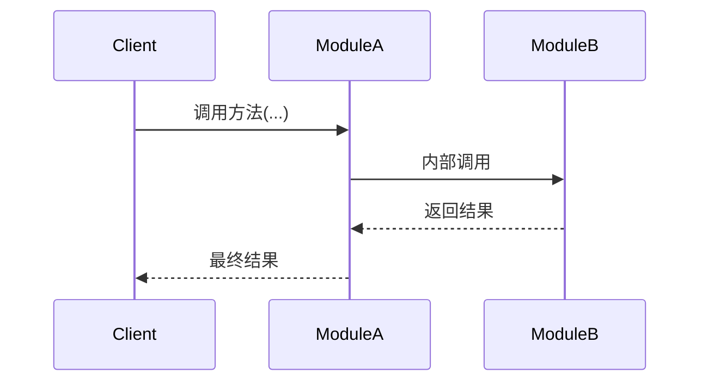

# design.md 设计规范

> **适用范围**：所有 Phase 的 Task 阶段1 产出物（design.md 架构设计文档）
> **关联规范**：`project_info/tech_doc_design_spec.md`（技术学习文档规范）
---

## 硬约束（先读，不可违反）

- **不含完整实现代码**（阶段 2 产出 `src/`）
- **不含测试代码**（阶段 2 产出 `tests/`）
- **架构决策必须有候选对比与被选理由**
- **代码蓝图必须达到施工图纸级别**：
- **AI按本文约束工作，但产出内容实际服务于用户，注意用户画像，带入用户需求，请认真对待**

---

## 一、design.md

> 路径：`.project/tasks/phase_X/task_X.X_design.md`

~~~markdown
# Task X.X [任务名称] - 架构设计

> **原始需求**：`.project/outline/phase_X_*/task_X.X_*.md`
> **涉及文件**：`src/xxx/yyy.py`、`tests/test_yyy.py`

---

## 架构决策与权衡 MUST

### 先读：这不是填空题

目标：重建"为什么非选它不可"，而非描述"选了什么"。若在凑字数，停——你在记录不存在的决策。

---

### 入口判定（动笔前必答）

本 Task 是否存在"换方案则代码结构明显不同"的地方？

判据（命中任一即是决策）：

- 改变模块边界 / 调用链 / 返回类型 / 生命周期归属（含资源创建与销毁责任，不仅是运行时路径）
- 引入或消除组件（缓存层、适配层、索引结构等）
- 影响后续 Task 实现路径

以下不是决策（硬列只会稀释密度）：

- 写法 / 命名 / 风格差异但结构不变
- 性能差异在本项目规模下不可感知
- 其他 Task 已决定（引用即可）
- 写不出"某具体约束变了结论会反转"——无权衡

**项目特异性底线**：语境、优势/硬伤、排除理由、反驳场景——换项目后必须不再成立。违反即泛化判断，不是架构决策。

---

### 种子范例：推演版 vs 填空版

仅演示主决策。非关键决策与演化预告的写法示范见各自章节。

✅ **推演版**

> **决策：documents 字段——写 reducer 还是直接覆盖？**
>
> messages 用了 `Annotated[list[BaseMessage], add_messages]`——节点返回新消息时自动追加。直觉是 documents 也该用 reducer 保持风格一致。但两者的业务语义完全不同：对话历史需要累积（每条消息都有价值），检索结果是每轮独立的（上一轮的文档对当前轮无意义，混入反而降低回答质量）。
>
> 不写 reducer，节点返回 `{"documents": new_list}` 直接覆盖。覆盖是 TypedDict 无 reducer 时的默认行为——不需要额外机制来做正确的事。如果为了"风格一致"写一个 reducer，面试时面试官问你："你的 reducer 做了什么"——回答"覆盖旧值"。追问"覆盖不就是默认行为吗？"——无法自圆其说。
>
> 如果 Task 2.6 的自适应路由需要累积多轮检索结果（如对比前后两轮检索差异），结论会反转。
>
> **反事实自检**：拿掉"每轮检索独立，上轮结果无效"约束后——
> - [x] 写 reducer 不再是过度设计，两方案都可行 → 该约束正是让 reducer 失效的原因 → 验证通过

❌ **填空版**

> 决策：documents 字段 reducer 策略
> 语境：状态字段需要定义合并策略。
> 候选对比：无 reducer 直接覆盖简单直接；Annotated+reducer 与 messages 风格一致。
> 结论：综合考量，选无 reducer，在简洁性和风格一致性之间取得平衡。

---

### 决策记录骨架

斜体行 = **写前警告**，命中即不该这么写。

#### 决策 N：[关键选型]

**语境**：为什么此决策在本 Task 不可避免？

*警告：只能写"需要 X"、"为实现 Y"等任何项目通用理由 → 不是决策，回入口判定。*

**候选对比**：

- **方案 A**：[简述]
  - 本项目优势：
  - 本项目硬伤：
- **方案 B**：[简述]
  - 本项目优势：
  - 本项目硬伤：若无硬伤写"无硬伤，因 [具体约束] 倾向另一方"。

*警告：优势/硬伤放到你上个月做的另一个项目里读一遍——仍成立则无效，重写。*

**反驳推演**：选被否方案，会在本项目什么场景下失败？

*警告：只能写"慢一点"、"不灵活"、"扩展性差" → 删除整个字段。无具体场景的反驳 = 结论复读。*

**结论**：选 X，根本理由 [一条本项目约束]。若 [具体约束] 变为 [具体值]，结论反转。

*警告：检查——*
*1. 结论句出现"综合考量"/"取得平衡"/"更优雅/更现代/最佳实践" → 分歧点未找到，回语境重找。*
*2. 反转条件写成"如果需求变了"/"如果约束变了" → 须精确到"哪条约束变成什么值"；若无法精确化，同样回语境重找。*

---

**反事实自检**（强制输出，三选一）

将结论中的根本理由从约束里临时移除，在剩余约束下重跑对比——

- [ ] 方案 ___ 不再失效，两方案都可行 → 该约束正是失效原因 → 验证通过
    - 要求：约束必须原文出现在语境字段，不得临时新增。
- [ ] 方案 ___ 仍失效，具体场景：______ → 失效原因非你写的约束，回候选对比重找分歧点重写结论
    - 要求：场景须带具体数字 / 调用路径 / 业务流，禁止"性能下降"、"不够灵活"等泛化词。
- [ ] 方案不再失效，但仍会选原方案 → 按顺序处理：
    1. **优先检查**：回语境字段重读你写的根本理由，是否可用更精确的表述重写？例：把“更安全”改写为“调用点迁移出错的回滚成本高”。能精确化则回结论重写。
    2. 若精确化后仍需勾选本项：补充未写出的第二条约束 ______（须与第一条性质不重叠），回语境补充后重跑反事实。

---

### 非关键决策确认

记录"有可选项但不够格进方案对比"的决策。

**判据**：thinking 中有实质性对比段落（非一句话带过），且不命中入口判定。

**排除理由原则**：须指向具体项目约束或场景（含可验证约束值/失败场景），禁止通用质量评价（须过项目特异性底线）。

**边界处理**：若同时是"未来 Task 才切换"的选型，另在 `已知后续替换` 处留痕，不冲突。

#### 决策 1：[选型/取舍]
- **选项 A**：[简述] — 优点 / 缺点
- **选项 B**：[简述] — 优点 / 缺点
- **结论**：选 X，理由...

#### 决策 2：[同上]

---

### 与后续 Task 的接口衔接

- Task X.Y：[预留接口，简述]
- Task X.Z：[预留接口，简述]

**已知后续替换**（命中判据才写，否则省略）：

判据（须同时满足）：
1. thinking 中明确想过"现在 A、未来切 B"
2. 切换范围命中任一硬信号：
   - 接口契约变更（签名/返回类型/异常声明）
   - 生命周期模式变更（sync→async、有状态→无状态）
   - 依赖方向反转

模板：

> 当前 X 为临时实现；Task Y.Z 切换为 W。
> 仅保证 [接口/生命周期/调用方式] 可替换，不提前实现未来结构。

**反例**（不写）：
- Chroma → FAISS（RetrieverProtocol 屏蔽，契约不变，不命中硬信号）

**正例**：
- SqliteSaver → AsyncSqliteSaver（硬信号 2：sync→async）

---

### 质量准则豁免

若 CLAUDE.md 10 维准则中某维度在本 Task 客观无法体现，声明：

> **[维度名]**：不适用。[可验证理由，扎根本 Task 约束]

示例：**可扩展性**：不适用。纯函数，无状态/依赖/演化轴，扩展点不可预期。

---

## 模块结构

### 文件组织
```
src/xxx/
├── __init__.py      # 公共导出
└── yyy.py          # 职责说明
```

### 关键外部依赖（仅列非标准库）
```
yyy.py
├── some_third_party_lib   # 用途说明（版本约束如有）
└── another_lib            # 用途说明
```

### 职责边界
```
yyy.py 职责：
✅ 包含：...
❌ 不包含：...  ← 属于 zzz.py
```

---

## 错误处理策略（条件性：涉及 ≥ 2 种异常时补充）

枚举每种异常：捕获位置、处理方式（回退 / 传播 / 包装）、是否中断主流程、理由。格式自选（列表或表格）。

> **与代码蓝图的分工**：本章节给出异常的全局策略表（何种异常如何处置）；代码蓝图的步骤注释只内联到"在此步捕获 X → 回退 Y"的实例级描述，不重复策略理由。

---

## 测试策略概要（条件性：涉及 Mock 或非平凡测试场景时补充）

回答：哪些依赖需 Mock 及策略、哪些函数可独立测试、必须覆盖的关键测试场景。格式自选。

---

## 代码蓝图：施工图纸级别 MUST

> 前置条件：架构决策章节已通过反思检查并稳定

> 写前必知：读者代码能力一般，思考如果这么注释了，读者能否在有参与感和独立编写代码之间平衡

**施工图纸**的定义：
- **目标**：读者按注释信息可独立编写满足生产级质量要求的代码。
- **边界**：不写 import、不写完整可运行代码、不复读代码语法。
- **精度**：读者只需翻译、无需设计——不会面临”有多种合理实现方式而不知选哪个”的局面。

---

### 1. 注释层级

#### 函数/类级（docstring）— 职责声明

1. **设计意图**（必选）：职责详述
2. **为什么**：按四类触发条件回答
3. **注意点**（可选）：隐含前提、易错点
4. **反模式**（可选）：典型错误用法及后果
5. **流程编排**（可选）：多步骤或分支时的流程概览
6. **非显而易见的默认值**（可选）：如 `max_turns=10` 为何选这个值
7. **跨 Task TODO**（可选）：技术债和前瞻性衔接
8. **其他**（可选）：上述字段无法承载、但对读者理解有帮助的内容（如非标准类比、面试视角延伸）

#### 步骤级（函数体内注释）

> 写前必知：注释本质是回答”做什么+为什么”——先确定读者看到这步会不会有疑问。

- **函数调用**：使用”调用 XXX，传入 YYY，返回 ZZZ”格式描述调用链。
  - 仅当参数或调用方式不直观时，附加一行说明作用或原因。
  - 当命中四类触发条件之一时，回答”为什么”。
- **赋值和运算**：中文描述意图（”计数器加 1”而非 `count += 1`）；数据变换等非平凡场景按下方”格式规则”执行。
- **条件判断**：按下方”格式规则 → 结构性分支”执行。
- **质量标注**：按下方”质量标注”表补充异常处理、日志、可 Mock 注入、TODO。
- **自检**：注释去掉 `#` 后可直接运行 → 语法太完整，增加中文组织减少代码感。

---

### 2. 通用准则（两层级均适用）

#### “为什么”触发条件（四类）

| 类型 | 触发条件 | 示例 |
|------|---------|------|
| 设计决策 | 有多种合理方案，选了其中一个 | “为什么拆分两条链” |
| 反直觉辩护 | 行为和直觉相反 | “为什么不直接传播 RetrievalError” |
| 功能取舍 | 做了 A 没做 B | “为什么流式不包含引用提取” |
| 替代方案排除 | 读者可能想到另一种做法 | “为什么不用 generation_chain.invoke” |

#### 质量标注

| 维度 | 标注时机 | 格式 |
|------|---------|------|
| 鲁棒性 | 步骤涉及异常处理或回退策略 | 内联描述异常处理逻辑（含回退方向） |
| 可观测性 | 步骤需要记录日志 | `日志：[级别] 记录 X、Y 字段` |
| 可测试性 | 依赖可被 Mock 注入 | `# 注入：xxx（可 Mock）` |
| 可扩展性 | 步骤为后续 Task 预留接口 | `# TODO(Task X.Y): ...` |

### 3. 格式规则

1. **步骤注释组织**：步骤编号 + **字母子步骤**（如 2a, 2b, 2c）。

2. **结构性分支**（if/else 决定多行代码路径时）按路径数分档：

   - **路径 ≤ 2 条**：直接写 if/else 缩进，不画分支树
   - **路径 > 2 条**：使用条件分支树，替代平铺文字

   ```
   # 步骤 N：[描述] — 调用 xxx
   #   ├─ 条件 A → 结果 A
   #   ├─ 条件 B → 结果 B
   #   └─ 条件 C → 结果 C
   #        ├─ 子条件 C1 → 子结果 C1
   #        └─ 子条件 C2 → 子结果 C2
   ```

3. **赋值和运算**：中文描述意图（”计数器加 1”而非 `count += 1`）。

   - **例外（数据变换）**：当步骤是非平凡的数据变换（多条件列表推导、嵌套字典推导、链式 reduce/map 等）时，关键表达式可直接写出——单写中文意图无法让读者唯一翻译。
   - **例外（模板/常量）**：常量文本需写完整值（如 `SYSTEM_TEMPLATE = “””你是一个...助手。”””`）。

### 4. 种子范例

以下骨架同时展示：docstring 中的”为什么”、流程控制 / 数据变换 / 业务校验三类步骤、条件分支树、质量标注四维、数据变换例外。

```python
class DocumentProcessor:
    “””文档批处理器：清洗、去重、向量化入库。

    为什么单独成类而非函数链（设计决策）：三步共享 metadata 上下文
    （来源、时间戳），拆成独立函数需重复传参；聚合为类可通过实例属性承载。
    “””
    def __init__(self, embedder, store):
        # 注入：embedder、store（均可 Mock，便于单测）
        ...

    def process(self, raw_docs: list[dict]) -> int:
        “””批量入库，返回成功入库数量。

        反直觉辩护：空列表返回 0 而非抛异常——调用方通常在轮询场景，
        把”本轮无新文档”当异常处理会造成日志噪音。
        “””
        # 步骤 1：过滤明显无效的原始文档（数据变换 → 写表达式）
        # [d for d in raw_docs if d.get(“content”) and len(d[“content”].encode()) <= MAX_BYTES]

        # 步骤 2：按 content_hash 去重，保留首次出现项（数据变换 → 写表达式）
        # {hash_of(d[“content”]): d for d in filtered}.values()

        # 步骤 3：校验 metadata 必填字段（业务校验 → 中文为主 + 分支树）
        #   ├─ 缺 source        → 抛 MetadataError（中断主流程，source 无法自愈）
        #   └─ 缺 timestamp     → 注入当前时间后继续（可恢复）
        # 日志：warning 记录注入次数，便于排查上游时钟问题

        # 步骤 4：调用 self.embedder.embed_batch，传入 texts，返回向量列表（流程控制 + 鲁棒性）
        # 捕获 EmbedError → 回退为单条重试；重试仍失败则跳过该条
        # 日志：info 记录 batch 大小、耗时；error 记录跳过条目的 hash

        # 步骤 5：调用 self.store.upsert，传入 items，返回成功数量
        # TODO(Task 4.2): 补充按 source 维度的入库数分组，供检索过滤用
```

**范例读法**：

- 步骤 1/2 是数据变换型——写了关键表达式，因为单写”过滤无效”、”去重”无法唯一翻译。
- 步骤 3 是业务校验型——用分支树展示条件 → 结果，中文为主。
- 步骤 4 是流程控制 + 鲁棒性——“调用/传入/返回”描述调用链，另起一行描述异常回退方向，不写 try/except 骨架。
- 每个”为什么”都扎在本项目语境上（日志噪音、上游时钟、Task 4.2），换个项目不成立。

---

## 交互时序图（条件性：自行判定是否需要）

> 时序图捕捉跨组件协作流（谁先调谁、返回什么、异常怎么传播）



---

## 常见坑点

按 Task 实际情况列举，不设最低数量要求。

1. **[坑点名称]**：[具体描述 + 为什么会踩坑 + 如何避免]
2. ...

~~~

---

## 二、质量自检

- [ ] “为什么”在四类触发条件出现时已写清楚
- [ ] 质量标注已按触发时机表补充
- [ ] 涉及异常的步骤都标注了处理方向（回退 / 传播 / 包装）
- [ ] 涉及副作用或关键路径的步骤都标注了日志（级别 + 字段）
- [ ] 条件分支（>2 条路径）已使用分支树格式
- [ ] 函数调用注释已使用"调用/传入/返回"格式
- [ ] 架构决策每个都完成反事实自检（三选一勾选）
