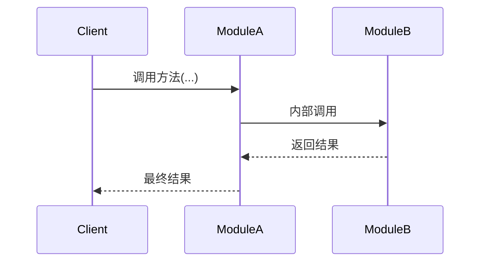

# design.md 设计规范 v3

> **适用范围**：所有 Phase 的 Task 阶段1 产出物（design.md 架构设计文档）
> **核心原则**：职责分离 — design.md 记录架构决策。代码和测试直接生成文件
> **关联规范**：`project_info/tech_doc_design_spec.md`（技术学习文档规范）
> **版本变更**：基于 Task 1.5~1.8 实际生成数据的评估，消除核心接口设计与代码骨架的冗余，将质量驱动力内化到骨架生成规则

---

## 〇、生成顺序指引

> **核心章节**（代码驱动力极强/强，必须高质量完成）：1~7
> **可后置章节**（代码驱动力弱，可简化或后置补充）：8~11

AI 在 token 有限时，应优先保证核心章节的质量，可后置章节可在后续补充。

---

## 一、design.md 模板

> 路径：存储于 `.project_tasks/phase_X/task_X.X_design.md`
> 定位：架构设计文档，让用户有能力根据配备详细中文纯度高的，逐步骤注释的骨架代码，来完全独立编写代码

~~~markdown
# Task X.X [任务名称] - 架构设计

> **原始需求**：`.project_outline/phase_X/task_X.X_*.md`
> **涉及文件**：`src/xxx/yyy.py`、`tests/test_yyy.py`

---

## 架构决策与权衡

> 记录当前 Task 中的关键设计选型。一个高质量的决策分析通常具备以下特征（仅供参考，非强制模板）：
> - **语境关联**：让读者理解该决策为何在当前 Task 不可避免，而非凭空产生。
> - **优劣分析**：不只罗列优缺点，而是明确指出被拒绝方案的"在本项目中不可接受的硬伤"或者更优秀的方案的独特之处。
> - **务实结论**：选择理由扎根于项目现实（验收标准、维护成本、团队能力），避免纯理论最优。
> - **质量锚点**：若决策显著体现了某条质量准则（如鲁棒性、可扩展性），可自然点出，无需逐条贴标。
> - 决策数量不限，但应覆盖当前 Task 的核心设计分歧点。无争议的常规实现无需列为决策。

### 决策 1：[关键选型/方案取舍]
- **设计原则**：[本决策主要体现的设计原则，如"依赖倒置"、"开闭原则"]
- **选项 A**：[简述] — 优点 / 缺点
- **选项 B**：[简述] — 优点 / 缺点
- **结论**：选 X，理由...
- **技术文档展开方向**（可选）：[建议技术文档讲透什么，如"讲透策略模式 vs if-else 的扩展性边界"]

### 决策 2：[同上]

---

## 设计约束与假设

> **目的**：隐含约束散落在决策分析中容易遗漏，显式记录可防止 AI 在代码生成时违反隐含前提。

### 外部约束
- [运行环境/依赖版本/API 限制等，如"DeepSeek 免费 API 限流 429 频繁"]
- [...]

### 设计假设
- [当前阶段成立的假设，如"当前只有 2 个 Prompt 版本，字典映射足够"]
- [假设失效时的迁移路径，如"超过 10 个版本时迁移到 YAML 配置"]

### 隐含前提
- [容易被忽略但影响实现的前提，如"第三方库日志需与 structlog 走同一路径"]
- [...]

---

## 模块结构

### 文件组织
```
src/xxx/
├── __init__.py      # 公共导出
└── yyy.py          # 职责说明
```

### 关键外部依赖
> 仅列出非标准库依赖及其用途，标准库依赖从代码骨架的 import 语句推断。

```
yyy.py
├── some_third_party_lib   # 用途说明（版本约束如有）
└── another_lib            # 用途说明
```

### 职责边界
> 清晰的边界能防止代码腐化。✅ 包含本文件的直接职责，❌ 不包含应归属其他模块的功能，并标注归属地。
```
yyy.py 职责：
✅ 包含：...
❌ 不包含：...  ← 属于 zzz.py
```

---

## 契约速览

> **定位**：模块公共 API 的快速概览，让阅读者无需翻阅完整骨架即可了解"有哪些类/函数、各负什么职责"。
> **与代码骨架的关系**：契约速览仅提供签名 + 一句话职责；完整 docstring、步骤注释、实现配方全部在代码骨架中。
> **声明式类型**（异常类、数据类、枚举、常量）不在此处出现，仅在代码骨架中定义。

### [模块名 / 文件名]

```python
class ClassName:  # P0
    """一句话职责描述（不超过 2 行）。"""
    def method_a(self, param: Type) -> ReturnType: ...
    def method_b(self, param: Type) -> ReturnType: ...

def standalone_func(param: Type) -> ReturnType:  # P1
    """一句话职责描述。"""
```

**示例**：

```python
class ChatSession:  # P0
    """CLI 会话状态管理器 — 解耦对话历史与交互循环，预留 Task 2.5 对话记忆兼容性。"""
    def add_user_message(self, content: str) -> None: ...
    def add_ai_message(self, content: str) -> None: ...
    def get_history(self) -> List[BaseMessage]: ...
    def clear(self) -> None: ...

def format_sources(sources: List[str]) -> str:  # P2
    """将来源 URL 列表格式化为带编号的可读字符串。"""
```

---

## 错误处理策略

> **目的**：集中描述异常捕获策略，代码生成时不会遗漏。骨架步骤注释仅引用本章节，不重复细节。
> **例外**：当异常处理逻辑是该步骤的核心逻辑（而非防御性代码）时，骨架中写完整说明。

### 异常捕获与包装策略
| 异常类型 | 捕获位置 | 包装为 | 是否中断主流程 | 理由 |
|---------|---------|-------|-------------|------|
| [底层异常] | [哪个方法/步骤] | [自定义异常] | [是/否] | [为什么] |

### 可恢复 vs 不可恢复的判定
- **可恢复**（不中断主流程）：[列举场景，如"引用提取失败 → 返回空引用列表"]
- **不可恢复**（中断并上抛）：[列举场景，如"LLM 调用重试耗尽 → 抛出 LLMCallError"]

### 骨架引用规则
骨架步骤注释中使用 `# 按异常策略表第 N 行处理` 引用本表，不重复异常处理细节。
仅当异常处理是步骤核心逻辑时，在骨架中写完整说明。

---

## 代码骨架

> **核心标准**：仅凭骨架，读者能独立编写出功能正确、细节完整的代码。
> 不是完整可运行代码（不需要包含 import 语句），但必须像"施工图纸"一样精确。

### 优先级标注

每个函数/类标注优先级，AI 在 token 有限时优先保证核心路径的步骤注释精度：
- **P0**（核心路径）：必须精确到每一步，步骤注释不可省略
- **P1**（重要功能）：需完整 docstring + 关键步骤注释
- **P2**（辅助功能）：docstring 即可，步骤注释可简化

### 质量要求：施工图纸级别（注意力集中此处!）

> 骨架必须包含以下内容才是可独立编写的施工图纸：

**1. 函数/类级别（docstring）**：
- **做什么**(必选)：职责描述。
- **为什么**（必选）：设计理由、权衡考量。
- **注意点**（可选）：若存在调用方易忽略的全局易错点，应予指出。
- **反模式**（可选）：若有典型的错误用法，可列出并说明后果。
- **非显而易见的默认值**（可选）：如 `max_turns=10`，需说明为什么选这个值。

**2. 每一步级别（函数体内行间注释）**：
- **怎么做**（必选）：精确到可直接翻译为代码的中文步骤描述 + 预期输入/输出，**无具体代码**！！
- 描述时可根据步骤复杂度灵活组织，例如说明"当前拥有什么数据、需要变成什么结果、中间经过什么处理"。
- 复杂逻辑步骤需要回答为什么这么做。
- 简单步骤可直接写动作（如 `# 若 docs 为空，返回空字符串`），无需强行拆分数据/变换/结果。

### P0 函数骨架规则（质量驱动力内化）

> 以下规则将鲁棒性、可观测性、可测试性等质量维度直接内化到骨架生成规则中，
> 确保 AI 在写骨架时自然覆盖，而非事后填表检查。

**鲁棒性**：P0 函数的步骤注释**必须**标注异常处理点：
- 引用方式：`# 按异常策略表第 N 行处理`
- 仅当异常是核心逻辑时写完整说明

**可观测性**：P0 函数的步骤注释**必须**标注日志记录点：
- 格式：`日志：[级别] 记录 X、Y 字段`
- 如：`日志：info 记录检索耗时、文档数量`

**可测试性**：依赖**必须**通过构造函数/参数注入，骨架中标注注入点：
- 格式：`# 注入：xxx（可 Mock）`
- 如：`def __init__(self, retriever: BaseRetriever):  # 注入：retriever（可 Mock）`

**配置外部化**：非显而易见的默认值在 docstring 中说明理由：
- 如：`max_turns: int = 10  # 限制对话轮数，长对话的 history 会导致 Prompt token 爆炸`

**可扩展性**：预留扩展点用 TODO 标注在骨架中：
- 如：`# TODO(Task 2.5): 启用 include_chat_history=True`

### 步骤注释规则

| 内容类型 | 要求 | 正确示例 | 错误示例 |
|---------|------|---------|--------|
| 模板/常量文本 | 写出完整内容 | `SYSTEM_TEMPLATE = """你是一个...助手。\n## 角色定义\n- ..."""` | `SYSTEM_TEMPLATE = """..."""  # 与V1类似` |
| 条件分支 | 写出所有条件和对应动作 | `# relevant_ids 为空 → 返回 0.0` | `# 边界处理` |
| 数据变换 | 写出输入→变换→输出 | `# 取 retrieved_ids[:k] 转为集合 → 判断是否有交集 → 1.0 或 0.0` | `# 计算指标` |
| 差异说明 | 明确写出差异点 | `# V2 vs V1：新增"跨语言策略"章节 + 引用格式从"列出"改为"严格遵守一一对应"` | `# V2 指令更详细` |
| 函数内部逻辑 | 逐步骤写出核心逻辑 | `# 步骤1：遍历... 步骤2：累加... 步骤3：返回...` | `# 内部调用` |

- 函数签名（`def func(...):`）、类定义（`class X:`）、docstring → 允许写（骨架的结构框架）
- 函数体内的控制流关键字（`while`、`try`、`except`、`if`、`for`）→ 禁止写，用中文描述
- 函数体内的 API 调用（`input()`、`.lower()`、`print()`）→ 禁止写，用中文描述"调用什么函数，传入什么参数"
- 函数体内的赋值和运算 → 禁止写，用中文描述"将 A 变为 B"
- 例外：模板/常量的完整文本内容需要写出（如欢迎信息文本）

### 条件分支标注格式

> 当步骤涉及条件分支或回退路径（>2 条路径）时，使用"伪代码分支树"替代平铺文字描述。

**格式**：
```
# 步骤 N：[描述] — 调用 xxx
#   ├─ 条件 A → 结果 A
#   ├─ 条件 B → 结果 B
#   └─ 条件 C → 结果 C
#        ├─ 子条件 C1 → 子结果 C1
#        └─ 子条件 C2 → 子结果 C2
```

**格式规则**：
- 用 `├─` / `└─` 表示分支
- 每个分支写"条件 → 结果"
- 嵌套分支缩进 2 空格
- 仅在 P0 函数且存在 >2 条路径时使用

**示例**：
```
# 步骤 2f：流式输出 — 调用 chain.stream(user_input)
#   ├─ 成功 → 逐 token 打印，拼接 full_answer
#   ├─ 抛出 RAGSystemError → 向上传播（由步骤 5 统一处理）
#   └─ 抛出其他异常 → 回退到 chain.invoke()
#        ├─ invoke 成功 → full_answer = invoke 结果
#        ├─ invoke 抛出 RAGSystemError → 向上传播
#        └─ invoke 抛出其他异常 → full_answer 保持空字符串
```

### 步骤注释模式推荐

> 根据函数复杂度和场景，选择最适合的步骤组织方式。可混合使用。

**模式 A：字母子步骤** — 适用于顺序过程逻辑

适用场景：REPL 主循环、初始化序列、事件循环、单线数据流

格式：
```python
def cli_loop(chain, session):  # P0
    """REPL 主循环..."""
    # 步骤 1：打印欢迎信息
    # 步骤 2：进入主循环
    #   步骤 2a：读取用户输入，提示符为 "🤔 你："
    #   步骤 2b：去除首尾空白，若为空字符串 → 跳过本轮
    #   步骤 2c：退出判断 — 输入转小写，为 "exit"/"quit" → 打印告别信息 → 跳出循环
    #   步骤 2d：session.add_user_message(用户输入)
    #   ...
    #   步骤 2m：打印分隔线
    # 步骤 3：捕获 KeyboardInterrupt → 打印换行 + 告别信息 → 跳出循环
    # 步骤 4：捕获 EOFError → 同步骤 3（Windows 下 Ctrl+Z+Enter 触发 EOFError）
    # 步骤 5：捕获 RAGSystemError → 打印 "❌ 系统错误" + 记录 error 日志 → 不跳出循环
    # 步骤 6：捕获其他 Exception → 打印 "❌ 未预期的错误" + 记录 error 日志 → 不跳出循环
```

**模式 B：四维注释** — 适用于多步编排方法

适用场景：管道式处理（检索→生成→验证）、复杂算法、含多步外部调用的方法

格式：
```python
def invoke(self, question: str) -> RAGResponse:  # P0
    """同步调用完整 RAG 管道..."""
    # ===== 步骤 1：检索 =====
    # 为什么这样做：检索是 RAG 的第一步，获取与问题相关的文档片段
    # 具体做法：
    #   调用 self._retriever.invoke(question)，返回 List[Document]
    # 异常处理：按异常策略表第 3 行处理
    # 日志：info 记录检索耗时、文档数量

    # ===== 步骤 2：空检索拦截 =====
    # ...
```

**模式 C：异常顶层步骤** — 适用于持续运行场景

适用场景：REPL/服务器主循环、长时间运行的消费者、命令分发器

格式：将不同异常类型的处理作为独立顶层步骤（如模式 A 示例中的步骤 3-6），每个步骤写明：
- 捕获什么异常
- 做什么（打印什么、记录什么日志）
- 是否中断循环（跳出 vs 继续）
- 为什么这样处理

**选择规则**：
- 单一职责的编排方法 → 模式 A
- 多步管道/复杂算法 → 模式 B
- REPL/事件循环/服务器主循环 → 模式 A + 模式 C 混合

### 步骤注释中的关键信息点

| 信息点 | 必选/可选 | 说明 | 示例 |
|--------|---------|------|------|
| 做什么 | 必选 | 精确的中文操作描述 | "去除输入首尾空白字符" |
| 为什么 | 条件必选 | 非显而易见时必须说明 | "为什么不区分大小写：用户可能输入 EXIT/Quit 等变体" |
| 平台细节 | 可选 | 跨平台差异 | "Windows 下 Ctrl+Z+Enter 触发 EOFError 而非 KeyboardInterrupt" |
| 跨 Task TODO | 可选 | 标注技术债 | "TODO(Task 2.2): LangGraph 节点将 sources 写入状态" |
| 回退策略 | 可选 | 失败时的备选方案 | "stream 失败 → 回退到 invoke；invoke 也失败 → full_answer 保持为空" |

### 示例对比

```python
# ===== 差的骨架（只有意图，无法独立编写） =====
# 计算 NDCG@k：DCG 归一化到 [0, 1]
# 为什么：精细排名场景需要区分"第1位 vs 第3位命中"的差异
# 具体做法：先算 DCG，再除以理想 DCG
def ndcg_at_k(retrieved_ids, relevant_ids, k=3):
    # 边界处理
    # 计算相关性分数
    # 算 DCG 和 IDCG
    # 返回归一化结果
    ...


# ===== 好的骨架（施工图纸级别，**步骤无代码**，但可独立编写！） =====
def ndcg_at_k(retrieved_ids: List[str], relevant_ids: List[str], k: int = 3) -> float:  # P1
    """计算 NDCG@k（Normalized Discounted Cumulative Gain）。

    含义：DCG 归一化到 [0, 1]，考虑多级相关性和排名加权。
    值域：[0.0, 1.0]，1.0 = 完美排序。
    适用场景：精细排名场景，需要区分"第 1 位 vs 第 3 位命中"的差异。

    当前使用二值相关性（相关=1，不相关=0）。
    扩展到分级相关性时，只需将 relevant_ids: List[str] 替换为
    relevance_map: Dict[str, float] 并修改 rel_score 计算逻辑。

    Args:
        retrieved_ids: 检索返回的文档 ID 列表（按排名顺序）
        relevant_ids: 相关文档 ID 列表
        k: 截断位置

    Returns:
        NDCG@k 值，范围 [0.0, 1.0]
        当 relevant_ids 为空时返回 0.0
    """
    # 无具体代码！
    # 步骤 1：边界处理 — relevant_ids 为空 → 返回 0.0
    # 步骤 2：将 relevant_ids 转为集合
    # 步骤 3：将 retrieved_ids 转为二值相关性分数列表 [1.0 if id in relevant else 0.0]
    # 步骤 4：计算实际 DCG@k（调用 _dcg_at_k 辅助函数）
    # 步骤 5：计算理想 DCG@k（IDCG）— 全 1 排在最前
    #   IDCG = _dcg_at_k([1.0] * min(len(relevant_ids), k) + [0.0] * ..., k)
    # 步骤 6：返回 DCG / IDCG，IDCG 为 0 时返回 0.0
```

**关键差异**：差的骨架中"算 DCG 和 IDCG"是一句空话，读者仍然不知道 DCG 的公式是什么、IDCG 怎么构造、相关性分数怎么映射。好的骨架把数学公式的每一步翻译成了精确的代码操作，读者只需按步骤翻译成 Python 语法即可。

---

## 常见坑点

1. **[坑点名称]**：[具体描述 + 为什么会踩坑 + 如何避免]
2. **[坑点名称]**：[同上]
3. **[坑点名称]**：[同上]

---

## 测试策略概要（条件性）

> **适用条件**：仅当 Task 涉及非平凡的 Mock 边界或复杂测试场景时补充此章节。
> 简单 Task（纯计算、格式化、简单 CRUD）无需此章节。

### Mock 边界
- [哪些依赖需要 Mock，如"LLM 调用"、"向量库检索"]
- [Mock 策略，如"通过构造函数注入 Mock 对象"]

### 可独立测试的纯函数
- [列举无副作用的函数，如"format_docs"、"_is_retryable_error"]

### 关键测试场景
- [必须覆盖的测试场景，如"空检索返回预设回复"、"429 触发重试"]

---

## 验收标准

### 功能验收
- [ ] ...

### 质量验收
- [ ] ...

### 性能验收
- [ ] ...

---

## 最佳实践自检清单

> **替代原 10 维最佳实践落地表格**。高驱动力维度（鲁棒性、可观测性、可测试性）已内化为骨架生成规则，
> 此清单仅作最后复查用。

### 关键落地点（必须具体说明，2~3 维）

> 选择本 Task 中**最显著体现**的 2~3 个维度，给出具体落地方式（类名/方法名/字段/行为）。

- [维度名称]：[具体落地方式]

### 常规落地（无需展开，确认即可）

- [ ] 模块分离：文件职责边界已在"职责边界"章节说明
- [ ] 架构分层：数据流和层次关系已在"架构决策"和"模块结构"中体现
- [ ] SOLID 原则：依赖倒置通过构造函数注入实现
- [ ] 封装与抽象：公共 API 与内部实现以下划线分隔
- [ ] 设计模式：[选择的设计模式名称，或"当前复杂度不需要特定模式"]
- [ ] 可观测性：P0 函数已标注日志记录点（骨架规则）
- [ ] 配置管理：非显而易见的默认值已在 docstring 中说明理由
- [ ] 鲁棒性/容错：异常体系已在"错误处理策略"中集中描述；P0 函数已标注异常处理点
- [ ] 可测试性：依赖注入点已在骨架中标注
- [ ] 可扩展性：预留扩展点已在代码骨架的 TODO 中标注

### 豁免声明

若某维度客观不适用，填写"不适用"并简述可逻辑论证的理由，该声明视为满足要求。

---

## 交互时序图（可选）

> **适用条件**：仅当跨组件交互超过 3 个参与者且含条件分支时补充。
> 对于代码生成，骨架中的条件分支标注格式通常比 mermaid 图更直接有用。



---

## 前瞻性设计（精简）

> TODO 已在代码骨架的步骤注释中标注（`# TODO(Task X.Y): ...`），
> 此处仅记录与后续 Task 的接口衔接。

### 与后续 Task 的接口衔接
- Task X.Y：[预留接口，1 行说明]
- Task X.Z：[预留接口，1 行说明]

---

## 参考技术文档（可后置）

- [xxx.md](../../docs/task_x.x/xxx.md) - 技术主题说明
- [yyy.md](../../docs/task_x.x/yyy.md) - 技术主题说明
~~~

### 关键约束

- **严禁包含完整实现代码**（阶段2直接生成 src/ 文件）
- **严禁包含测试代码**（阶段2直接生成 tests/ 文件）
- **代码骨架必须达到"施工图纸"级别的精度，是中文纯度高的注释步骤，而不是具体代码！**

---

## 二、质量检查清单

### 核心章节必检项（章节 1~7）

- [ ] 架构决策有明确的方案对比和选择理由
- [ ] 设计约束与假设已显式记录（外部约束 + 设计假设 + 隐含前提）
- [ ] 契约速览包含类名 + 一句话职责 + 公共方法签名，声明式类型不在此处
- [ ] 错误处理策略已集中描述（异常捕获表 + 可恢复/不可恢复判定）
- [ ] **代码骨架必须达到"施工图纸"级别的精度，是中文纯度高的注释步骤，而不是具体代码！**，严禁出现 `...` 等省略
- [ ] P0 函数的步骤注释完整且精确，包含异常处理点 + 日志记录点 + 注入点标注
- [ ] 条件分支（>2 条路径）已使用伪代码分支树格式
- [ ] 常见坑点至少 3 个（包含原因 + 解决方法）
- [ ] **不含完整实现代码**
- [ ] **不含测试代码**

### 可后置章节检查项（章节 8~11）

- [ ] 测试策略概要（如补充）描述了 Mock 边界 + 纯函数 + 关键场景
- [ ] 最佳实践自检清单的关键落地点有具体实现说明
- [ ] 验收标准覆盖功能、质量、性能
- [ ] 交互时序图（如补充）清晰展示组件协作流程
- [ ] 前瞻性设计与前后 Task 衔接精简清晰
- [ ] 参考技术文档以覆盖面试和项目知识面为考量