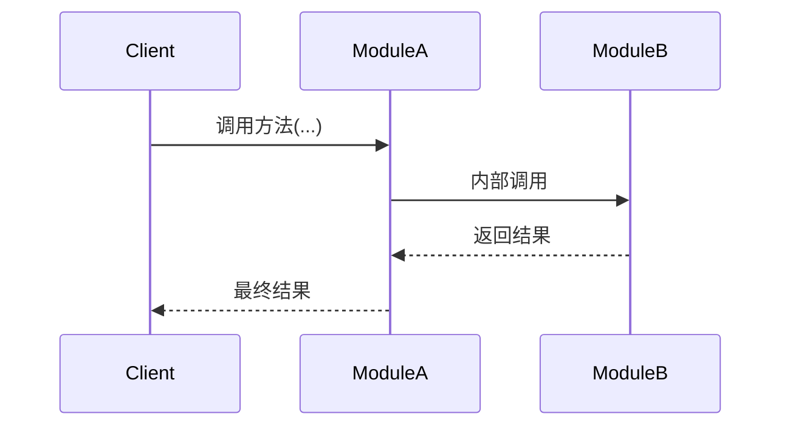

# design.md 设计规范 v2

> **适用范围**：所有 Phase 的 Task 阶段1 产出物（design.md 架构设计文档）
> **关联规范**：`project_info/tech_doc_design_spec.md`（技术学习文档规范）

---

## 硬约束（先读，不可违反）

- **不含完整实现代码**（阶段 2 产出 `src/`）
- **不含测试代码**（阶段 2 产出 `tests/`）
- **代码蓝图不含 import 语句**（读者按注释组织依赖）
- **架构决策必须有候选对比与被选理由**

---

## 一、design.md 模板

> 路径：`.project/tasks/phase_X/task_X.X_design.md`
> **范例说明**：下方种子范例中出现的 `Task 4.2`、`DocumentProcessor`、`embedder` 等均为教学构造，实际写作时以本 Task 真实情况替换。

~~~markdown
# Task X.X [任务名称] - 架构设计

> **原始需求**：`.project/outline/phase_X_*/task_X.X_*.md`
> **涉及文件**：`src/xxx/yyy.py`、`tests/test_yyy.py`

---

## 架构决策与权衡 MUST

### 先读：这不是填空题

这个章节的任务不是描述你选了什么，而是重建你为什么非选它不可。如果你发现自己在“按子节标题凑字数”，停下来——你很可能在记录一个不存在的决策。

---

### 入口判定（动笔前必答）

本 Task 中，是否存在“换一个方案，代码结构会明显不同”的地方？

“结构明显不同”的三条操作性判据（命中任一即是决策）：

- 换方案会改变模块边界 / 调用链 / 返回类型
- 换方案会引入或消除额外组件（缓存层、适配层、索引结构等）
- 换方案会影响后续 Task 的实现路径

以下情况不是决策（硬列只会稀释密度）：

- 写法 / 命名 / 风格差异但结构不变
- 性能差异但在本项目规模下不可感知
- 别的 Task 已决定过（引用即可）
- 你写不出“如果某具体约束变了结论会反转”——说明本来就没权衡

若全部不命中 → 整章不写。

---

### 种子范例：推演版 vs 填空版

✅ **推演版**

> **决策：向量库选型——Chroma vs FAISS**
>
> 本 Task 需在离线环境跑 RAG 检索。第一反应是 FAISS——性能毋庸置疑。但接入时发现：FAISS 索引是纯二进制，没有元数据管理。而下一个 Task 4.2 要做“按文档来源过滤检索”——这意味着需要在向量库外层自建元数据表，把本应由库解决的问题外溢到应用层。
>
> Chroma 把元数据作为一等公民。性能在 10 万向量以内不如 FAISS，但本项目 1 万文档远在其舒适区，性能差距不可感知。
>
> 选 Chroma。不是因为它更好，而是 FAISS 的短板恰好踩在后续 Task 的必经之路上。如果规模涨到百万级、或 Task 4.2 的元数据过滤被砍掉，结论会反转。
>
> **反事实自检**：拿掉“Task 4.2 需要元数据过滤”约束后——
> - [x] FAISS 不再失效，两方案都可行 → 该约束正是让 FAISS 失效的原因 → 验证通过

❌ **填空版**

> 决策：向量库选型
> 语境：本 Task 需要向量检索能力。
> 候选对比：FAISS 性能好、API 底层；Chroma 易用、支持元数据。
> 结论：综合考量，选 Chroma，在易用性和功能性之间取得平衡。

**区别**：推演版每一句都扎在本项目具体约束上（离线、1 万文档、Task 4.2 要元数据）；填空版每一句换到任何项目都成立。

---

### 决策记录骨架

每个字段后的斜体行是**写前警告**——动笔前先读一遍，命中警告说明这里不该这么写。

#### 决策 N：[关键选型]

**语境**：为什么这个决策在本 Task 不可避免？

*写前警告：如果只能写出“本 Task 需要 X”、“为实现 Y 功能”这类任何项目都能套用的理由——不是架构决策，回入口判定。*

**候选对比**：

- **方案 A**：[简述]
  - 在本项目语境下的优势：
  - 在本项目语境下的硬伤：
- **方案 B**：[简述]
  - 在本项目语境下的优势：
  - 在本项目语境下的硬伤：若无硬伤，写“无硬伤，但因 [具体项目约束] 更倾向另一方”。

*写前警告：把优势/硬伤放到你上个月做的另一个项目里读一遍——同样成立就删掉重写。真正的项目特异性判断换项目后会立刻失效。*

**反驳推演**：如果选被否的方案，会在本项目的什么具体场景下失败？

*写前警告：如果只能写“会慢一点”、“不够灵活”、“扩展性差”——删除整个字段。没有具体场景的反驳只是结论复读。*

**结论**：选 X，根本理由是 [一条扎根本项目现实的约束]。如果 [具体约束] 变成 [具体值]，结论会反转。

*写前警告：检查两件事——*
*① 结论句是否出现“综合考量”、“取得平衡”、“更优雅 / 更现代 / 符合最佳实践”？→ 分歧点没找到，整段回语境重找。*
*② 反转条件是否写成“如果需求变了”、“如果约束变了”？→ 必须精确到“哪条约束变成什么值”；若连精确化都做不到，说明 ① 也踩了，一起处理。*

---

**反事实自检**（强制输出，三选一）

把“结论”里写下的根本理由从项目约束里临时拿掉，在剩余约束下重跑对比——

- [ ] 方案 ___ 不再失效，两方案都可行 → 该约束正是让该方案失效的原因 → 验证通过
    - 要求：该约束必须原文出现在语境字段，不得临时新增。

- [ ] 方案 ___ 仍然失效，具体场景：______ → 失效原因不是你写的约束，回候选对比重找分歧点重写结论
    - 要求：场景必须带具体数字 / 调用路径 / 业务流，不得写“性能下降”、“不够灵活”等泛化词。

- [ ] 方案不再失效，但仍会选原方案 → 按顺序处理：
    1. **优先检查**：回语境字段重读你写的根本理由，是否可用更精确的表述重写？例：把“更安全”改写为“调用点迁移出错的回滚成本高”。能精确化则回结论重写。
    2. 若精确化后仍需勾选本项：补充未写出的第二条约束 ______（须与第一条性质不重叠），回语境补充后重跑反事实。

---

### 质量准则豁免

若 CLAUDE.md 10 维质量准则中某维度在本 Task 客观无法体现，在此处声明：

> **[维度名]**：不适用。[简述可逻辑验证的理由，须扎根本 Task 具体约束]

示例：**可扩展性**：不适用。本 Task 仅提供配置读取的纯函数，无状态、无依赖、无演化轴，未来扩展点不可预期。

---

## 模块结构

### 文件组织
```
src/xxx/
├── __init__.py      # 公共导出
└── yyy.py          # 职责说明
```

### 关键外部依赖（仅列非标准库）
```
yyy.py
├── some_third_party_lib   # 用途说明（版本约束如有）
└── another_lib            # 用途说明
```

### 职责边界
```
yyy.py 职责：
✅ 包含：...
❌ 不包含：...  ← 属于 zzz.py
```

### 与后续 Task 的接口衔接
- Task X.Y：[预留接口，1 行说明]
- Task X.Z：[预留接口，1 行说明]

---

## 错误处理策略（条件性：涉及 ≥ 2 种异常时补充）

枚举每种异常：捕获位置、处理方式（回退 / 传播 / 包装）、是否中断主流程、理由。格式自选（列表或表格）。

> **与代码蓝图的分工**：本章节给出异常的全局策略表（何种异常如何处置）；代码蓝图的步骤注释只内联到"在此步捕获 X → 回退 Y"的实例级描述，不重复策略理由。

---

## 测试策略概要（条件性：涉及 Mock 或非平凡测试场景时补充）

回答：哪些依赖需 Mock 及策略、哪些函数可独立测试、必须覆盖的关键测试场景。格式自选。

---

## 代码蓝图：施工图纸级别 MUST

**目标**：读者按注释信息可独立编写满足生产级质量要求的代码。
**边界**：不写 import、不写完整可运行代码、不复读代码语法。
**精度**：读者只需翻译、无需设计——不会面临“有多种合理实现方式而不知选哪个”的局面。

### “为什么”四类触发条件（适用于所有级别的注释）

| 类型 | 触发条件 | 示例 |
|------|---------|------|
| 设计决策 | 有多种合理方案，选了其中一个 | “为什么拆分两条链” |
| 反直觉辩护 | 行为和直觉相反 | “为什么不直接传播 RetrievalError” |
| 功能取舍 | 做了 A 没做 B | “为什么流式不包含引用提取” |
| 替代方案排除 | 读者可能想到另一种做法 | “为什么不用 generation_chain.invoke” |

*写前警告：如果你写的“为什么”换个项目、换个函数仍然成立（如“为了性能”、“为了可维护性”）→ 不是真正的为什么，要么补到具体约束，要么删除。*

### 函数/类级别（docstring）

- **设计意图**（必选）：职责详述
- **为什么**：按四类触发条件回答
- **注意点**（可选）：隐含前提、易错点
- **反模式**（可选）：典型错误用法及后果
- **流程编排**（可选）：多步骤或分支时的流程概览
- **非显而易见的默认值**（可选）：如 `max_turns=10` 为何选这个值
- **跨 Task TODO**（可选）：技术债和前瞻性衔接
- **其他**（可选）：上述字段无法承载、但对读者理解有帮助的内容（如非标准类比、面试视角延伸）。*写前警告：如果换一个项目/函数仍然成立，删除。*

### 每一步级别（函数体内行间注释）

- 用中文描述意图而非代码实现——代码元素（函数名、try/except、分支树）是设计信息的载体而非实现代码。
- 复杂步骤（异常分支、设计决策、多步变换）：详细注释 + 按四类触发条件回答“为什么”。
- 简单步骤（赋值、边界检查、透传调用）：描述清楚即可。

### 质量标注（哪里有需要标注哪里）

| 维度 | 标注时机 | 格式 |
|------|---------|------|
| 鲁棒性 | 步骤涉及异常处理或回退策略 | 内联描述异常处理逻辑（含回退方向） |
| 可观测性 | 步骤需要记录日志 | `日志：[级别] 记录 X、Y 字段` |
| 可测试性 | 依赖可被 Mock 注入 | `# 注入：xxx（可 Mock）` |
| 可扩展性 | 步骤为后续 Task 预留接口 | `# TODO(Task X.Y): ...` |

### 格式规则

1. **步骤注释组织**：步骤编号 + 必要时字母子步骤（如 2a, 2b, 2c）。

2. **结构性分支**（if/else 决定多行代码路径时）按路径数分档：

   - **路径 ≤ 2 条**：直接写 if/else 缩进，不画分支树
   - **路径 > 2 条**：使用条件分支树，替代平铺文字

   ```
   # 步骤 N：[描述] — 调用 xxx
   #   ├─ 条件 A → 结果 A
   #   ├─ 条件 B → 结果 B
   #   └─ 条件 C → 结果 C
   #        ├─ 子条件 C1 → 子结果 C1
   #        └─ 子条件 C2 → 子结果 C2
   ```

3. **函数调用规则**：

   | 类型 | 怎么写 | 理由 |
   |------|-------|------|
   | 本项目函数 / 方法 | 函数名 + 参数变量名 + 返回值 | 变量名保精度 |
   | 第三方库函数 / 构造 | 函数名 + 中文描述关键参数意图 | 函数名让读者知道查什么 |
   | 标准库 / 语言结构 | 直接写 | 不因版本变化 |

4. **赋值和运算**：中文描述意图（“计数器加 1”而非 `count += 1`）。

   - **例外（数据变换）**：当步骤是非平凡的数据变换（多条件列表推导、嵌套字典推导、链式 reduce/map 等）时，关键表达式可直接写出——单写中文意图无法让读者唯一翻译。
   - **例外（模板/常量）**：常量文本需写完整值（如 `SYSTEM_TEMPLATE = """你是一个...助手。"""`）。

---

### 种子范例（高密度）

以下骨架同时展示：docstring 中的“为什么”、流程控制 / 数据变换 / 业务校验三类步骤、条件分支树、质量标注四维、数据变换例外。

```python
class DocumentProcessor:
    """
    文档批处理器：清洗、去重、向量化入库。

    为什么单独成类而非函数链（设计决策）：三步共享 metadata 上下文
    （来源、时间戳），拆成独立函数需重复传参；聚合为类可通过实例属性承载。
    """
    def __init__(self, embedder, store):
        # 注入：embedder、store（均可 Mock，便于单测）
        ...

    def process(self, raw_docs: list[dict]) -> int:
        """
        批量入库，返回成功入库数量。

        反直觉辩护：空列表返回 0 而非抛异常——调用方通常在轮询场景，
        把“本轮无新文档”当异常处理会造成日志噪音。
        """
        # 步骤 1：过滤明显无效的原始文档（数据变换 → 写表达式）
        # [d for d in raw_docs if d.get("content") and len(d["content"].encode()) <= MAX_BYTES]

        # 步骤 2：按 content_hash 去重，保留首次出现项（数据变换 → 写表达式）
        # {hash_of(d["content"]): d for d in filtered}.values()

        # 步骤 3：校验 metadata 必填字段（业务校验 → 中文为主 + 分支树）
        #   ├─ 缺 source        → 抛 MetadataError（中断主流程，source 无法自愈）
        #   └─ 缺 timestamp     → 注入当前时间后继续（可恢复）
        # 日志：warning 记录注入次数，便于排查上游时钟问题

        # 步骤 4：调 self.embedder.embed_batch(texts) 得向量列表（流程控制 + 鲁棒性）
        # 捕获 EmbedError → 回退为单条重试；重试仍失败则跳过该条
        # 日志：info 记录 batch 大小、耗时；error 记录跳过条目的 hash

        # 步骤 5：调 self.store.upsert(items) 入库，返回成功数量
        # TODO(Task 4.2): 补充按 source 维度的入库数分组，供检索过滤用
```

**范例读法**：

- 步骤 1/2 是数据变换型——写了关键表达式，因为单写“过滤无效”、“去重”无法唯一翻译。
- 步骤 3 是业务校验型——用分支树展示条件 → 结果，中文为主。
- 步骤 4 是流程控制 + 鲁棒性——中文描述调用和回退方向，不写 try/except 骨架。
- 每个“为什么”都扎在本项目语境上（日志噪音、上游时钟、Task 4.2），换个项目不成立。

---

## 交互时序图（条件性：跨组件 ≥ 3 参与者时）

> **与代码蓝图的分工**：时序图捕捉跨组件协作流（谁先调谁、返回什么、异常怎么传播）；代码蓝图的条件分支树捕捉单个函数内部逻辑流。两者层面不同，不替代。



---

## 常见坑点

按 Task 实际情况列举，不设最低数量要求。

1. **[坑点名称]**：[具体描述 + 为什么会踩坑 + 如何避免]
2. ...

~~~

---

## 二、质量自检

- [ ] 不含完整实现代码（阶段 2 产出）
- [ ] 不含测试代码（阶段 2 产出）
- [ ] 代码蓝图不含 import 语句
- [ ] “为什么”在四类触发条件出现时已写清楚
- [ ] 质量标注已按触发时机表补充
- [ ] 涉及异常的步骤都标注了处理方向（回退 / 传播 / 包装）
- [ ] 涉及副作用或关键路径的步骤都标注了日志（级别 + 字段）
- [ ] 条件分支（>2 条路径）已使用分支树格式
- [ ] 函数调用规则已遵守
- [ ] 架构决策每个都完成反事实自检（三选一勾选）
