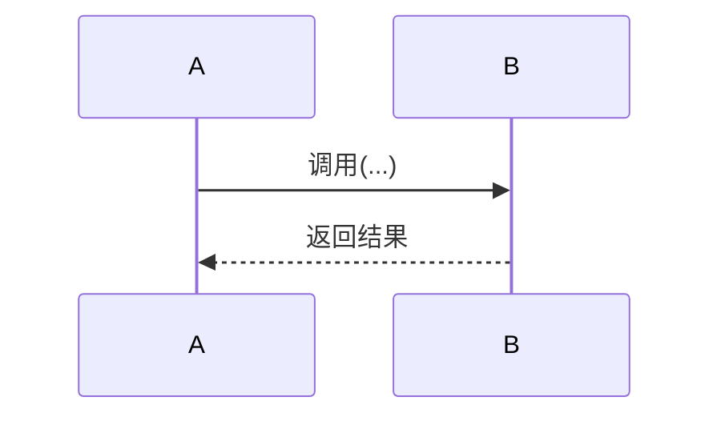

# design.md 设计规范

> **定位**：这不是模板，是一份认知协议。你的任务不是填空，是把一次诚实的架构推演过程记录下来。读完全文再动笔。

---

## 硬约束

- 不含完整实现代码（代码在 `src/`）
- 不含测试代码（代码在 `tests/`）
- 架构决策必须有候选对比与被选理由
- 代码蓝图达到施工图纸级别

---

## 第一章：这个 Task 有决策吗？

**先问自己一个问题，不要跳过**：这个 Task 里，是否存在"换一个方案，调用方的代码结构也得跟着改"的地方？

具体判据只一条——换了方案后，是否牵连改动范围超出当前模块内部实现？是，就记录。不是，就跳过"架构决策与权衡"整章，不要留任何占位文字。

**以下不是决策**：命名/写法/风格差但结构不变的选型；本项目规模下不可感知的性能差异；已在其他 Task 决定过的（引用即可）。

---

### 如果你跳过了整章

审阅者会在代码蓝图中检查是否有未被记录的岔路口。发现一个，就是不合格项。跳过不是免责声明，是一个可被证伪的断言。

---

## 第二章：架构决策与权衡

### 2.1 一个推演决策长什么样

本节不是教你格式，而是给你一把尺。下面是一个"扎实推演" vs "泛泛而谈"的对比，这把尺你用来量自己写的每个决策。

**✅ 扎实推演**

> **决策：向量库选型——Chroma vs FAISS**
>
> 本 Task 需在离线环境做 RAG 检索。第一反应是 FAISS，性能最优。但下一步 Task 4.2 要做"按文档来源过滤检索结果"。FAISS 只存向量不存元数据，选了它意味着要在向量库外层自建元数据映射表，并把"检索→过滤"的耦合逻辑写进应用层。
>
> Chroma 把元数据当一等公民，过滤是内置功能。本项目文档量 1 万级别，Chroma 性能劣势不可感知，但 FAISS 的元数据缺失是硬缺口——它把库该解决的问题外溢到了下游模块。
>
> **结论**：选 Chroma。根本理由是避免元数据管理逻辑外溢到应用层。如果 Task 4.2 的元数据过滤需求被砍掉，结论立刻反转。
>
> **反事实验证**：拿掉"Task 4.2 需要按 source 过滤"这个约束后，FAISS 不再有硬缺口，两个方案平手。这一条正是让 FAISS 失效的唯一原因。

**❌ 泛泛而谈**

> 决策：向量库选型。需要向量检索能力。FAISS 性能好、API 底层；Chroma 易用、支持元数据。综合考量选 Chroma，取得平衡。

**区别**：左边的理由换到你的项目还成立吗？成立就删掉重写。项目特异性的判断换项目后立刻失效。

---

### 2.2 决策记录格式

> 以下格式不是填空题。每个字段下面一行是写之前必须回答自己的问题。答案不在纸面上，但答不出说明你没想清楚。

---

**决策 N：[名称]**

**语境**：在本 Task 的什么具体约束下，这个决策不可避免？

*（自问：如果我换到上个月做的另一个项目，这句话还成立吗？成立就重写。）*

**候选对比**

| 方案 | 本项目的优势 | 本项目的硬伤 |
|------|-------------|-------------|
| A | ... | 若无硬伤，写"无硬伤，但因[具体约束]更倾向另一方" |
| B | ... | ... |

*（自问：优势/硬伤能放到别的项目也成立吗？能就重写。）*

**反驳推演**：如果选被否方案，在本项目的哪条具体调用链上、会因为缺什么字段/条件抛什么异常或返回错误结果？

*（必须写到调用链级精度。写不出"抛X异常"或"返回Y被误判"，说明你没在做推演，是在给结论扩句。）*

**结论**：选 X。根本理由是 [一条扎根项目具体约束的理由]。如果 [具体约束] 变为 [具体值]，结论会反转。

**反事实验证**（必写，一句话）：

把上面那条根本理由从项目约束里拿掉，两个方案是否变得平手？
- 是 → 通过。你找到的正是分歧点。
- 否 → 失效原因不是你写的这条。返回候选对比重找。

*这句话你写出来，读者自会判断它是不是狡辩。你不需要声明"验证通过"。*

---

## 第三章：代码蓝图

### 3.1 施工图纸是什么意思

你的读者是另一个合格工程师，但对这个 Task 的代码库陌生。你的目标是：他/她只读你的注释，就能写出代码，且不需要自己做任何架构决策。

两件事不要做：重述语法（谁都知道 `if/else` 怎么写）；写伪代码（那是在替读者做翻译）。解释**为什么分支**、**各分支承接了什么业务职责**，读者自己会写实现。

### 3.2 什么时候必须写"为什么"

一条原则：**当你做的事会让读者心里问"等等，为什么不是 X？"**

四种典型时刻：
- 有多种合理做法，你只选其一
- 你做了和直觉相反的事
- 你做了 A 但没做 B（读者很可能想做 B）
- 你放弃了一个读者能想到的方案

### 3.3 函数/类级注释

写清：**职责详述** + **必须在上面四种时刻出现的"为什么"**。可选：隐含前提/易错点、流程概览、跨 Task TODO。

### 3.4 步骤级注释

每一步用中文写意图。分三种情况：

- 简单赋值/透传：一句话描述意图即可
- 多分支（≤2 条路径）：直接写 if/else 缩进，不画树
- 多分支（>2 条路径）：用分支树

```
# 步骤 N：校验 metadata 必填字段
#   ├─ 缺 source    → 抛 MetadataError（中断主流程，source 无法自愈）
#   ├─ 缺 timestamp → 注入当前时间后继续（可恢复）
#   └─ 都齐        → 继续
# 日志：warning 记录注入次数
```

- 非平凡数据变换：关键表达式可直接写——单写中文意图无法让读者唯一翻译的位置

### 3.5 质量标注（哪里有就标哪里）

| 维度 | 何时标 | 格式 |
|------|-------|------|
| 鲁棒性 | 有异常处理/回退 | 内联写清回退方向 |
| 可观测性 | 需日志 | `日志：[级别] 记录 X、Y` |
| 可测试性 | 依赖可 Mock 注入 | `# 注入：xxx（可 Mock）` |
| 可扩展性 | 为后续 Task 预留 | `# TODO(Task X.Y): ...` |

### 3.6 函数调用写法

- 本项目函数：函数名 + 参数变量名 + 返回值变量名
- 第三方库：函数名 + 中文描述关键参数意图
- 标准库/语言结构：直接写

---

## 第四章：模块结构（必写）

### 文件组织
```
src/xxx/
├── __init__.py      # 公共导出
└── yyy.py          # 职责说明
```

### 职责边界
```
yyy.py
✅ 包含：...
❌ 不包含：...  ← 属于 zzz.py
```

### 与后续 Task 的接口衔接
- Task X.Y：[预留接口，1 行说明]

---

## 第五章：错误处理策略（涉及 2 种以上异常时写）

枚举每种异常：捕获位置、处理方式（回退/传播/包装）、是否中断主流程、理由。

---

## 第六章：测试策略概要（涉及 Mock 或非平凡测试时写）

哪些依赖需 Mock 及策略、哪些函数可独立测试、必须覆盖的关键场景。

---

## 第七章：交互时序图（跨组件 3 个以上参与者时写）



---

## 第八章：常见坑点

按实际情况列举，不设数量下限。
1. **[坑点]**：[场景 + 会怎么踩 + 怎么避免]

---

## 质量自检

- [ ] 每条决策的反事实验证都能一句说清
- [ ] "为什么"出现在读者会问"等等为什么"的地方
- [ ] 异常步骤标了回退方向
- [ ] 关键路径有日志级别和字段
- [ ] >2条分支用了条件分支树
- [ ] 函数调用格式正确