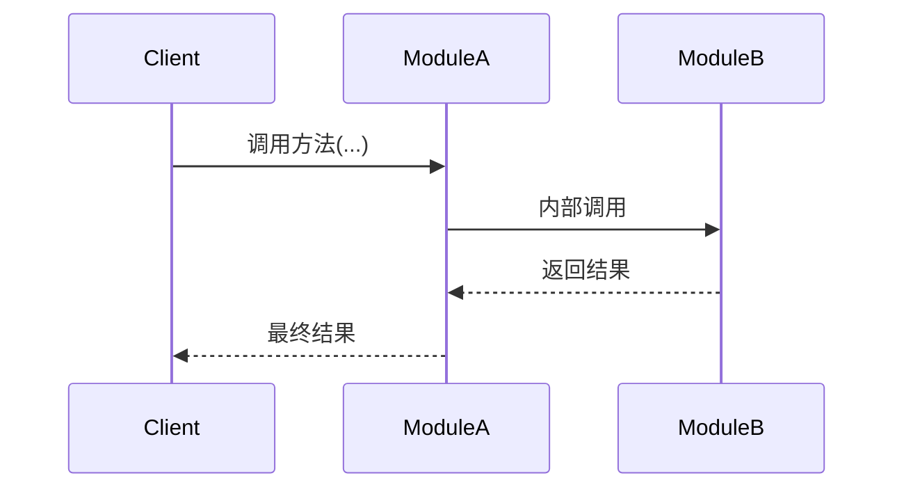

# design.md 设计规范

> **适用范围**：所有 Phase 的 Task 阶段1 产出物（design.md 架构设计文档）
> **关联规范**：`project_info/tech_doc_design_spec.md`（技术学习文档规范）

---

## 0、范式宣言（先读）

本规范 **不是"字段清单模板"，而是"决策推演引擎"**。

- **错误的使用方式**：按节标题填空，凑够字段 → 产出"合格但无灵魂"的设计文档
- **正确的使用方式**：先识别本 Task 的 **关键决策点**，再让每个章节成为决策推演的载体

**判定标准**：半年后的读者能否凭此文档 **重建当时的决策过程**，而不仅是"知道结论是什么"。

---

## 一、design.md 模板

> 路径：存储于 `.project/tasks/phase_X/task_X.X_design.md`
> 定位：架构设计文档，让用户有能力根据配备详细中文纯度高的、逐步骤注释的骨架代码，来完全独立编写代码

~~~markdown
# Task X.X [任务名称] - 架构设计

> **原始需求**：`.project/outline/phase_X_*/task_X.X_*.md`
> **涉及文件**：`src/xxx/yyy.py`、`tests/test_yyy.py`

---

## 架构决策与权衡 MUST

> 记录当前 Task 中的关键设计选型。一个高质量的决策分析通常具备以下特征（可自由发挥，但产出质量应不低于此标准）：
> - **语境关联**：让读者理解该决策为何在当前 Task 不可避免，而非凭空产生。
> - **优劣分析**：不只罗列优缺点，而是明确指出被拒绝方案的"在本项目中不可接受的硬伤"或者更优秀的方案的独特之处。
> - **务实结论**：选择理由扎根于项目现实（验收标准、维护成本、团队能力），避免纯理论最优。
> - **质量锚点**：若决策显著体现了某条质量准则（如鲁棒性、可扩展性），应自然点出，无需逐条贴标。
> - **决策数量不限**：应覆盖当前 Task 的核心设计分歧点。无争议的常规实现无需列为决策。

> **AI 写决策分析最易踩的 4 类陷阱**（写完对照自查）：
>
> | 陷阱 | 典型表现（❌ Bad） | 反制要求（✅ Good） |
> |------|-------------------|-------------------|
> | **表面合理** | "采用 X 以提升性能" | 必须写清**为什么不是 Y**，且 Y 要具体到有名字 |
> | **伪选型** | A/B/C 并列，对比项雷同、无实质差异 | 至少一个维度上候选有**可判定的胜负关系** |
> | **决策前置** | 直接给结论，优缺点是"事后补写"的对仗 | 结论前必有**至少一次反驳推理**（"如果选 A 会怎样"） |
> | **方案膨胀** | 把所有候选都"部分采纳"、不敢选 | 最终**选一项**，其余进附录或只留被否理由 |

### 决策 1：[关键选型/方案取舍]

**语境**：为什么这个决策在本 Task 不可避免？（1-2 句）

**候选对比**：
- **方案 A**：[简述]
  - 优势：[项目语境下的具体优势，非通用优点]
  - 硬伤：[在本项目中不可接受的具体问题]
- **方案 B**：[简述]
  - 优势：...
  - 硬伤：...（若无硬伤，说明"为什么最终没选它"）

**反驳推演**：如果选 A，会在 [具体场景] 出什么问题？

**结论**：选 B，根本理由是 [扎根于项目现实的一条，非"更优雅"之类]。

### 决策 2：[同上]

---

## 模块结构

### 文件组织
```
src/xxx/
├── __init__.py      # 公共导出
└── yyy.py          # 职责说明
```

### 关键外部依赖
> 仅列出非标准库依赖及其用途，标准库依赖从代码骨架的 import 语句推断。

```
yyy.py
├── some_third_party_lib   # 用途说明（版本约束如有）
└── another_lib            # 用途说明
```

### 职责边界
> 清晰的边界能防止代码腐化。✅ 包含本文件的直接职责，❌ 不包含应归属其他模块的功能，并标注归属地。
```
yyy.py 职责：
✅ 包含：...
❌ 不包含：...  ← 属于 zzz.py
```

### 与后续 Task 的接口衔接
- Task X.Y：[预留接口，1 行说明]
- Task X.Z：[预留接口，1 行说明]

---

## 错误处理策略（条件性）

> **适用条件**：涉及 ≥ 2 种异常处理时补充；仅 1 种异常或不涉及异常的 Task 可跳过。
> **定位**：设计自检工具，服务于人类审查和设计完整性。骨架中的异常处理以内联方式描述，不引用本章节。
> 枚举每种异常，说明：捕获位置、处理方式（回退/传播/包装）、是否中断主流程、理由。
> 格式自选——简单场景用列表，复杂场景用表格。

---

## 测试策略概要（条件性）

> **适用条件**：涉及 Mock 依赖或非平凡测试场景时补充；纯代码质量改善且测试改动极小时可跳过。
> **定位**：设计自检工具，服务于人类审查和设计完整性。
> 需要回答：哪些依赖需要 Mock 及策略、哪些函数可独立测试、必须覆盖的关键测试场景。
> 格式自选。

---

## 代码蓝图：施工图纸级别 MUST

> "施工图纸"：读者能根据注释信息独立编写出满足生产级质量要求的代码
> 不是完整可运行代码（不需要包含 import 语句）

**"为什么"的四类触发条件**（适用于代码蓝图所有级别的注释）：

代码蓝图中"为什么"不强制每处都写，但出现以下四类情况时必须写清楚：

| 类型 | 触发条件 | 示例 |
|------|---------|------|
| 设计决策 | 有多种合理方案，选了其中一个 | "为什么拆分两条链" |
| 反直觉辩护 | 行为和直觉相反 | "为什么不直接传播 RetrievalError" |
| 功能取舍 | 做了 A 没做 B | "为什么流式不包含引用提取" |
| 替代方案排除 | 读者可能想到另一种做法 | "为什么不用 generation_chain.invoke" |

### 函数/类级别（docstring）

- **设计意图**（必选）：函数/类的职责详述
- **为什么**：按四类触发条件回答
- **注意点**（可选）：隐含前提、易错点等
- **反模式**（可选）：典型错误用法及后果等
- **流程编排**（可选）：涉及多个步骤或分支时的流程概览
- **非显而易见的默认值**（可选）：如 `max_turns=10`，需说明为什么选这个值。
- **跨 Task TODO**（可选）：标注技术债和前瞻性衔接
- **其他**（真诚请求）：为了便于用户理解，可任意发挥的内容

### 每一步级别（函数体内行间注释）

> 精确到读者只需翻译、无需设计——不会面临"有多种合理实现方式而不知选哪个"的局面
> 用中文描述意图而非代码实现——步骤注释以中文为主体，代码元素（函数名、try/except、分支树）是设计信息的载体而非实现代码

- 由步骤本身的需求决定，不设注释统一深度
- 复杂逻辑步骤（异常分支、设计决策、多步变换等）：详细注释 + 按四类触发条件回答"为什么"
- 简单逻辑步骤（赋值、边界检查、透传调用等）：通常情况描述清楚即可，但也可按照复杂逻辑步骤的格式描述

**质量标注**：
> 哪里有需要就标注哪里，由步骤本身的复杂度决定。

| 维度 | 标注时机 | 格式 | 示例 |
|------|---------|------|------|
| 鲁棒性 | 步骤涉及异常处理或回退策略时 | 内联描述异常处理逻辑（含回退方向） | `# 捕获 NotImplementedError → 回退正则` |
| 可观测性 | 步骤需要记录日志时 | `日志：[级别] 记录 X、Y 字段` | `日志：info 记录检索耗时、文档数量` |
| 可测试性 | 依赖可被 Mock 注入时 | `# 注入：xxx（可 Mock）` | `def __init__(self, retriever):  # 注入：retriever（可 Mock）` |
| 可扩展性 | 步骤为后续 Task 预留接口时 | `# TODO(Task X.Y): ...` | `# TODO(Task 2.5): 启用 include_chat_history=True` |

### 格式规则

1. **步骤注释的组织方式**：步骤编号 + 必要时用字母子步骤（如 2a, 2b, 2c），根据内容复杂度自然选择。
```
# 步骤 1：[步骤描述]
# 步骤 2：[步骤描述，含子步骤]
#   步骤 2a：[子步骤 a 描述]
#   步骤 2b：[子步骤 b 描述]
#   步骤 2c：[子步骤 c 描述]
# 步骤 3：[步骤描述]
```

2. **结构性分支**（if/else 决定多行代码路径时）：使用条件分支树或直接写 if/else 缩进，根据复杂度自然选择。

3. **条件分支树**（路径 >2 条时使用，替代平铺文字）：

```
# 步骤 N：[描述] — 调用 xxx
#   ├─ 条件 A → 结果 A
#   ├─ 条件 B → 结果 B
#   └─ 条件 C → 结果 C
#        ├─ 子条件 C1 → 子结果 C1
#        └─ 子条件 C2 → 子结果 C2
```

规则：`├─`/`└─` 表示分支，每分支写"条件 → 结果"，嵌套缩进 2 空格。

4. **函数调用规则**：

| 类型 | 骨架里怎么写 | 理由 |
|------|------------|------|
| 本项目的函数/方法 | 写函数名 + 参数变量名 + 返回值 | 变量名保精度，读者需组织调用语法和处理返回值 |
| 第三方库的函数/构造 | 写函数名 + 中文描述关键参数意图 | 函数名让读者知道查什么，参数名是需查文档的实现细节 |
| 标准库/语言结构 | 直接写 | 不因版本变化 |

5. **赋值和运算**：中文描述（"计数器加 1"而非 `count += 1`）；**例外**：模板/常量的完整文本内容需写出（如 `SYSTEM_TEMPLATE = """你是一个...助手。"""`）

---

## 交互时序图（条件性）

> **适用条件**：跨组件交互 ≥ 3 个参与者时补充。
> **为什么保留**：时序图解决的是跨组件协作流（谁先调谁、返回什么、异常怎么传播），
> 与条件分支树（单个函数内部逻辑流）是不同层面的问题。画图过程本身在强迫理清组件边界和交互协议，
> 如果交互没想清楚，调用关系就会写错。
> **不适用时**：单文件、无跨组件调用的 Task 无需此章节。



---

## 常见坑点

> 按 Task 实际情况列举，不设最低数量要求。
1. **[坑点名称]**：[具体描述 + 为什么会踩坑 + 如何避免]
2. ...

~~~

### 关键约束

- **严禁包含完整实现代码**（阶段2直接生成 src/ 文件）
- **严禁包含完整测试代码**（阶段2直接生成 tests/ 文件）
- **架构决策有明确的方案对比和选择理由**
- **代码蓝图必须达到"施工图纸"级别的精度**

---

## 二、质量自检

### A. 客观事实自检（可机械勾选）

- [ ] 不含完整实现代码（阶段 2 产出）
- [ ] 不含测试代码（阶段 2 产出）
- [ ] "为什么"在四类触发条件出现时已写清楚
- [ ] 质量标注已按触发时机表补充
- [ ] 条件分支（>2 条路径）已使用分支树格式
- [ ] 函数调用规则已遵守

### B. 推理深度自检（可判定追问）

回答下面 3 个问题，**每一问都必须能在文档中找到支撑段落**：

1. **决策考古**：半年后的我凭这份文档，能否重建当时的决策过程？
   - 能 → 指出支撑段落；否 → 决策章节不合格，回到决策章节重写
2. **反驳痕迹**：如果读者想选被否的方案 A，能否从文档中读出"为什么不行"？
   - 能 → 指出段落；否 → 补反驳推演
3. **陷阱对照**：对照"4 类陷阱"表，本 Task 的每个决策是否都避开了这 4 类？
   - 能 → 决策章节通过；否 → 定位到违反的陷阱重写
